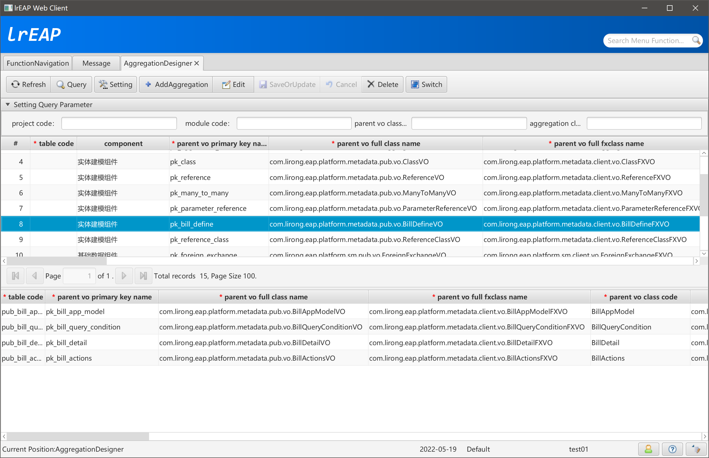
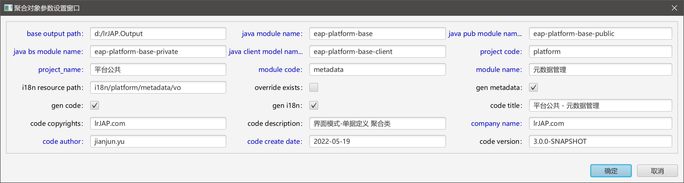
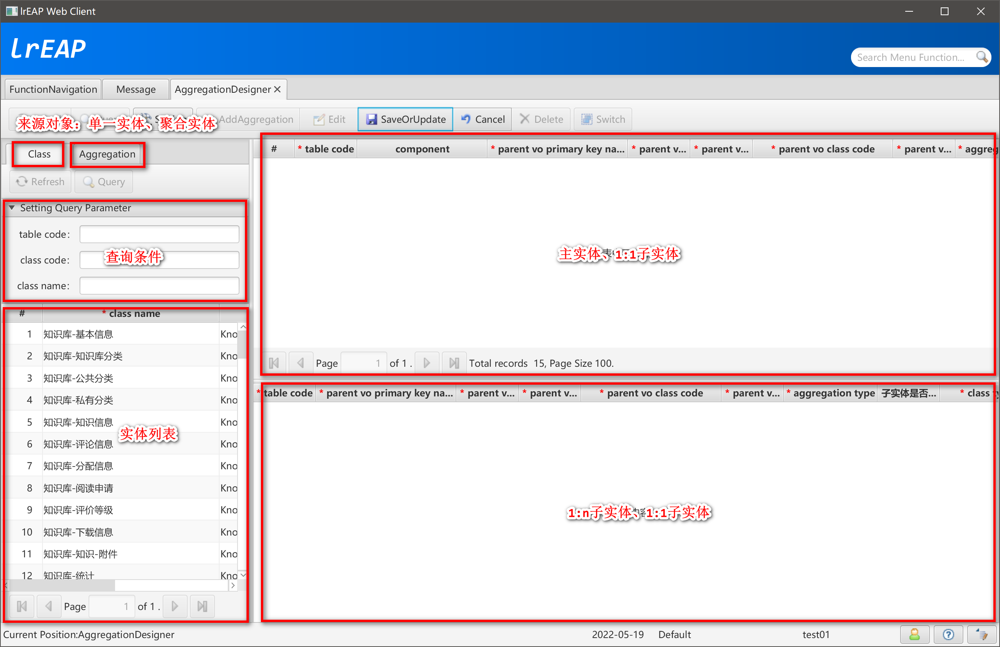
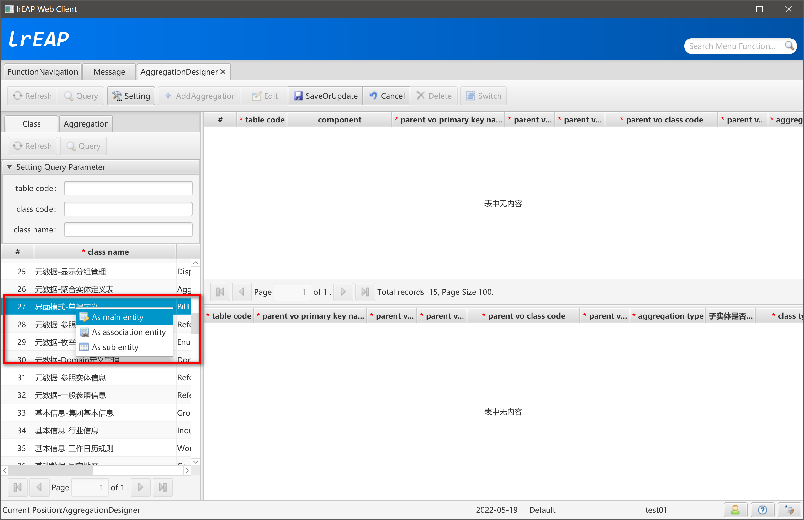
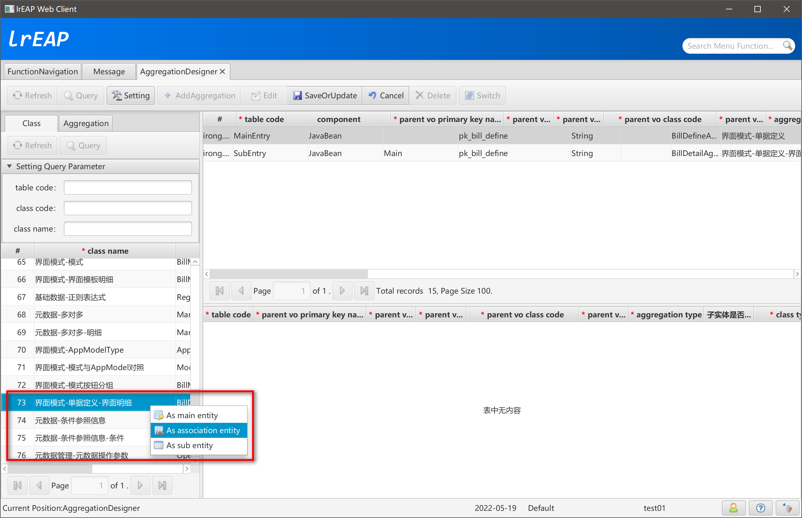
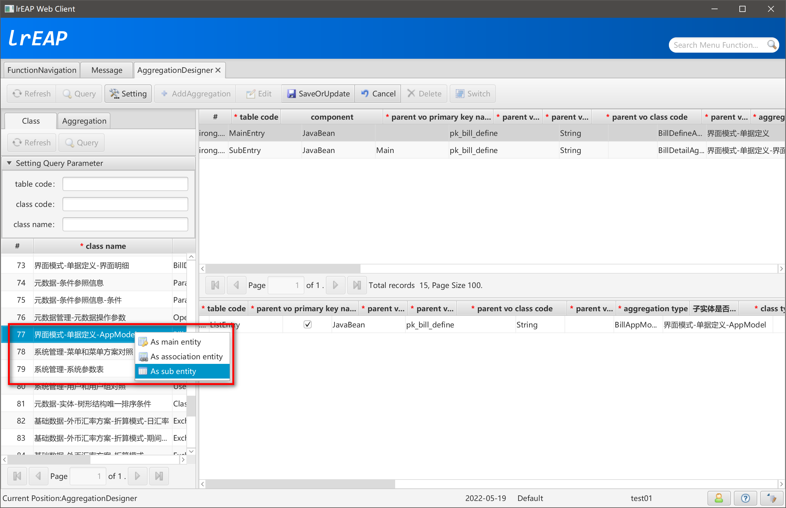
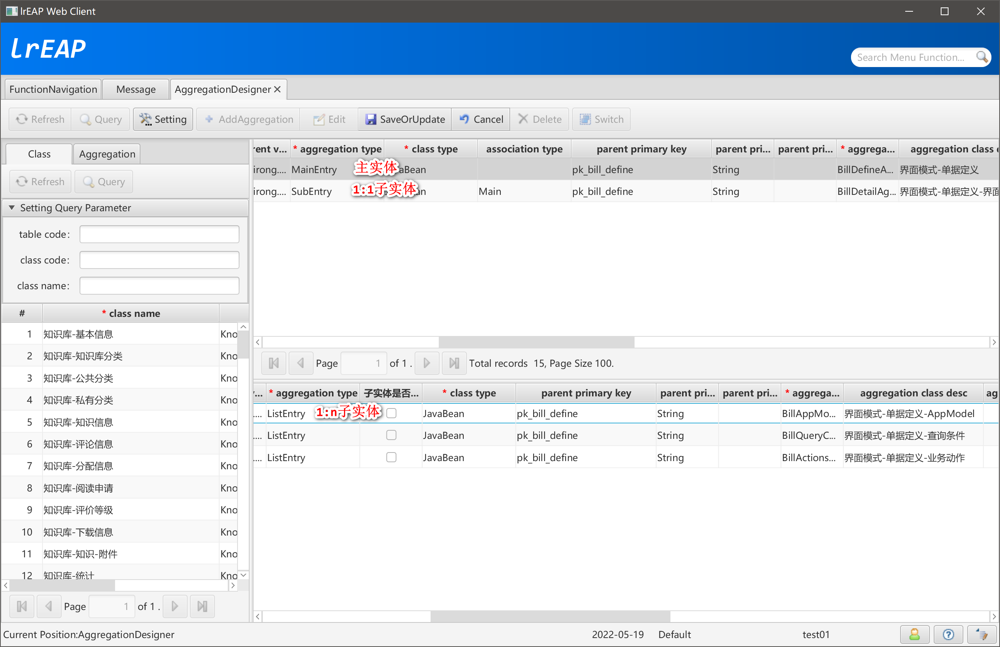

# AggregationDesigner聚合对象设计

[返回](../../README.md)

## 简述

使用单一VO就能够满足的业务功能相对来说是比较简单的，在整个企业应用系统中往往占比较小。大多数情况下，我们的业务领域映射到Java对象时，都具有较复杂的结构，如主子表、一主多子表，甚至是多主多子表等。

聚合VO体系主要用来描述比较复杂的数据结构。例如，主子表结构。包括一主多子、多主多子等复杂结构。即MyBatis中的association和collection。

## 打开聚合对象设计器


## 聚合对象设计器主界面



## 参数设置



## 新增聚合对象



## 添加主实体



## 添加1:1子实体



## 添加1:n子实体



## 聚合实体结构



## 检查生成的聚合对象资源信息

### 公共模块（eap-knowledge-base-public）

#### BillDefineAggregationVO

```java
/**
 * <p>Title: LiRong Java Enterprise Application Platform</p>
 * <p>平台公共 - 元数据管理</p>
 * Description: BillDefineAggregationVO 聚合类主实体<br>
 * <p>Copyright: Copyright (c) 2019</p>
 * <p>Company: lrJAP.com</p>
 *
 * @author jianjun.yu
 * @version 3.0.0-SNAPSHOT
 * @date 2022-05-19
 * @since 1.0.0-SNAPSHOT
 */
public class BillDefineAggregationVO extends BillDefineVO implements IAggregationMain {

    private static final long serialVersionUID = -4492808507529608763L;

    @DoNotPersistent
    private static final List<String> associationNames = Arrays.asList(
            "billDetailVO" // $NON-NLS$
    );

    @DoNotPersistent
    private BillDetailAggregationVO billDetailVO = new BillDetailAggregationVO();

    @DoNotPersistent
    public static final List<String> collectionNames = Arrays.asList(
            "listBillAppModelVO", // $NON-NLS$
            "listBillQueryConditionVO", // $NON-NLS$
            "listBillActionsVO" // $NON-NLS$
    );

    @DoNotPersistent
    private List<BillAppModelAggregationVO> listBillAppModelVO = new ArrayList<>();

    @DoNotPersistent
    private List<BillQueryConditionAggregationVO> listBillQueryConditionVO = new ArrayList<>();

    @DoNotPersistent
    private List<BillActionsAggregationVO> listBillActionsVO = new ArrayList<>();


    public BillDetailAggregationVO getBillDetailVO() {

        return billDetailVO;
    }


    public void setBillDetailVO(BillDetailAggregationVO billDetailVO) {

        final BillDetailAggregationVO oldValue = this.billDetailVO;
        this.billDetailVO = billDetailVO;
        firePropertyChange("billDetailVO", oldValue, this.billDetailVO); // $NON-NLS$
    }


    public List<BillAppModelAggregationVO> getListBillAppModelVO() {

        return this.listBillAppModelVO;
    }

    public List<BillQueryConditionAggregationVO> getListBillQueryConditionVO() {

        return this.listBillQueryConditionVO;
    }

    public List<BillActionsAggregationVO> getListBillActionsVO() {

        return this.listBillActionsVO;
    }


    public void setListBillAppModelVO(List<BillAppModelAggregationVO> listBillAppModelVO) {

        this.listBillAppModelVO = listBillAppModelVO;
    }

    public void setListBillQueryConditionVO(List<BillQueryConditionAggregationVO> listBillQueryConditionVO) {

        this.listBillQueryConditionVO = listBillQueryConditionVO;
    }

    public void setListBillActionsVO(List<BillActionsAggregationVO> listBillActionsVO) {

        this.listBillActionsVO = listBillActionsVO;
    }

    public BillDefineAggregationVO() {

        super();
        setListBillAppModelVO(new ArrayList<>());
        setListBillQueryConditionVO(new ArrayList<>());
        setListBillActionsVO(new ArrayList<>());
    }

    @Override
    public List<String> getAssociationNames() {

        return associationNames;
    }

    @Override
    public List<String> getCollectionNames() {

        return collectionNames;
    }

    /******************************************************************************************************************/
    /********************************************** lrEAP Code Generator **********************************************/
    /******************************************************************************************************************/
}
```

#### BillDetailAggregationVO

```java
/**
 * <p>Title: LiRong Java Enterprise Application Platform</p>
 * <p>平台公共 - 元数据管理</p>
 * Description: BillDetailAggregationVO 聚合类1:1子实体<br>
 * <p>Copyright: Copyright (c) 2019</p>
 * <p>Company: lrJAP.com</p>
 *
 * @author jianjun.yu
 * @version 3.0.0-SNAPSHOT
 * @date 2022-05-19
 * @since 1.0.0-SNAPSHOT
 */
public class BillDetailAggregationVO extends com.lirong.eap.platform.metadata.pub.vo.BillDetailVO implements IAggregationAssociation {

    @Override
    public String getParentPrimaryKeyName() {

        return "pk_bill_define"; // $NON-NLS$
    }

    @Override
    public void setAssociationPrimaryKey(Object parentPrimaryKey) {

        if (parentPrimaryKey == null) {
            throw new BusinessException("错误：父实体主键不允许为空。");
        }
        setPk_bill_define(parentPrimaryKey.toString());
    }

    @Override
    public AggregationClassTypeEnum getAssociationType() {
        return AggregationClassTypeEnum.JAVA_BEAN;
    }

    /******************************************************************************************************************/
    /********************************************** lrEAP Code Generator **********************************************/
    /******************************************************************************************************************/
}
```

#### BillActionsAggregationVO

```java
/**
 * <p>Title: LiRong Java Enterprise Application Platform</p>
 * <p>平台公共 - 元数据管理</p>
 * Description: BillActionsAggregationVO 聚合类1:n子实体<br>
 * <p>Copyright: Copyright (c) 2019</p>
 * <p>Company: lrJAP.com</p>
 *
 * @author jianjun.yu
 * @version 3.0.0-SNAPSHOT
 * @date 2022-05-19
 * @since 1.0.0-SNAPSHOT
 */
public class BillActionsAggregationVO extends BillActionsVO implements IAggregationDetail {

    @Override
    public String getParentPrimaryPropertyCode() {

        return PK_BILL_DEFINE_PROPERTY_CODE;
    }

    @Override
    public void setParentPrimaryPropertyCode(Object parentPrimaryPropertyCode) {

        if (parentPrimaryPropertyCode == null) {
            throw new BusinessException("错误：父实体主键不允许为空。");
        }
        setPkBillDefine(parentPrimaryPropertyCode.toString());
    }

    /******************************************************************************************************************/
    /********************************************** lrEAP Code Generator **********************************************/
    /******************************************************************************************************************/
}
```

#### BillQueryConditionAggregationVO

```java
/**
 * <p>Title: LiRong Java Enterprise Application Platform</p>
 * <p>平台公共 - 元数据管理</p>
 * Description: BillQueryConditionAggregationVO 聚合类1:n子实体<br>
 * <p>Copyright: Copyright (c) 2019</p>
 * <p>Company: lrJAP.com</p>
 *
 * @author jianjun.yu
 * @version 3.0.0-SNAPSHOT
 * @date 2022-05-19
 * @since 1.0.0-SNAPSHOT
 */
public class BillQueryConditionAggregationVO extends BillQueryConditionVO implements IAggregationDetail {

    @Override
    public String getParentPrimaryPropertyCode() {

        return PK_BILL_DEFINE_PROPERTY_CODE;
    }

    @Override
    public void setParentPrimaryPropertyCode(Object parentPrimaryPropertyCode) {

        if (parentPrimaryPropertyCode == null) {
            throw new BusinessException("错误：父实体主键不允许为空。");
        }
        setPkBillDefine(parentPrimaryPropertyCode.toString());
    }

    /******************************************************************************************************************/
    /********************************************** lrEAP Code Generator **********************************************/
    /******************************************************************************************************************/
}
```

#### BillAppModelAggregationVO

```java
/**
 * <p>Title: LiRong Java Enterprise Application Platform</p>
 * <p>平台公共 - 元数据管理</p>
 * Description: BillAppModelAggregationVO 聚合类1:n子实体<br>
 * <p>Copyright: Copyright (c) 2019</p>
 * <p>Company: lrJAP.com</p>
 *
 * @author jianjun.yu
 * @version 3.0.0-SNAPSHOT
 * @date 2022-05-19
 * @since 1.0.0-SNAPSHOT
 */
public class BillAppModelAggregationVO extends BillAppModelVO implements IAggregationDetail {

    @Override
    public String getParentPrimaryPropertyCode() {

        return PK_BILL_DEFINE_PROPERTY_CODE;
    }

    @Override
    public void setParentPrimaryPropertyCode(Object parentPrimaryPropertyCode) {

        if (parentPrimaryPropertyCode == null) {
            throw new BusinessException("错误：父实体主键不允许为空。");
        }
        setPkBillDefine(parentPrimaryPropertyCode.toString());
    }

    /******************************************************************************************************************/
    /********************************************** lrEAP Code Generator **********************************************/
    /******************************************************************************************************************/
}
```

#### IBillDefineAggregation

```java
/**
 * <p>Title: LiRong Java Enterprise Application Platform</p>
 * <p>平台公共 - 元数据管理</p>
 * Description: BillDefineAggregation 的业务接口类<br>
 * <p>Copyright: Copyright (c) 2019</p>
 * <p>Company: lrJAP.com</p>
 *
 * @author jianjun.yu
 * @version 3.0.0-SNAPSHOT
 * @date 2022-05-19
 * @since 1.0.0-SNAPSHOT
 */
public interface IBillDefineAggregation extends IAggregationBusinessService<BillDefineAggregationVO> {

    String SERVICE_NAME = "billDefineAggregationService"; // $NON-NLS$

    String REMOTING_SERVICE_NAME = "/platform-metadata/billDefineAggregationHttpInvokerService"; // $NON-NLS$

    /**
     * 不分页查询，查询主表信息，不查询1:1子表和1:n子表信息
     *
     * @param params Map
     * @return List
     */
    List<BillDefineAggregationVO> queryAggregationMain(Map<String, Object> params);

    /**
     * 查询完整的单个聚合对象，包括1:1子表和1:n子表信息
     *
     * @param params Map
     * @return BillDefineAggregationVO
     */
    BillDefineAggregationVO queryAggregation(Map<String, Object> params);

    /******************************************************************************************************************/
    /********************************************** lrEAP Code Generator **********************************************/
    /******************************************************************************************************************/
}
```

### 业务处理模块（eap-knowledge-base-private）

#### BillDefineAggregationBO

```java
/**
 * <p>Title: LiRong Java Enterprise Application Platform</p>
 * <p>平台公共 - 元数据管理</p>
 * Description: BillDefineAggregation 的业务处理类<br>
 * <p>Copyright: Copyright (c) 2019</p>
 * <p>Company: lrJAP.com</p>
 *
 * @author jianjun.yu
 * @version 3.0.0-SNAPSHOT
 * @date 2022-05-19
 * @since 1.0.0-SNAPSHOT
 */
@Service(IBillDefineAggregation.SERVICE_NAME)
@Transactional
public class BillDefineAggregationBO extends AggregationBusinessBO implements IBillDefineAggregation {

    @Autowired
    private IBillDefineAggregationMapper billDefineAggregationMapper;


    /**
     * 不分页查询，查询主表信息，不查询1:1子表和1:n子表信息
     *
     * @param params Map
     * @return List
     */
    public List<BillDefineAggregationVO> queryAggregationMain(Map<String, Object> params) {

        return billDefineAggregationMapper.queryAggregationMain(params);
    }

    /**
     * 查询完整的单个聚合对象，包括1:1子表和1:n子表信息
     *
     * @param params Map
     * @return BillDefineAggregationVO
     */
    public BillDefineAggregationVO queryAggregation(Map<String, Object> params) {

        BillDefineAggregationVO vo = billDefineAggregationMapper.queryAggregation(params);


        return vo;
    }

    private void checkListEntry(String listEntryAlias) {

        if (BillDefineAggregationVO.collectionNames.indexOf(listEntryAlias) < 0) {
            throw new BusinessException("错误：子实体别名不存在。");
        }
    }

    @Override
    public PaginationResult queryDetailPaginationList(String listEntryAlias, Map<String, Object> params) throws BusinessException {

        checkListEntry(listEntryAlias);

        PaginationResult paginationResult = new PaginationResult();

        if ("listBillAppModelVO".equalsIgnoreCase(listEntryAlias)) { // $NON-NLS$
            if (getSqlDialect() == SQLDialect.MYSQL) {
                paginationResult.setDataCounter(getBaseModelService().queryListBillAppModelVOPaginationCount(params));
                if (paginationResult.getDataCounter() > 0) {
                    paginationResult.setListData(getBaseModelService().queryListBillAppModelVOPaginationList(params));
                }
            } else if (getSqlDialect() == SQLDialect.ORACLE || getSqlDialect() == SQLDialect.DB2) {
                paginationResult.setListData(getBaseModelService().queryListBillAppModelVOPaginationList(params));
                if (!paginationResult.getListData().isEmpty()) {
                    if (paginationResult.getListData().get(0) instanceof ValueObject) {
                        Integer dataCounter = ((ValueObject) paginationResult.getListData().get(0)).getDataCounter();
                        if (dataCounter == null) {
                            throw new BusinessException("Oracle/DB2实现分页时，MyBatis Mapper中，必须提供PageCount信息。");
                        }
                        paginationResult.setDataCounter(dataCounter);
                    } else {
                        paginationResult.setDataCounter(getBaseModelService().queryListBillAppModelVOPaginationCount(params));
                    }
                }
            } else {
                throw new BusinessException("不支持的数据库类型。");
            }
            return paginationResult;
        }
        if ("listBillQueryConditionVO".equalsIgnoreCase(listEntryAlias)) { // $NON-NLS$
            if (getSqlDialect() == SQLDialect.MYSQL) {
                paginationResult.setDataCounter(getBaseModelService().queryListBillQueryConditionVOPaginationCount(params));
                if (paginationResult.getDataCounter() > 0) {
                    paginationResult.setListData(getBaseModelService().queryListBillQueryConditionVOPaginationList(params));
                }
            } else if (getSqlDialect() == SQLDialect.ORACLE || getSqlDialect() == SQLDialect.DB2) {
                paginationResult.setListData(getBaseModelService().queryListBillQueryConditionVOPaginationList(params));
                if (!paginationResult.getListData().isEmpty()) {
                    if (paginationResult.getListData().get(0) instanceof ValueObject) {
                        Integer dataCounter = ((ValueObject) paginationResult.getListData().get(0)).getDataCounter();
                        if (dataCounter == null) {
                            throw new BusinessException("Oracle/DB2实现分页时，MyBatis Mapper中，必须提供PageCount信息。");
                        }
                        paginationResult.setDataCounter(dataCounter);
                    } else {
                        paginationResult.setDataCounter(getBaseModelService().queryListBillQueryConditionVOPaginationCount(params));
                    }
                }
            } else {
                throw new BusinessException("不支持的数据库类型。");
            }
            return paginationResult;
        }
        if ("listBillActionsVO".equalsIgnoreCase(listEntryAlias)) { // $NON-NLS$
            if (getSqlDialect() == SQLDialect.MYSQL) {
                paginationResult.setDataCounter(getBaseModelService().queryListBillActionsVOPaginationCount(params));
                if (paginationResult.getDataCounter() > 0) {
                    paginationResult.setListData(getBaseModelService().queryListBillActionsVOPaginationList(params));
                }
            } else if (getSqlDialect() == SQLDialect.ORACLE || getSqlDialect() == SQLDialect.DB2) {
                paginationResult.setListData(getBaseModelService().queryListBillActionsVOPaginationList(params));
                if (!paginationResult.getListData().isEmpty()) {
                    if (paginationResult.getListData().get(0) instanceof ValueObject) {
                        Integer dataCounter = ((ValueObject) paginationResult.getListData().get(0)).getDataCounter();
                        if (dataCounter == null) {
                            throw new BusinessException("Oracle/DB2实现分页时，MyBatis Mapper中，必须提供PageCount信息。");
                        }
                        paginationResult.setDataCounter(dataCounter);
                    } else {
                        paginationResult.setDataCounter(getBaseModelService().queryListBillActionsVOPaginationCount(params));
                    }
                }
            } else {
                throw new BusinessException("不支持的数据库类型。");
            }
            return paginationResult;
        }

        return paginationResult;
    }

    @Override
    public List queryDetailList(String listEntryAlias, Map<String, Object> params) throws BusinessException {

        checkListEntry(listEntryAlias);

        if ("listBillAppModelVO".equalsIgnoreCase(listEntryAlias)) { // $NON-NLS$
            return getBaseModelService().queryListBillAppModelVO(params);
        }
        if ("listBillQueryConditionVO".equalsIgnoreCase(listEntryAlias)) { // $NON-NLS$
            return getBaseModelService().queryListBillQueryConditionVO(params);
        }
        if ("listBillActionsVO".equalsIgnoreCase(listEntryAlias)) { // $NON-NLS$
            return getBaseModelService().queryListBillActionsVO(params);
        }

        return new ArrayList<>();
    }

    @Override
    public List<PropertyVO> queryAggregationMainMetadata() throws BusinessException {

        return mdProperty.queryMetadataInfo("BillDefine"); // $NON-NLS$
    }

    @Override
    public String saveOrUpdateAggregationVO(BillDefineAggregationVO vo) throws BusinessException {

        return super.businessSaveOrUpdateAggregationVO(vo);
    }

    @Override
    public String saveOrUpdateOrDeleteAggregationVO(BillDefineAggregationVO vo, Map<String, List<String>> mapDeleteDetail) throws BusinessException {

        final String pk = saveOrUpdateAggregationVO(vo);
        if (mapDeleteDetail != null && !mapDeleteDetail.isEmpty()) {

            final String strDeleteTemp = "delete from temp_update_delete_pks";  // $NON-NLS$

            final List<String> listBillAppModelVODetailPKs = mapDeleteDetail.get("listBillAppModelVO"); // $NON-NLS$
            if (listBillAppModelVODetailPKs != null && !listBillAppModelVODetailPKs.isEmpty()) {
                executeUpdate(strDeleteTemp);
                insertListIntoTempUpdateDelete(listBillAppModelVODetailPKs);
                final String strSqlBillAppModelVO = "delete from pub_bill_app_model t where exists (select 1 from temp_update_delete_pks temp where t.pk_bill_app_model = temp.pk)"; // $NON-NLS$
                executeUpdate(strSqlBillAppModelVO);
            }

            final List<String> listBillQueryConditionVODetailPKs = mapDeleteDetail.get("listBillQueryConditionVO"); // $NON-NLS$
            if (listBillQueryConditionVODetailPKs != null && !listBillQueryConditionVODetailPKs.isEmpty()) {
                executeUpdate(strDeleteTemp);
                insertListIntoTempUpdateDelete(listBillQueryConditionVODetailPKs);
                final String strSqlBillQueryConditionVO = "delete from pub_bill_query_condition t where exists (select 1 from temp_update_delete_pks temp where t.pk_bill_query_condition = temp.pk)"; // $NON-NLS$
                executeUpdate(strSqlBillQueryConditionVO);
            }

            final List<String> listBillActionsVODetailPKs = mapDeleteDetail.get("listBillActionsVO"); // $NON-NLS$
            if (listBillActionsVODetailPKs != null && !listBillActionsVODetailPKs.isEmpty()) {
                executeUpdate(strDeleteTemp);
                insertListIntoTempUpdateDelete(listBillActionsVODetailPKs);
                final String strSqlBillActionsVO = "delete from pub_bill_actions t where exists (select 1 from temp_update_delete_pks temp where t.pk_bill_actions = temp.pk)"; // $NON-NLS$
                executeUpdate(strSqlBillActionsVO);
            }

        }
        return pk;
    }

    @Override
    public void deleteAggregationVO(BillDefineAggregationVO vo) throws BusinessException {

        super.businessDeleteAggregationVO(vo);
    }

    @Override
    public IBillDefineAggregationMapper getBaseModelService() {

        return this.billDefineAggregationMapper;
    }

    @Override
    public BillDefineAggregationVO queryByPrimaryKey(String pk) throws BusinessException {

        if (StringUtils.isBlank(pk)) {
            throw new BusinessException("参数错误。");
        }

        return getBaseModelService().queryAggregationByPK(pk);
    }

    @Override
    public List<String> getClassCode() throws BusinessException {

        return Arrays.asList("BillDefine", "BillDetail", "BillAppModel", "BillQueryCondition", "BillActions"); // $NON-NLS$
    }

    /******************************************************************************************************************/
    /********************************************** lrEAP Code Generator **********************************************/
    /******************************************************************************************************************/
}
```

#### IBillDefineAggregationMapper

```java
/**
 * <p>Title: LiRong Java Enterprise Application Platform</p>
 * <p>平台公共 - 元数据管理</p>
 * Description: BillDefineAggregationVO DAO<br>
 * <p>Copyright: Copyright (c) 2019</p>
 * <p>Company: lrJAP.com</p>
 *
 * @author jianjun.yu
 * @version 3.0.0-SNAPSHOT
 * @date 2022-05-19
 * @since 1.0.0-SNAPSHOT
 */
@Repository
public interface IBillDefineAggregationMapper extends IBaseModelService {

    /**
     * 不分页查询，查询主表信息，不查询1:1子表和1:n子表信息
     *
     * @param params Map
     * @return List
     */
    List<BillDefineAggregationVO> queryAggregationMain(Map<String, Object> params);

    /**
     * 查询完整的单个聚合对象，包括1:1子表和1:n子表信息
     *
     * @param params Map
     * @return BillDefineAggregationVO
     */
    BillDefineAggregationVO queryAggregation(Map<String, Object> params);

    /**
     * 查询完整的单个聚合对象，包括1:1子表和1:n子表信息
     *
     * @param pk_bill_define String
     * @return BillDefineAggregationVO
     */
    BillDefineAggregationVO queryAggregationByPK(final String pk_bill_define);

    /**
     * 子表（界面模式-单据定义-AppModel） 不分页查询
     *
     * @param parent_pk String
     * @return List<BillAppModelAggregationVO>
     */
    List<BillAppModelAggregationVO> queryListBillAppModelVOWithParentPK(final String parent_pk);

    /**
     * 表（界面模式-单据定义-AppModel） 分页查询 查询总页数
     *
     * @param params Map
     * @return Integer
     */
    Integer queryListBillAppModelVOPaginationCount(final Map<String, Object> params);

    /**
     * 表（界面模式-单据定义-AppModel） 分页查询 查询数据
     *
     * @param params Map
     * @return List<BillAppModelAggregationVO>
     */
    List<BillAppModelAggregationVO> queryListBillAppModelVOPaginationList(final Map<String, Object> params);

    /**
     * 表（界面模式-单据定义-AppModel） 分页查询 查询数据
     *
     * @param params Map
     * @return List<BillAppModelAggregationVO>
     */
    List<BillAppModelAggregationVO> queryListBillAppModelVO(final Map<String, Object> params);
    /**
     * 子表（界面模式-单据定义-查询条件） 不分页查询
     *
     * @param parent_pk String
     * @return List<BillQueryConditionAggregationVO>
     */
    List<BillQueryConditionAggregationVO> queryListBillQueryConditionVOWithParentPK(final String parent_pk);

    /**
     * 表（界面模式-单据定义-查询条件） 分页查询 查询总页数
     *
     * @param params Map
     * @return Integer
     */
    Integer queryListBillQueryConditionVOPaginationCount(final Map<String, Object> params);

    /**
     * 表（界面模式-单据定义-查询条件） 分页查询 查询数据
     *
     * @param params Map
     * @return List<BillQueryConditionAggregationVO>
     */
    List<BillQueryConditionAggregationVO> queryListBillQueryConditionVOPaginationList(final Map<String, Object> params);

    /**
     * 表（界面模式-单据定义-查询条件） 分页查询 查询数据
     *
     * @param params Map
     * @return List<BillQueryConditionAggregationVO>
     */
    List<BillQueryConditionAggregationVO> queryListBillQueryConditionVO(final Map<String, Object> params);
    /**
     * 子表（界面模式-单据定义-业务动作） 不分页查询
     *
     * @param parent_pk String
     * @return List<BillActionsAggregationVO>
     */
    List<BillActionsAggregationVO> queryListBillActionsVOWithParentPK(final String parent_pk);

    /**
     * 表（界面模式-单据定义-业务动作） 分页查询 查询总页数
     *
     * @param params Map
     * @return Integer
     */
    Integer queryListBillActionsVOPaginationCount(final Map<String, Object> params);

    /**
     * 表（界面模式-单据定义-业务动作） 分页查询 查询数据
     *
     * @param params Map
     * @return List<BillActionsAggregationVO>
     */
    List<BillActionsAggregationVO> queryListBillActionsVOPaginationList(final Map<String, Object> params);

    /**
     * 表（界面模式-单据定义-业务动作） 分页查询 查询数据
     *
     * @param params Map
     * @return List<BillActionsAggregationVO>
     */
    List<BillActionsAggregationVO> queryListBillActionsVO(final Map<String, Object> params);

    /******************************************************************************************************************/
    /********************************************** lrEAP Code Generator **********************************************/
    /******************************************************************************************************************/
}
```

#### IBillDefineAggregationMapper

```xml
<?xml version="1.0" encoding="UTF-8" ?>
<!DOCTYPE mapper PUBLIC "-//mybatis.org//DTD Mapper 3.0//EN" "http://mybatis.org/dtd/mybatis-3-mapper.dtd">

<mapper namespace="com.lirong.eap.platform.metadata.bs.dao.IBillDefineAggregationMapper">

    <!-- 主实体。用于界面初始化显示，不包括1:1和1:n子实体 -->
    <resultMap type="com.lirong.eap.platform.metadata.pub.vo.BillDefineAggregationVO" id="BillDefineAggregationVOMain"
               extends="com.lirong.eap.platform.metadata.bs.dao.IBillDefineMapper.BillDefineVO">

    </resultMap>

    <!-- 主实体。包括1:1和1:n子实体 不自动查询子实体，用于可能存在的分页查询 -->
    <resultMap type="com.lirong.eap.platform.metadata.pub.vo.BillDefineAggregationVO" id="BillDefineAggregationVO"
               extends="com.lirong.eap.platform.metadata.bs.dao.IBillDefineMapper.BillDefineVO">
        <!-- 1:1子实体：界面模式-单据定义-界面明细 -->
        <association property="billDetailVO" column="pk_bill_define"
                    javaType="com.lirong.eap.platform.metadata.pub.vo.BillDetailAggregationVO"
                    select="com.lirong.eap.platform.metadata.bs.dao.IBillDetailAggregationMapper.queryForListWithParentPK"/>
        <!-- 1:n子实体：界面模式-单据定义-AppModel -->
        <!-- 子表不分页 -->
        <collection property="listBillAppModelVO" column="pk_bill_define"
                    javaType="ArrayList"
                    select="com.lirong.eap.platform.metadata.bs.dao.IBillAppModelAggregationMapper.queryForListWithParentPK" />
        <!-- 1:n子实体：界面模式-单据定义-查询条件 -->
        <!-- 子表不分页 -->
        <collection property="listBillQueryConditionVO" column="pk_bill_define"
                    javaType="ArrayList"
                    select="com.lirong.eap.platform.metadata.bs.dao.IBillQueryConditionAggregationMapper.queryForListWithParentPK" />
        <!-- 1:n子实体：界面模式-单据定义-业务动作 -->
        <!-- 子表不分页 -->
        <collection property="listBillActionsVO" column="pk_bill_define"
                    javaType="ArrayList"
                    select="com.lirong.eap.platform.metadata.bs.dao.IBillActionsAggregationMapper.queryForListWithParentPK" />
    </resultMap>

    <!-- 主实体。包括1:1和1:n子实体 自动查询子实体，用于查询一个完成的聚合对象 -->
    <resultMap type="com.lirong.eap.platform.metadata.pub.vo.BillDefineAggregationVO" id="BillDefineAggregationVOFull"
               extends="com.lirong.eap.platform.metadata.bs.dao.IBillDefineMapper.BillDefineVO">
        <!-- 1:1子实体：界面模式-单据定义-界面明细 -->
        <association property="billDetailVO" column="pk_bill_define"
                    javaType="com.lirong.eap.platform.metadata.pub.vo.BillDetailAggregationVO"
                    select="com.lirong.eap.platform.metadata.bs.dao.IBillDetailAggregationMapper.queryForListWithParentPK"/>
        <!-- 1:n子实体：界面模式-单据定义-AppModel -->
        <!-- 子表不分页 -->
        <collection property="listBillAppModelVO" column="pk_bill_define" javaType="ArrayList"
                    select="com.lirong.eap.platform.metadata.bs.dao.IBillAppModelAggregationMapper.queryForListWithParentPK" />
        <!-- 1:n子实体：界面模式-单据定义-查询条件 -->
        <!-- 子表不分页 -->
        <collection property="listBillQueryConditionVO" column="pk_bill_define" javaType="ArrayList"
                    select="com.lirong.eap.platform.metadata.bs.dao.IBillQueryConditionAggregationMapper.queryForListWithParentPK" />
        <!-- 1:n子实体：界面模式-单据定义-业务动作 -->
        <!-- 子表不分页 -->
        <collection property="listBillActionsVO" column="pk_bill_define" javaType="ArrayList"
                    select="com.lirong.eap.platform.metadata.bs.dao.IBillActionsAggregationMapper.queryForListWithParentPK" />
    </resultMap>

    <!-- 主表分页查询.获取数据 Oracle -->
    <select id="queryPaginationList" resultMap="BillDefineAggregationVOMain" parameterType="HashMap" databaseId="oracle" flushCache="true">
        <include refid="com.lirong.eap.platform.metadata.bs.dao.IBillDefineMapper.queryPaginationOracleDB2"/>
    </select>

    <!-- 主表分页查询.获取数据 db2 -->
    <select id="queryPaginationList" resultMap="BillDefineAggregationVOMain" parameterType="HashMap" databaseId="db2" flushCache="true">
        <include refid="com.lirong.eap.platform.metadata.bs.dao.IBillDefineMapper.queryPaginationOracleDB2"/>
    </select>

    <!-- 主表分页查询.获取数据 mysql -->
    <select id="queryPaginationList" resultMap="BillDefineAggregationVOMain" parameterType="HashMap" databaseId="mysql" flushCache="true">
        <include refid="com.lirong.eap.platform.metadata.bs.dao.IBillDefineMapper.queryPaginationMySQL"/>
    </select>

    <!-- 主表分页查询.获取总行数 -->
    <select id="queryPaginationCount" resultType="int" parameterType="HashMap" flushCache="true">
        <include refid="com.lirong.eap.platform.metadata.bs.dao.IBillDefineMapper.sqlQueryPaginationCount"/>
    </select>

    <select id="queryForList" resultMap="BillDefineAggregationVOMain" parameterType="java.util.Map" flushCache="true">
        <include refid="com.lirong.eap.platform.metadata.bs.dao.IBillDefineMapper.sqlQueryForList"/>
    </select>

    <select id="queryAggregationMain" resultMap="BillDefineAggregationVOMain" parameterType="java.util.Map" flushCache="true">
        <include refid="com.lirong.eap.platform.metadata.bs.dao.IBillDefineMapper.sqlQueryForList"/>
    </select>

    <select id="queryAggregation" resultMap="BillDefineAggregationVO" parameterType="java.util.Map" flushCache="true">
        <include refid="com.lirong.eap.platform.metadata.bs.dao.IBillDefineMapper.sqlQueryForList"/>
    </select>

    <select id="queryAggregationByPK" resultMap="BillDefineAggregationVOFull" parameterType="java.lang.String" flushCache="true">
        <include refid="com.lirong.eap.platform.metadata.bs.dao.IBillDefineMapper.sqlQueryByPrimaryKey"/>
    </select>

    <!-- Collection 分页查询，即使当前子表设置为不分页，也将将其生成分页查询相关的SQL，以便于后续使用 -->
    <!-- 界面模式-单据定义-AppModel 不分页查询 -->
    <select id="queryListBillAppModelVOWithParentPK" resultMap="com.lirong.eap.platform.metadata.bs.dao.IBillAppModelAggregationMapper.BillAppModelAggregationVO"
            parameterType="String" flushCache="true">
        <include refid="com.lirong.eap.platform.metadata.bs.dao.IBillAppModelAggregationMapper.sqlQueryWithParentPK"/>
    </select>

    <!-- 界面模式-单据定义-AppModel 分页查询 -->
    <select id="queryListBillAppModelVOPaginationList" resultMap="com.lirong.eap.platform.metadata.bs.dao.IBillAppModelAggregationMapper.BillAppModelAggregationVO"
            parameterType="HashMap" databaseId="oracle" flushCache="true">
        <include refid="com.lirong.eap.platform.metadata.bs.dao.IBillAppModelAggregationMapper.sqlQueryListBillAppModelVOPaginationForOracleDB2"/>
    </select>

    <select id="queryListBillAppModelVOPaginationList" resultMap="com.lirong.eap.platform.metadata.bs.dao.IBillAppModelAggregationMapper.BillAppModelAggregationVO"
            parameterType="HashMap" databaseId="db2" flushCache="true">
        <include refid="com.lirong.eap.platform.metadata.bs.dao.IBillAppModelAggregationMapper.sqlQueryListBillAppModelVOPaginationForOracleDB2"/>
    </select>

    <select id="queryListBillAppModelVOPaginationList" resultMap="com.lirong.eap.platform.metadata.bs.dao.IBillAppModelAggregationMapper.BillAppModelAggregationVO"
            parameterType="HashMap" databaseId="mysql" flushCache="true">
        <include refid="com.lirong.eap.platform.metadata.bs.dao.IBillAppModelAggregationMapper.sqlQueryListBillAppModelVOPaginationForMySQL"/>
    </select>

    <select id="queryListBillAppModelVOPaginationCount" resultType="int" parameterType="HashMap" flushCache="true">
        <include refid="com.lirong.eap.platform.metadata.bs.dao.IBillAppModelAggregationMapper.sqlQueryListBillAppModelVOPaginationCount"/>
    </select>

    <select id="queryListBillAppModelVO" resultMap="com.lirong.eap.platform.metadata.bs.dao.IBillAppModelAggregationMapper.BillAppModelAggregationVO" parameterType="HashMap" flushCache="true">
        <include refid="com.lirong.eap.platform.metadata.bs.dao.IBillAppModelAggregationMapper.sqlQueryListBillAppModelVO"/>
    </select>

    <!-- 界面模式-单据定义-查询条件 不分页查询 -->
    <select id="queryListBillQueryConditionVOWithParentPK" resultMap="com.lirong.eap.platform.metadata.bs.dao.IBillQueryConditionAggregationMapper.BillQueryConditionAggregationVO"
            parameterType="String" flushCache="true">
        <include refid="com.lirong.eap.platform.metadata.bs.dao.IBillQueryConditionAggregationMapper.sqlQueryWithParentPK"/>
    </select>

    <!-- 界面模式-单据定义-查询条件 分页查询 -->
    <select id="queryListBillQueryConditionVOPaginationList" resultMap="com.lirong.eap.platform.metadata.bs.dao.IBillQueryConditionAggregationMapper.BillQueryConditionAggregationVO"
            parameterType="HashMap" databaseId="oracle" flushCache="true">
        <include refid="com.lirong.eap.platform.metadata.bs.dao.IBillQueryConditionAggregationMapper.sqlQueryListBillQueryConditionVOPaginationForOracleDB2"/>
    </select>

    <select id="queryListBillQueryConditionVOPaginationList" resultMap="com.lirong.eap.platform.metadata.bs.dao.IBillQueryConditionAggregationMapper.BillQueryConditionAggregationVO"
            parameterType="HashMap" databaseId="db2" flushCache="true">
        <include refid="com.lirong.eap.platform.metadata.bs.dao.IBillQueryConditionAggregationMapper.sqlQueryListBillQueryConditionVOPaginationForOracleDB2"/>
    </select>

    <select id="queryListBillQueryConditionVOPaginationList" resultMap="com.lirong.eap.platform.metadata.bs.dao.IBillQueryConditionAggregationMapper.BillQueryConditionAggregationVO"
            parameterType="HashMap" databaseId="mysql" flushCache="true">
        <include refid="com.lirong.eap.platform.metadata.bs.dao.IBillQueryConditionAggregationMapper.sqlQueryListBillQueryConditionVOPaginationForMySQL"/>
    </select>

    <select id="queryListBillQueryConditionVOPaginationCount" resultType="int" parameterType="HashMap" flushCache="true">
        <include refid="com.lirong.eap.platform.metadata.bs.dao.IBillQueryConditionAggregationMapper.sqlQueryListBillQueryConditionVOPaginationCount"/>
    </select>

    <select id="queryListBillQueryConditionVO" resultMap="com.lirong.eap.platform.metadata.bs.dao.IBillQueryConditionAggregationMapper.BillQueryConditionAggregationVO" parameterType="HashMap" flushCache="true">
        <include refid="com.lirong.eap.platform.metadata.bs.dao.IBillQueryConditionAggregationMapper.sqlQueryListBillQueryConditionVO"/>
    </select>

    <!-- 界面模式-单据定义-业务动作 不分页查询 -->
    <select id="queryListBillActionsVOWithParentPK" resultMap="com.lirong.eap.platform.metadata.bs.dao.IBillActionsAggregationMapper.BillActionsAggregationVO"
            parameterType="String" flushCache="true">
        <include refid="com.lirong.eap.platform.metadata.bs.dao.IBillActionsAggregationMapper.sqlQueryWithParentPK"/>
    </select>

    <!-- 界面模式-单据定义-业务动作 分页查询 -->
    <select id="queryListBillActionsVOPaginationList" resultMap="com.lirong.eap.platform.metadata.bs.dao.IBillActionsAggregationMapper.BillActionsAggregationVO"
            parameterType="HashMap" databaseId="oracle" flushCache="true">
        <include refid="com.lirong.eap.platform.metadata.bs.dao.IBillActionsAggregationMapper.sqlQueryListBillActionsVOPaginationForOracleDB2"/>
    </select>

    <select id="queryListBillActionsVOPaginationList" resultMap="com.lirong.eap.platform.metadata.bs.dao.IBillActionsAggregationMapper.BillActionsAggregationVO"
            parameterType="HashMap" databaseId="db2" flushCache="true">
        <include refid="com.lirong.eap.platform.metadata.bs.dao.IBillActionsAggregationMapper.sqlQueryListBillActionsVOPaginationForOracleDB2"/>
    </select>

    <select id="queryListBillActionsVOPaginationList" resultMap="com.lirong.eap.platform.metadata.bs.dao.IBillActionsAggregationMapper.BillActionsAggregationVO"
            parameterType="HashMap" databaseId="mysql" flushCache="true">
        <include refid="com.lirong.eap.platform.metadata.bs.dao.IBillActionsAggregationMapper.sqlQueryListBillActionsVOPaginationForMySQL"/>
    </select>

    <select id="queryListBillActionsVOPaginationCount" resultType="int" parameterType="HashMap" flushCache="true">
        <include refid="com.lirong.eap.platform.metadata.bs.dao.IBillActionsAggregationMapper.sqlQueryListBillActionsVOPaginationCount"/>
    </select>

    <select id="queryListBillActionsVO" resultMap="com.lirong.eap.platform.metadata.bs.dao.IBillActionsAggregationMapper.BillActionsAggregationVO" parameterType="HashMap" flushCache="true">
        <include refid="com.lirong.eap.platform.metadata.bs.dao.IBillActionsAggregationMapper.sqlQueryListBillActionsVO"/>
    </select>

</mapper>
```

#### IBillDetailAggregationMapper

```xml
/**
 * <p>Title: LiRong Java Enterprise Application Platform</p>
 * <p>平台公共 - 元数据管理</p>
 * Description: BillDetailAggregationVO DAO<br>
 * <p>Copyright: Copyright (c) 2019</p>
 * <p>Company: lrJAP.com</p>
 *
 * @author jianjun.yu
 * @version 3.0.0-SNAPSHOT
 * @date 2022-05-19
 * @since 1.0.0-SNAPSHOT
 */
@Repository
public interface IBillDetailAggregationMapper {

    /**
     * 不分页查询
     *
     * @param params Map
     * @return List
     */
    List<BillDetailAggregationVO> queryForList(Map<String, Object> params);

    /**
     * 不分页查询（指定主键，用于聚合查询）
     *
     * @param pk String
     * @return List
     */
    List<BillDetailAggregationVO> queryForListWithParentPK(final String pk);

    /**
     * 不分页查询（指定主键，用于聚合查询）
     *
     * @param listPK List
     * @return List
     */
    List<BillDetailAggregationVO> queryForListByPrimaryKey(final List<String> listPK);

    /******************************************************************************************************************/
    /********************************************** lrEAP Code Generator **********************************************/
    /******************************************************************************************************************/
}
```

#### IBillDetailAggregationMapper

```xml
<?xml version="1.0" encoding="UTF-8" ?>
<!DOCTYPE mapper PUBLIC "-//mybatis.org//DTD Mapper 3.0//EN" "http://mybatis.org/dtd/mybatis-3-mapper.dtd">

<mapper namespace="com.lirong.eap.platform.metadata.bs.dao.IBillDetailAggregationMapper">

    <!-- 主实体。用于界面初始化显示，不包括1:1和1:n子实体 -->
    <resultMap type="com.lirong.eap.platform.metadata.pub.vo.BillDetailAggregationVO" id="BillDetailAggregationVOMain"
               extends="com.lirong.eap.platform.metadata.bs.dao.IBillDetailMapper.BillDetailVO">

    </resultMap>

    <!-- 主实体。包括1:1和1:n子实体 -->
    <resultMap type="com.lirong.eap.platform.metadata.pub.vo.BillDetailAggregationVO" id="BillDetailAggregationVO"
               extends="com.lirong.eap.platform.metadata.bs.dao.IBillDetailMapper.BillDetailVO">
        <!-- 1:n子实体：元数据-参照属性信息 聚合对象 -->
        <collection property="listReferencePropertyVO" column="pk_reference_class"
                    javaType="ArrayList"
                    select="com.lirong.eap.platform.metadata.bs.dao.IBillDetailMapper.queryForListWithParentPK"/>
    </resultMap>

    <!-- 不分页查询（指定主键，用于聚合查询） -->
    <select id="queryForListWithParentPK" resultMap="BillDetailAggregationVO" parameterType="String" flushCache="true">
        <include refid="com.lirong.eap.platform.metadata.bs.dao.IBillDetailMapper.sqlQueryWithParentPK"/>
    </select>
</mapper>
```

#### IBillQueryConditionAggregationMapper

```java
/**
 * <p>Title: LiRong Java Enterprise Application Platform</p>
 * <p>平台公共 - 元数据管理</p>
 * Description: BillQueryConditionAggregationVO DAO<br>
 * <p>Copyright: Copyright (c) 2019</p>
 * <p>Company: lrJAP.com</p>
 *
 * @author jianjun.yu
 * @version 3.0.0-SNAPSHOT
 * @date 2022-05-19
 * @since 1.0.0-SNAPSHOT
 */
@Repository
public interface IBillQueryConditionAggregationMapper {

    /**
     * 不分页查询
     *
     * @param params Map
     * @return List
     */
    List<BillQueryConditionAggregationVO> queryForList(Map<String, Object> params);

    /**
     * 不分页查询（指定主键，用于聚合查询）
     *
     * @param pk String
     * @return List
     */
    List<BillQueryConditionAggregationVO> queryForListWithParentPK(final String pk);

    /**
     * 不分页查询（指定主键，用于聚合查询）
     *
     * @param listPK List
     * @return List
     */
    List<BillQueryConditionAggregationVO> queryForListByPrimaryKey(final List<String> listPK);

    /******************************************************************************************************************/
    /********************************************** lrEAP Code Generator **********************************************/
    /******************************************************************************************************************/
}
```

#### IBillQueryConditionAggregationMapper

```xml
<?xml version="1.0" encoding="UTF-8" ?>
<!DOCTYPE mapper PUBLIC "-//mybatis.org//DTD Mapper 3.0//EN" "http://mybatis.org/dtd/mybatis-3-mapper.dtd">

<mapper namespace="com.lirong.eap.platform.metadata.bs.dao.IBillQueryConditionAggregationMapper">

    <resultMap type="com.lirong.eap.platform.metadata.pub.vo.BillQueryConditionAggregationVO" id="BillQueryConditionAggregationVO"
               extends="com.lirong.eap.platform.metadata.bs.dao.IBillQueryConditionMapper.BillQueryConditionVO">
    </resultMap>

    <!-- 不分页查询 -->
    <select id="queryForList" resultMap="BillQueryConditionAggregationVO" parameterType="HashMap" flushCache="true">
        <include refid="com.lirong.eap.platform.metadata.bs.dao.IBillQueryConditionMapper.sqlQueryForList"/>
    </select>

    <!-- 不分页查询（指定主键，用于聚合查询） -->
    <select id="queryForListWithParentPK" resultMap="BillQueryConditionAggregationVO" parameterType="String" flushCache="true">
        <include refid="com.lirong.eap.platform.metadata.bs.dao.IBillQueryConditionMapper.sqlQueryWithParentPK"/>
    </select>

    <!-- 根据主键查询信息 -->
    <select id="queryForListByPrimaryKey" resultMap="BillQueryConditionAggregationVO" parameterType="java.util.List" flushCache="true">
        <include refid="com.lirong.eap.platform.metadata.bs.dao.IBillQueryConditionMapper.sqlQueryByPrimaryKeyList"/>
    </select>

    <!-- 聚合查询 -->
    <!-- 不分页 1：1 -->
    <sql id="sqlQueryWithParentPK">
        <include refid="com.lirong.eap.platform.metadata.bs.dao.IBillQueryConditionMapper.sqlQueryWithParentPK"/>
    </sql>

    <!-- 分页 1:n -->
    <sql id="sqlQueryListBillQueryConditionVOPaginationForOracleDB2">
        <include refid="com.lirong.eap.platform.metadata.bs.dao.IBillQueryConditionMapper.queryPaginationOracleDB2"/>
    </sql>

    <sql id="sqlQueryListBillQueryConditionVOPaginationForMySQL">
        <include refid="com.lirong.eap.platform.metadata.bs.dao.IBillQueryConditionMapper.queryPaginationMySQL"/>
    </sql>

    <sql id="sqlQueryListBillQueryConditionVOPaginationCount">
        <include refid="com.lirong.eap.platform.metadata.bs.dao.IBillQueryConditionMapper.sqlQueryPaginationCount"/>
    </sql>

    <sql id="sqlQueryListBillQueryConditionVO">
        <include refid="com.lirong.eap.platform.metadata.bs.dao.IBillQueryConditionMapper.sqlQueryForList"/>
    </sql>
</mapper>
```

#### IBillActionsAggregationMapper

```java
/**
 * <p>Title: LiRong Java Enterprise Application Platform</p>
 * <p>平台公共 - 元数据管理</p>
 * Description: BillActionsAggregationVO DAO<br>
 * <p>Copyright: Copyright (c) 2019</p>
 * <p>Company: lrJAP.com</p>
 *
 * @author jianjun.yu
 * @version 3.0.0-SNAPSHOT
 * @date 2022-05-19
 * @since 1.0.0-SNAPSHOT
 */
@Repository
public interface IBillActionsAggregationMapper {

    /**
     * 不分页查询
     *
     * @param params Map
     * @return List
     */
    List<BillActionsAggregationVO> queryForList(Map<String, Object> params);

    /**
     * 不分页查询（指定主键，用于聚合查询）
     *
     * @param pk String
     * @return List
     */
    List<BillActionsAggregationVO> queryForListWithParentPK(final String pk);

    /**
     * 不分页查询（指定主键，用于聚合查询）
     *
     * @param listPK List
     * @return List
     */
    List<BillActionsAggregationVO> queryForListByPrimaryKey(final List<String> listPK);

    /******************************************************************************************************************/
    /********************************************** lrEAP Code Generator **********************************************/
    /******************************************************************************************************************/
}
```

#### IBillActionsAggregationMapper

```xml
<?xml version="1.0" encoding="UTF-8" ?>
<!DOCTYPE mapper PUBLIC "-//mybatis.org//DTD Mapper 3.0//EN" "http://mybatis.org/dtd/mybatis-3-mapper.dtd">

<mapper namespace="com.lirong.eap.platform.metadata.bs.dao.IBillActionsAggregationMapper">

    <resultMap type="com.lirong.eap.platform.metadata.pub.vo.BillActionsAggregationVO" id="BillActionsAggregationVO"
               extends="com.lirong.eap.platform.metadata.bs.dao.IBillActionsMapper.BillActionsVO">
    </resultMap>

    <!-- 不分页查询 -->
    <select id="queryForList" resultMap="BillActionsAggregationVO" parameterType="HashMap" flushCache="true">
        <include refid="com.lirong.eap.platform.metadata.bs.dao.IBillActionsMapper.sqlQueryForList"/>
    </select>

    <!-- 不分页查询（指定主键，用于聚合查询） -->
    <select id="queryForListWithParentPK" resultMap="BillActionsAggregationVO" parameterType="String" flushCache="true">
        <include refid="com.lirong.eap.platform.metadata.bs.dao.IBillActionsMapper.sqlQueryWithParentPK"/>
    </select>

    <!-- 根据主键查询信息 -->
    <select id="queryForListByPrimaryKey" resultMap="BillActionsAggregationVO" parameterType="java.util.List" flushCache="true">
        <include refid="com.lirong.eap.platform.metadata.bs.dao.IBillActionsMapper.sqlQueryByPrimaryKeyList"/>
    </select>

    <!-- 聚合查询 -->
    <!-- 不分页 1：1 -->
    <sql id="sqlQueryWithParentPK">
        <include refid="com.lirong.eap.platform.metadata.bs.dao.IBillActionsMapper.sqlQueryWithParentPK"/>
    </sql>

    <!-- 分页 1:n -->
    <sql id="sqlQueryListBillActionsVOPaginationForOracleDB2">
        <include refid="com.lirong.eap.platform.metadata.bs.dao.IBillActionsMapper.queryPaginationOracleDB2"/>
    </sql>

    <sql id="sqlQueryListBillActionsVOPaginationForMySQL">
        <include refid="com.lirong.eap.platform.metadata.bs.dao.IBillActionsMapper.queryPaginationMySQL"/>
    </sql>

    <sql id="sqlQueryListBillActionsVOPaginationCount">
        <include refid="com.lirong.eap.platform.metadata.bs.dao.IBillActionsMapper.sqlQueryPaginationCount"/>
    </sql>

    <sql id="sqlQueryListBillActionsVO">
        <include refid="com.lirong.eap.platform.metadata.bs.dao.IBillActionsMapper.sqlQueryForList"/>
    </sql>
</mapper>
```

#### IBillAppModelAggregationMapper

```java
/**
 * <p>Title: LiRong Java Enterprise Application Platform</p>
 * <p>平台公共 - 元数据管理</p>
 * Description: BillAppModelAggregationVO DAO<br>
 * <p>Copyright: Copyright (c) 2019</p>
 * <p>Company: lrJAP.com</p>
 *
 * @author jianjun.yu
 * @version 3.0.0-SNAPSHOT
 * @date 2022-05-19
 * @since 1.0.0-SNAPSHOT
 */
@Repository
public interface IBillAppModelAggregationMapper {

    /**
     * 不分页查询
     *
     * @param params Map
     * @return List
     */
    List<BillAppModelAggregationVO> queryForList(Map<String, Object> params);

    /**
     * 不分页查询（指定主键，用于聚合查询）
     *
     * @param pk String
     * @return List
     */
    List<BillAppModelAggregationVO> queryForListWithParentPK(final String pk);

    /**
     * 不分页查询（指定主键，用于聚合查询）
     *
     * @param listPK List
     * @return List
     */
    List<BillAppModelAggregationVO> queryForListByPrimaryKey(final List<String> listPK);

    /******************************************************************************************************************/
    /********************************************** lrEAP Code Generator **********************************************/
    /******************************************************************************************************************/
}
```

#### IBillAppModelAggregationMapper

```xml
<?xml version="1.0" encoding="UTF-8" ?>
<!DOCTYPE mapper PUBLIC "-//mybatis.org//DTD Mapper 3.0//EN" "http://mybatis.org/dtd/mybatis-3-mapper.dtd">

<mapper namespace="com.lirong.eap.platform.metadata.bs.dao.IBillAppModelAggregationMapper">

    <resultMap type="com.lirong.eap.platform.metadata.pub.vo.BillAppModelAggregationVO" id="BillAppModelAggregationVO"
               extends="com.lirong.eap.platform.metadata.bs.dao.IBillAppModelMapper.BillAppModelVO">
    </resultMap>

    <!-- 不分页查询 -->
    <select id="queryForList" resultMap="BillAppModelAggregationVO" parameterType="HashMap" flushCache="true">
        <include refid="com.lirong.eap.platform.metadata.bs.dao.IBillAppModelMapper.sqlQueryForList"/>
    </select>

    <!-- 不分页查询（指定主键，用于聚合查询） -->
    <select id="queryForListWithParentPK" resultMap="BillAppModelAggregationVO" parameterType="String" flushCache="true">
        <include refid="com.lirong.eap.platform.metadata.bs.dao.IBillAppModelMapper.sqlQueryWithParentPK"/>
    </select>

    <!-- 根据主键查询信息 -->
    <select id="queryForListByPrimaryKey" resultMap="BillAppModelAggregationVO" parameterType="java.util.List" flushCache="true">
        <include refid="com.lirong.eap.platform.metadata.bs.dao.IBillAppModelMapper.sqlQueryByPrimaryKeyList"/>
    </select>

    <!-- 聚合查询 -->
    <!-- 不分页 1：1 -->
    <sql id="sqlQueryWithParentPK">
        <include refid="com.lirong.eap.platform.metadata.bs.dao.IBillAppModelMapper.sqlQueryWithParentPK"/>
    </sql>

    <!-- 分页 1:n -->
    <sql id="sqlQueryListBillAppModelVOPaginationForOracleDB2">
        <include refid="com.lirong.eap.platform.metadata.bs.dao.IBillAppModelMapper.queryPaginationOracleDB2"/>
    </sql>

    <sql id="sqlQueryListBillAppModelVOPaginationForMySQL">
        <include refid="com.lirong.eap.platform.metadata.bs.dao.IBillAppModelMapper.queryPaginationMySQL"/>
    </sql>

    <sql id="sqlQueryListBillAppModelVOPaginationCount">
        <include refid="com.lirong.eap.platform.metadata.bs.dao.IBillAppModelMapper.sqlQueryPaginationCount"/>
    </sql>

    <sql id="sqlQueryListBillAppModelVO">
        <include refid="com.lirong.eap.platform.metadata.bs.dao.IBillAppModelMapper.sqlQueryForList"/>
    </sql>
</mapper>
```

### 前端模块（eap-knowledge-base-client）

#### BillDefineAggregationFXVO

```java
/**
 * <p>Title: LiRong Java Enterprise Application Platform</p>
 * <p>平台公共 - 元数据管理</p>
 * Description: BillDefineAggregationVO 聚合类主实体<br>
 * <p>Copyright: Copyright (c) 2019</p>
 * <p>Company: lrJAP.com</p>
 *
 * @author jianjun.yu
 * @version 3.0.0-SNAPSHOT
 * @date 2022-05-19
 * @since 1.0.0-SNAPSHOT
 */
public class BillDefineAggregationFXVO extends BillDefineFXVO implements IAggregationMainFX {

    @DoNotPersistent
    private ObjectProperty<BillDetailAggregationFXVO> billDetailVO;

    @DoNotPersistent
    private ListProperty<BillAppModelAggregationFXVO> listBillAppModelVO;

    @DoNotPersistent
    private ListProperty<BillQueryConditionAggregationFXVO> listBillQueryConditionVO;

    @DoNotPersistent
    private ListProperty<BillActionsAggregationFXVO> listBillActionsVO;

    public BillDefineAggregationFXVO() {

        this(new BillDefineAggregationVO());
    }

    public BillDefineAggregationFXVO(BillDefineAggregationVO vo) {

        super(vo);
    }

    // 每次setValue时都会调用
    @Override
    protected void initProperty() {

        super.initProperty();

        billDetailVO = new SimpleObjectProperty<>(new BillDetailAggregationFXVO());
        billDetailVO.addListener((observable, oldValue, newValue) -> getValueObject().setBillDetailVO(newValue.getValueObject()));
        if (getValueObject() != null && getValueObject().getBillDetailVO() != null) {
            getBillDetailVO().setValueObject(getValueObject().getBillDetailVO());
        }

        listBillAppModelVO = new SimpleListProperty<>(FXCollections.observableArrayList());

        getValueObject().getListBillAppModelVO().forEach(vo ->
                getListBillAppModelVO().add(new BillAppModelAggregationFXVO(vo))
        );

        listBillAppModelVO.addListener((ListChangeListener<BillAppModelAggregationFXVO>) change -> {

            while (change.next()) {
                if (change.wasAdded()) {
                    for (BillAppModelAggregationFXVO subFXVO : change.getAddedSubList()) {
                        getValueObject().getListBillAppModelVO().add(subFXVO.getValueObject());
                    }
                } else if (change.wasRemoved()) {
                    for (BillAppModelAggregationFXVO subFXVO : change.getRemoved()) {
                        getValueObject().getListBillAppModelVO().remove(subFXVO.getValueObject());
                    }
                }
            }
        });

        listBillQueryConditionVO = new SimpleListProperty<>(FXCollections.observableArrayList());

        getValueObject().getListBillQueryConditionVO().forEach(vo ->
                getListBillQueryConditionVO().add(new BillQueryConditionAggregationFXVO(vo))
        );

        listBillQueryConditionVO.addListener((ListChangeListener<BillQueryConditionAggregationFXVO>) change -> {

            while (change.next()) {
                if (change.wasAdded()) {
                    for (BillQueryConditionAggregationFXVO subFXVO : change.getAddedSubList()) {
                        getValueObject().getListBillQueryConditionVO().add(subFXVO.getValueObject());
                    }
                } else if (change.wasRemoved()) {
                    for (BillQueryConditionAggregationFXVO subFXVO : change.getRemoved()) {
                        getValueObject().getListBillQueryConditionVO().remove(subFXVO.getValueObject());
                    }
                }
            }
        });

        listBillActionsVO = new SimpleListProperty<>(FXCollections.observableArrayList());

        getValueObject().getListBillActionsVO().forEach(vo ->
                getListBillActionsVO().add(new BillActionsAggregationFXVO(vo))
        );

        listBillActionsVO.addListener((ListChangeListener<BillActionsAggregationFXVO>) change -> {

            while (change.next()) {
                if (change.wasAdded()) {
                    for (BillActionsAggregationFXVO subFXVO : change.getAddedSubList()) {
                        getValueObject().getListBillActionsVO().add(subFXVO.getValueObject());
                    }
                } else if (change.wasRemoved()) {
                    for (BillActionsAggregationFXVO subFXVO : change.getRemoved()) {
                        getValueObject().getListBillActionsVO().remove(subFXVO.getValueObject());
                    }
                }
            }
        });
    }


    public ObservableList<BillAppModelAggregationFXVO> getListBillAppModelVO() {

        return this.listBillAppModelVO.get();
    }

    public ObservableList<BillQueryConditionAggregationFXVO> getListBillQueryConditionVO() {

        return this.listBillQueryConditionVO.get();
    }

    public ObservableList<BillActionsAggregationFXVO> getListBillActionsVO() {

        return this.listBillActionsVO.get();
    }

    public ListProperty<BillAppModelAggregationFXVO> listBillAppModelVOProperty() {

        return this.listBillAppModelVO;
    }

    public ListProperty<BillQueryConditionAggregationFXVO> listBillQueryConditionVOProperty() {

        return this.listBillQueryConditionVO;
    }

    public ListProperty<BillActionsAggregationFXVO> listBillActionsVOProperty() {

        return this.listBillActionsVO;
    }

    public void setListBillAppModelVO(ObservableList<BillAppModelAggregationFXVO> listBillAppModelVO) {

        this.listBillAppModelVO.set(listBillAppModelVO);
    }

    public void setListBillQueryConditionVO(ObservableList<BillQueryConditionAggregationFXVO> listBillQueryConditionVO) {

        this.listBillQueryConditionVO.set(listBillQueryConditionVO);
    }

    public void setListBillActionsVO(ObservableList<BillActionsAggregationFXVO> listBillActionsVO) {

        this.listBillActionsVO.set(listBillActionsVO);
    }


    public BillDetailAggregationFXVO getBillDetailVO() {

        return billDetailVO.get();
    }

     public ObjectProperty<BillDetailAggregationFXVO> billDetailVOProperty() {

         return billDetailVO;
     }

    public void setBillDetailVO(BillDetailAggregationFXVO billDetailVO) {

        this.billDetailVO.set(billDetailVO);
    }

    @Override
    public BillDefineAggregationVO getValueObject() {

        return (BillDefineAggregationVO) super.getValueObject();
    }

    @Override
    public BillDefineAggregationVO getAggregationValueObject() {

        return getValueObject();
    }

    @Override
    public String aggregationValidate() {

        return getValueObject().aggregationValidate();
    }

    /******************************************************************************************************************/
    /********************************************** lrEAP Code Generator **********************************************/
    /******************************************************************************************************************/
}
```

#### BillDetailAggregationFXVO

```java
/**
 * <p>Title: LiRong Java Enterprise Application Platform</p>
 * <p>平台公共 - 元数据管理</p>
 * Description: BillDetailAggregationFXVO 聚合类1:n子实体<br>
 * <p>Copyright: Copyright (c) 2019</p>
 * <p>Company: lrJAP.com</p>
 *
 * @author jianjun.yu
 * @version 3.0.0-SNAPSHOT
 * @date 2022-05-19
 * @since 1.0.0-SNAPSHOT
 */
public class BillDetailAggregationFXVO extends BillDetailFXVO {

    public BillDetailAggregationFXVO() {

        this(new BillDetailAggregationVO());
    }

    public BillDetailAggregationFXVO(BillDetailAggregationVO vo) {

        super(vo);
    }

    @Override
    public BillDetailAggregationVO getValueObject() {

        return (BillDetailAggregationVO) super.getValueObject();
    }

    /******************************************************************************************************************/
    /********************************************** lrEAP Code Generator **********************************************/
    /******************************************************************************************************************/
}
```

#### BillDetailAggregationFXVO

```java
/**
 * <p>Title: LiRong Java Enterprise Application Platform</p>
 * <p>平台公共 - 元数据管理</p>
 * Description: BillDetailAggregationFXVO 聚合类1:n子实体<br>
 * <p>Copyright: Copyright (c) 2019</p>
 * <p>Company: lrJAP.com</p>
 *
 * @author jianjun.yu
 * @version 3.0.0-SNAPSHOT
 * @date 2022-05-19
 * @since 1.0.0-SNAPSHOT
 */
public class BillDetailAggregationFXVO extends BillDetailFXVO {

    public BillDetailAggregationFXVO() {

        this(new BillDetailAggregationVO());
    }

    public BillDetailAggregationFXVO(BillDetailAggregationVO vo) {

        super(vo);
    }

    @Override
    public BillDetailAggregationVO getValueObject() {

        return (BillDetailAggregationVO) super.getValueObject();
    }

    /******************************************************************************************************************/
    /********************************************** lrEAP Code Generator **********************************************/
    /******************************************************************************************************************/
}
```

#### BillAppModelAggregationFXVO

```java
/**
 * <p>Title: LiRong Java Enterprise Application Platform</p>
 * <p>平台公共 - 元数据管理</p>
 * Description: BillAppModelAggregationFXVO 聚合类1:n子实体<br>
 * <p>Copyright: Copyright (c) 2019</p>
 * <p>Company: lrJAP.com</p>
 *
 * @author jianjun.yu
 * @version 3.0.0-SNAPSHOT
 * @date 2022-05-19
 * @since 1.0.0-SNAPSHOT
 */
public class BillAppModelAggregationFXVO extends BillAppModelFXVO {

    public BillAppModelAggregationFXVO() {

        this(new BillAppModelAggregationVO());
    }

    public BillAppModelAggregationFXVO(BillAppModelAggregationVO vo) {

        super(vo);
    }

    @Override
    public BillAppModelAggregationVO getValueObject() {

        return (BillAppModelAggregationVO) super.getValueObject();
    }

    /******************************************************************************************************************/
    /********************************************** lrEAP Code Generator **********************************************/
    /******************************************************************************************************************/
}
```

#### BillQueryConditionAggregationFXVO

```java
/**
 * <p>Title: LiRong Java Enterprise Application Platform</p>
 * <p>平台公共 - 元数据管理</p>
 * Description: BillQueryConditionAggregationFXVO 聚合类1:n子实体<br>
 * <p>Copyright: Copyright (c) 2019</p>
 * <p>Company: lrJAP.com</p>
 *
 * @author jianjun.yu
 * @version 3.0.0-SNAPSHOT
 * @date 2022-05-19
 * @since 1.0.0-SNAPSHOT
 */
public class BillQueryConditionAggregationFXVO extends BillQueryConditionFXVO {

    public BillQueryConditionAggregationFXVO() {

        this(new BillQueryConditionAggregationVO());
    }

    public BillQueryConditionAggregationFXVO(BillQueryConditionAggregationVO vo) {

        super(vo);
    }

    @Override
    public BillQueryConditionAggregationVO getValueObject() {

        return (BillQueryConditionAggregationVO) super.getValueObject();
    }

    /******************************************************************************************************************/
    /********************************************** lrEAP Code Generator **********************************************/
    /******************************************************************************************************************/
}
```

#### BillActionsAggregationFXVO

```java
/**
 * <p>Title: LiRong Java Enterprise Application Platform</p>
 * <p>平台公共 - 元数据管理</p>
 * Description: BillActionsAggregationFXVO 聚合类1:n子实体<br>
 * <p>Copyright: Copyright (c) 2019</p>
 * <p>Company: lrJAP.com</p>
 *
 * @author jianjun.yu
 * @version 3.0.0-SNAPSHOT
 * @date 2022-05-19
 * @since 1.0.0-SNAPSHOT
 */
public class BillActionsAggregationFXVO extends BillActionsFXVO {

    public BillActionsAggregationFXVO() {

        this(new BillActionsAggregationVO());
    }

    public BillActionsAggregationFXVO(BillActionsAggregationVO vo) {

        super(vo);
    }

    @Override
    public BillActionsAggregationVO getValueObject() {

        return (BillActionsAggregationVO) super.getValueObject();
    }

    /******************************************************************************************************************/
    /********************************************** lrEAP Code Generator **********************************************/
    /******************************************************************************************************************/
}
```

#### BillDefineAggregationClientConfig

```java
/**
 * <p>Title: LiRong Java Enterprise Application Platform</p>
 * <p>平台公共 - 元数据管理</p>
 * Description: BillDefineAggregation 的HttpInvokerConfig类<br>
 * <p>Copyright: Copyright (c) 2019</p>
 * <p>Company: lrJAP.com</p>
 *
 * @author jianjun.yu
 * @version 3.0.0-SNAPSHOT
 * @date 2022-05-19
 * @since 1.0.0-SNAPSHOT
 */
@Configuration
public class BillDefineAggregationClientConfig {

    @Bean(IBillDefineAggregation.SERVICE_NAME)
    public JAPHttpInvokerProxyFactoryBean billDefineAggregationService() {

        return createHttpInvokerPropertyFactoryBean(IBillDefineAggregation.REMOTING_SERVICE_NAME, IBillDefineAggregation.class);
    }

    /******************************************************************************************************************/
    /********************************************** lrEAP Code Generator **********************************************/
    /******************************************************************************************************************/
}
```


[返回](../../README.md)
