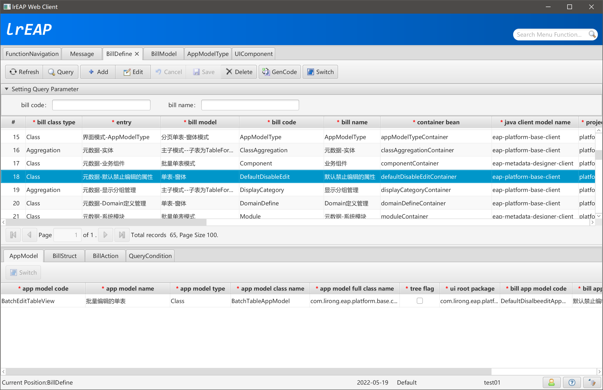
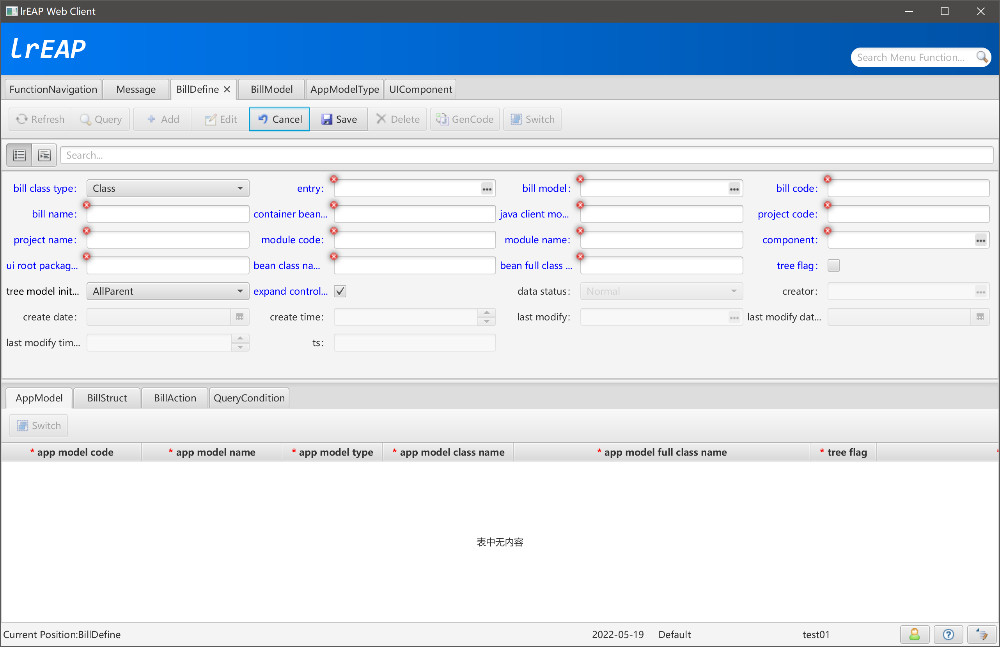
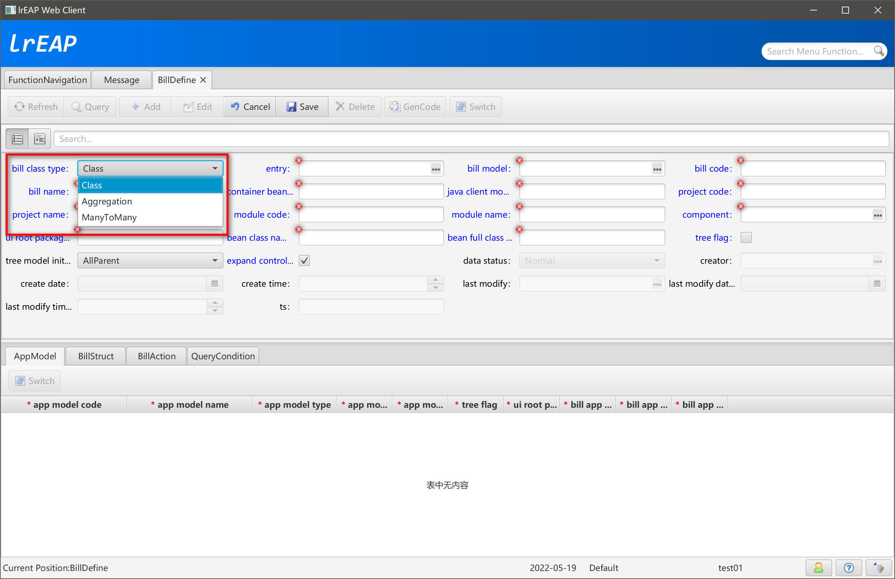
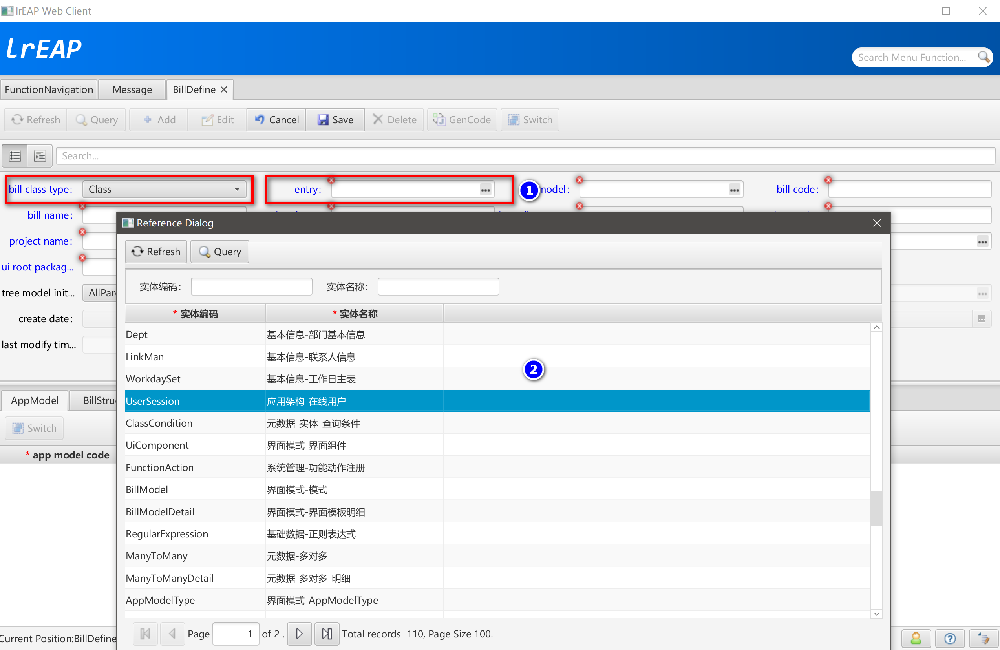
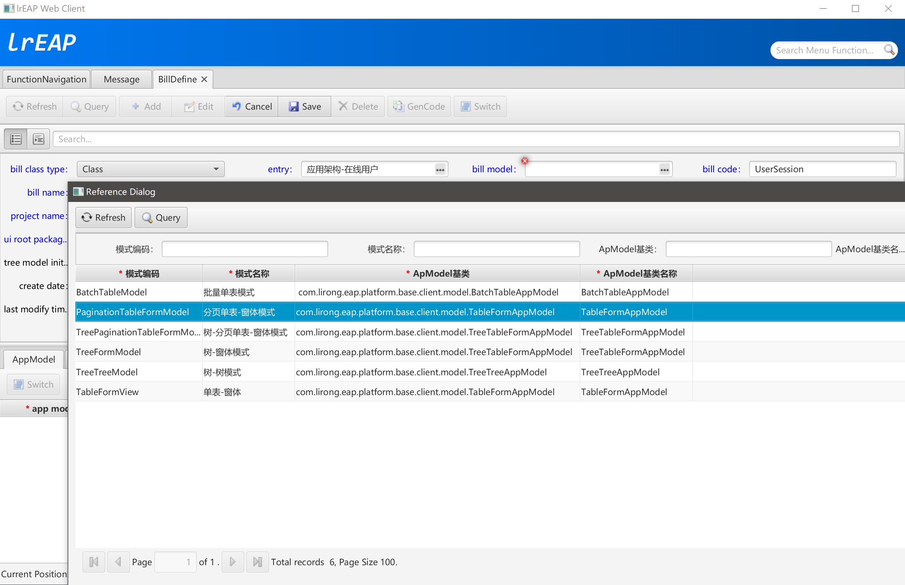
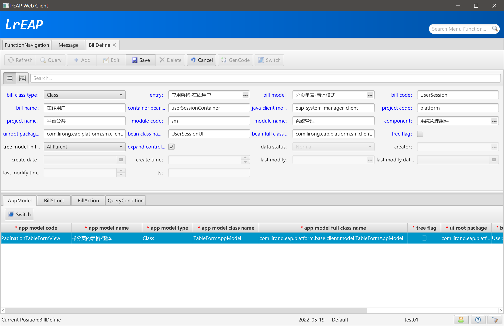
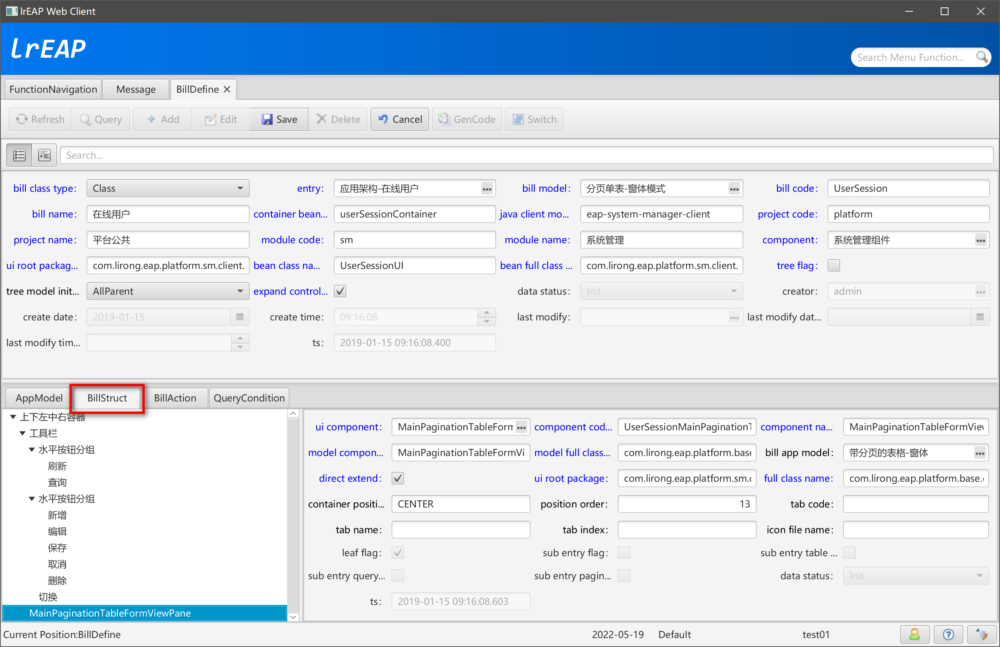
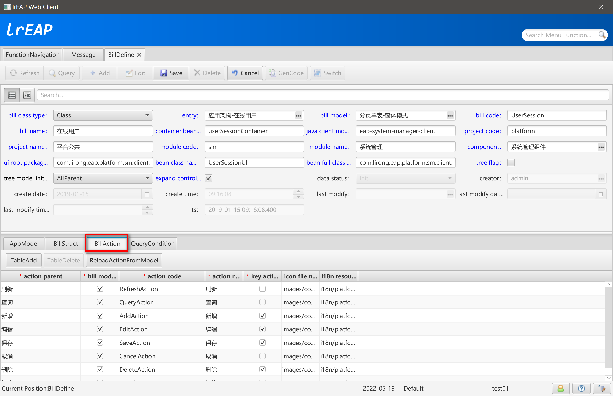
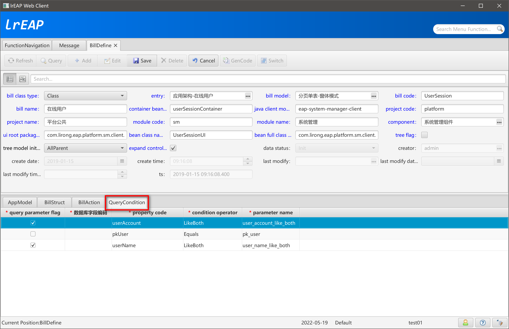
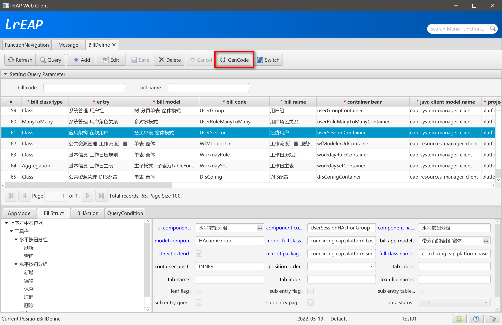

# BillDesigner单据定义

[返回](../../README.md)

## 简述

lrEAP的界面模式，在JavaFX提供的基础组件之上，进行封装、增强、优化，针对我们在界面层面需要解决的问题，提供完整的UI模式。

常见的UI功能界面，主要有以下几个部分构成：

工具栏。提供一系列按钮，用于完成特定的操作。这些按钮，可能还与功能权限、数据权限、流程权限等相关。

业务数据展现及管理。以多种形式展现、管理业务数据。这部分是整个业务功能界面中最重要的内容。从业务数据的展现形式上看，有单表界面、主子表界面、单子多子表界面、多主多子表界面、树卡界面、树单表界面、树卡表界面、树卡单表界面、树卡多表界面等。从业务数据的管理功能上看，主要有两种形式实现业务数据的新增、修改、删除等功能。一是在Form界面中进行单条业务数据的管理。二是在Table界面中实现对单笔、多笔业务数据的管理。

单据定义的来源数据，是由元数据设计生成单体、树型、聚合、多对多业务对象。

## 打开单据定义设计器


## 单元定义主界面



## 新增单据定义



### 指定单据引用的实体类型



### 选择实体



### 指定界面模式



### AppModel



### Struct



### BillAction



### QueryCondition



## GenCode



## 查看单据定义生成的资源信息

### 前端模块（eap-system-manager-client）

## UserSessionUIConfig

```java
/**
 * <p>Title: LiRong Java Enterprise Application Platform</p>
 * <p>平台公共 - 系统管理</p>
 * Description: 应用架构-在线用户 的 UIConfig类<br>
 * Copyright: lrJAP.com<br>
 * Company: lrJAP.com<br>
 *
 * @author jianjun.yu
 * @version 3.0.0-SNAPSHOT
 * @date 2022-05-19
 * @since 1.0.0-SNAPSHOT
 */
@Configuration
@Lazy
public class UserSessionUIConfig {

    // App Model

    @ClientBean
    @Scope(AppModelScope.APP_MODEL_SCOPE_NAME)
    public UserSessionAppModel userSessionAppModel() {

        return new UserSessionAppModel();
    }

    // Main UI
    @ClientBean
    public UserSessionUI userSessionContainer(
            @Qualifier("userSessionAppModel") UserSessionAppModel userSessionAppModel, // $NON-NLS$
            @Qualifier("userSessionToolbar") ActionGroupBox userSessionToolbar
            , @Qualifier("userSessionTableFormPane") MainPaginationTableFormViewPane userSessionTableFormPane) { // $NON-NLS$

        UserSessionUI userSessionUI = new UserSessionUI();
        userSessionUI.setAppModel(userSessionAppModel);
        userSessionUI.setToolbar(userSessionToolbar);
        userSessionUI.setTableFormPane(userSessionTableFormPane);
        return userSessionUI;
    }

    @ClientBean
    public MainPaginationTableFormViewPane userSessionTableFormPane(
            @Qualifier("userSessionAppModel") UserSessionAppModel userSessionAppModel, // $NON-NLS$
            @Qualifier("userSessionTableViewPane") PaginationTableFormViewPane userSessionTableViewPane, // $NON-NLS$
            @Qualifier("userSessionFormView") MainBillFormView userSessionFormView) { // $NON-NLS$

        MainPaginationTableFormViewPane tableFormPane = new MainPaginationTableFormViewPane();
        tableFormPane.setAppModel(userSessionAppModel);
        tableFormPane.setTablePane(userSessionTableViewPane);
        tableFormPane.setFormView(userSessionFormView);
        return tableFormPane;
    }

    @ClientBean
    public PaginationTableFormViewPane userSessionTableViewPane(
            @Qualifier("userSessionAppModel") UserSessionAppModel userSessionAppModel, // $NON-NLS$
            @Qualifier("userSessionQueryPane") SimpleQueryPane userSessionQueryPane, // $NON-NLS$
            @Qualifier("userSessionPaginationToolbar") PaginationToolbar userSessionPaginationToolbar, // $NON-NLS$
            @Qualifier("userSessionTableView") MainBillTableView userSessionTableView) { // $NON-NLS$

        PaginationTableFormViewPane paginationTablePane = new PaginationTableFormViewPane();
        paginationTablePane.setAppModel(userSessionAppModel);
        paginationTablePane.setQueryPane(userSessionQueryPane);
        paginationTablePane.setPaginationToolbar(userSessionPaginationToolbar);
        paginationTablePane.setBillTableView(userSessionTableView);
        return paginationTablePane;
    }

    @ClientBean
    public SimpleQueryPane userSessionQueryPane(@Qualifier("userSessionAppModel") UserSessionAppModel userSessionAppModel) { // $NON-NLS$

        SimpleQueryPane queryPane = new SimpleQueryPane();
        queryPane.setAppModel(userSessionAppModel);
        queryPane.getQueryCondition().addAll(Arrays.asList(
                "user_account_like_both", "user_name_like_both"
        ));
        return queryPane;
    }

    @ClientBean
    public PaginationToolbar userSessionPaginationToolbar(@Qualifier("userSessionAppModel") UserSessionAppModel userSessionAppModel) { // $NON-NLS$

        PaginationToolbar toolbar = new PaginationToolbar();
        toolbar.setAppModel(userSessionAppModel);
        return toolbar;
    }

    @ClientBean
    public MainBillTableView userSessionTableView(@Qualifier("userSessionAppModel") UserSessionAppModel userSessionAppModel) { // $NON-NLS$

        MainBillTableView tableView = new MainBillTableView();
        tableView.setAppModel(userSessionAppModel);
        tableView.setClassCode("UserSession"); // $NON-NLS$
        return tableView;
    }

    @ClientBean
    public MainBillFormView userSessionFormView(@Qualifier("userSessionAppModel") UserSessionAppModel userSessionAppModel) { // $NON-NLS$

        MainBillFormView formView = new MainBillFormView();
        formView.setAppModel(userSessionAppModel);
        formView.setClassCode("UserSession"); // $NON-NLS$
        return formView;
    }

    @ClientBean
    public ActionGroupBox userSessionToolbar(
            @Qualifier("userSessionRefreshAction") RefreshAction userSessionRefreshAction,
            @Qualifier("userSessionQueryAction") QueryAction userSessionQueryAction,
            @Qualifier("userSessionAddAction") AddAction userSessionAddAction,
            @Qualifier("userSessionEditAction") EditAction userSessionEditAction,
            @Qualifier("userSessionSaveAction") SaveAction userSessionSaveAction,
            @Qualifier("userSessionCancelAction") CancelAction userSessionCancelAction,
            @Qualifier("userSessionDeleteAction") DeleteAction userSessionDeleteAction,
            @Qualifier("userSessionSwitchAction") SwitchAction userSessionSwitchAction) {

            ActionGroupBox toolbar = new ActionGroupBox();
            toolbar.setActionGroups(Arrays.asList(
                new HActionGroup(Arrays.asList(
                        userSessionRefreshAction,
                        userSessionQueryAction
                )),
                new HActionGroup(Arrays.asList(
                        userSessionAddAction,
                        userSessionEditAction,
                        userSessionSaveAction,
                        userSessionCancelAction,
                        userSessionDeleteAction
                )),
                userSessionSwitchAction
            ));
            return toolbar;
    }


    @ClientBean
    public RefreshAction userSessionRefreshAction(@Qualifier("userSessionAppModel") UserSessionAppModel userSessionAppModel) {

        return new RefreshAction(userSessionAppModel);
    }

    @ClientBean
    public QueryAction userSessionQueryAction(@Qualifier("userSessionAppModel") UserSessionAppModel userSessionAppModel) {

        return new QueryAction(userSessionAppModel);
    }

    @ClientBean
    public AddAction userSessionAddAction(@Qualifier("userSessionAppModel") UserSessionAppModel userSessionAppModel) {

        return new AddAction(userSessionAppModel);
    }

    @ClientBean
    public EditAction userSessionEditAction(@Qualifier("userSessionAppModel") UserSessionAppModel userSessionAppModel) {

        return new EditAction(userSessionAppModel);
    }

    @ClientBean
    public SaveAction userSessionSaveAction(@Qualifier("userSessionAppModel") UserSessionAppModel userSessionAppModel) {

        return new SaveAction(userSessionAppModel);
    }

    @ClientBean
    public CancelAction userSessionCancelAction(@Qualifier("userSessionAppModel") UserSessionAppModel userSessionAppModel) {

        return new CancelAction(userSessionAppModel);
    }

    @ClientBean
    public DeleteAction userSessionDeleteAction(@Qualifier("userSessionAppModel") UserSessionAppModel userSessionAppModel) {

        return new DeleteAction(userSessionAppModel);
    }

    @ClientBean
    public SwitchAction userSessionSwitchAction(@Qualifier("userSessionAppModel") UserSessionAppModel userSessionAppModel) {

        return new SwitchAction(userSessionAppModel);
    }


    /******************************************************************************************************************/
    /********************************************** lrEAP Code Generator **********************************************/
    /******************************************************************************************************************/
}
```

## UserSessionAppModel

```java
/**
 * <p>Title: LiRong Java Enterprise Application Platform</p>
 * <p>平台公共 - 系统管理</p>
 * Description: 应用架构-在线用户 的 AppModel类<br>
 * Copyright: lrJAP.com<br>
 * Company: lrJAP.com<br>
 *
 * @author jianjun.yu
 * @version 3.0.0-SNAPSHOT
 * @date 2022-05-19
 * @since 1.0.0-SNAPSHOT
 */
public class UserSessionAppModel extends TableFormAppModel {

    @Autowired
    private IUserSession userSessionService;

    public UserSessionAppModel() {

        super();
        setMetadataClassCode("UserSession"); // $NON-NLS$
    }

    @Override
    public void initQueryParamVO() {

        setQueryParamVO(new UserSessionFXVO(new UserSessionVO()));
    }

    @Override
    public IUserSession getBusinessModelService() {

        return this.userSessionService;
    }

    @Override
    public void handleEvent(AppModelEvent event) {

    }

    @Override
    public void prepareSelectedDataAfterSet() {

    }

    @Override
    public void customCancelEdit() {

    }

    @Override
    public UserSessionFXVO getSelectedData() {

        return (UserSessionFXVO) super.getSelectedData();
    }

    /******************************************************************************************************************/
    /********************************************** lrEAP Code Generator **********************************************/
    /******************************************************************************************************************/
}
```

## UserSessionUI

```java
/**
 * <p>Title: LiRong Java Enterprise Application Platform</p>
 * <p>平台公共 - 系统管理</p>
 * Description: 应用架构-在线用户 的 UI类<br>
 * Copyright: lrJAP.com<br>
 * Company: lrJAP.com<br>
 *
 * @author jianjun.yu
 * @version 3.0.0-SNAPSHOT
 * @date 2022-05-19
 * @since 1.0.0-SNAPSHOT
 */
public class UserSessionUI extends LRFunctionNodeBorderPane {

    private UserSessionAppModel appModel;

    private ActionGroupBox toolbar;

    private MainPaginationTableFormViewPane tableFormPane;

    @Override
    public void afterPropertiesSet() throws Exception {

        initUI();
    }

    private void initUI() {

        setTop(getToolbar());
        setCenter(getTableFormPane());
    }

    @Override
    public void handleEvent(AppModelEvent event) {

    }

    public UserSessionAppModel getAppModel() {

        return appModel;
    }

    public void setAppModel(UserSessionAppModel appModel) {

        this.appModel = appModel;
        this.appModel.addAppModelEventListener(this);
    }

    public ActionGroupBox getToolbar() {

        return toolbar;
    }

    public void setToolbar(ActionGroupBox toolbar) {

        this.toolbar = toolbar;
    }

    public MainPaginationTableFormViewPane getTableFormPane() {

        return tableFormPane;
    }

    public void setTableFormPane(MainPaginationTableFormViewPane tableFormPane) {

        this.tableFormPane = tableFormPane;
    }

    @Override
    public Map<KeyCombination, Action> getAllCustomActionKeyCombination() {

        return toolbar == null ? null : toolbar.getAllCustomActionKeyCombination();
    }

    /******************************************************************************************************************/
    /********************************************** lrEAP Code Generator **********************************************/
    /******************************************************************************************************************/
}
```


[返回](../../README.md)
