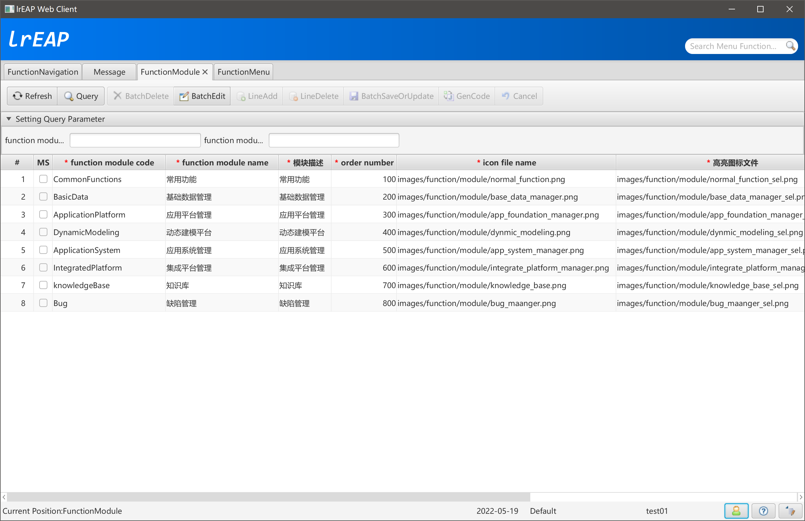
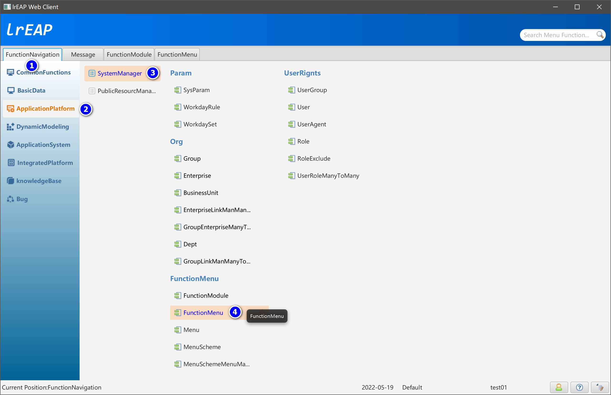
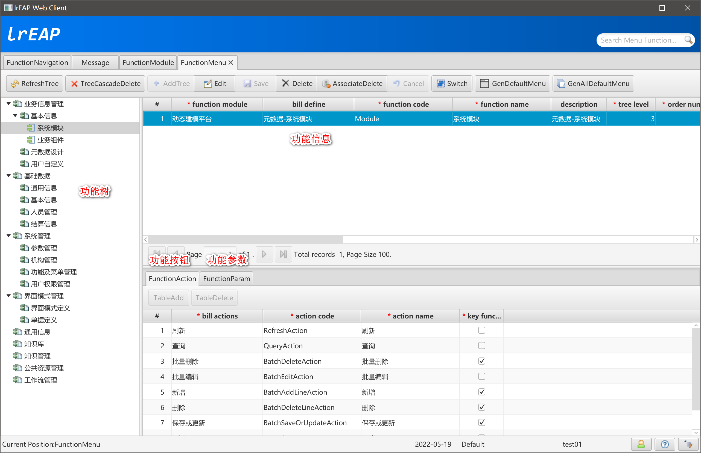
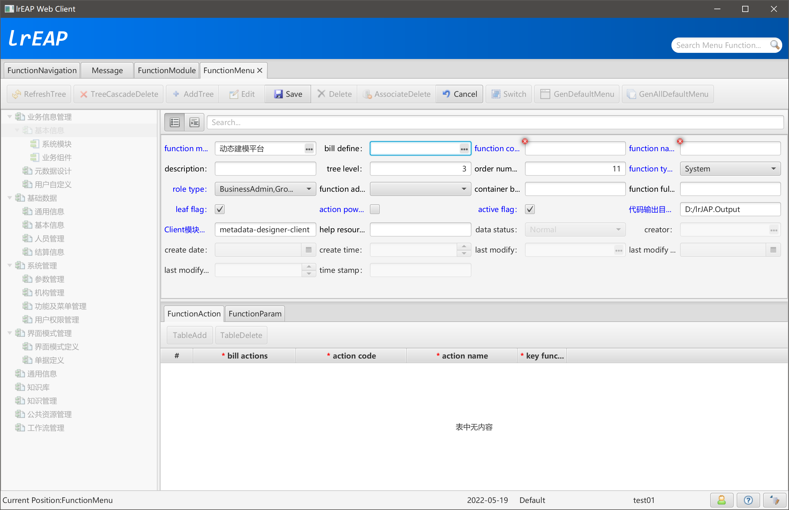
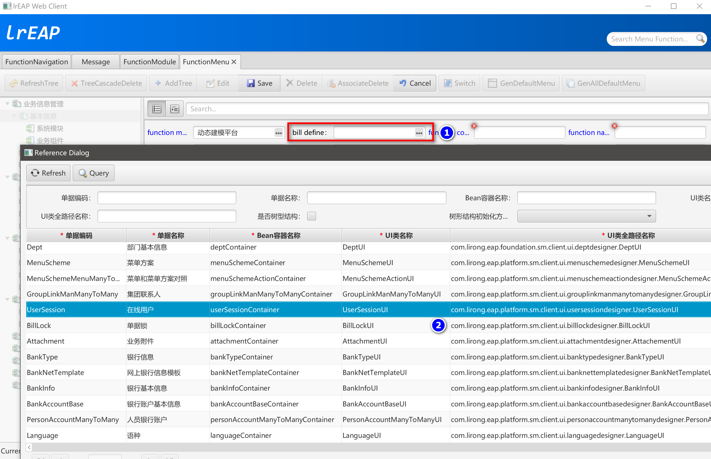
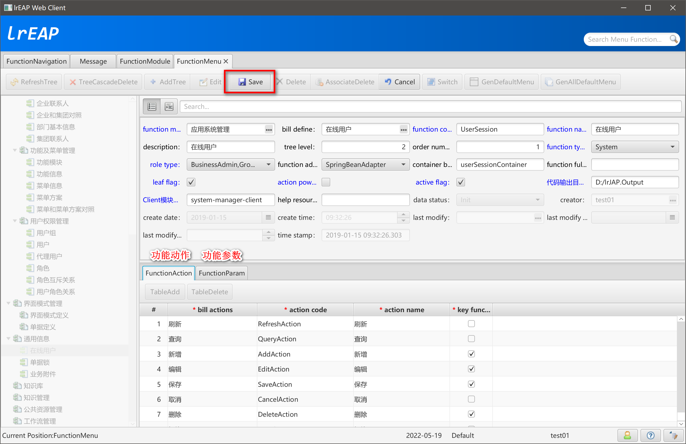
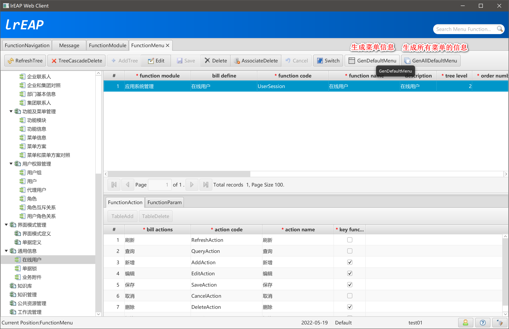
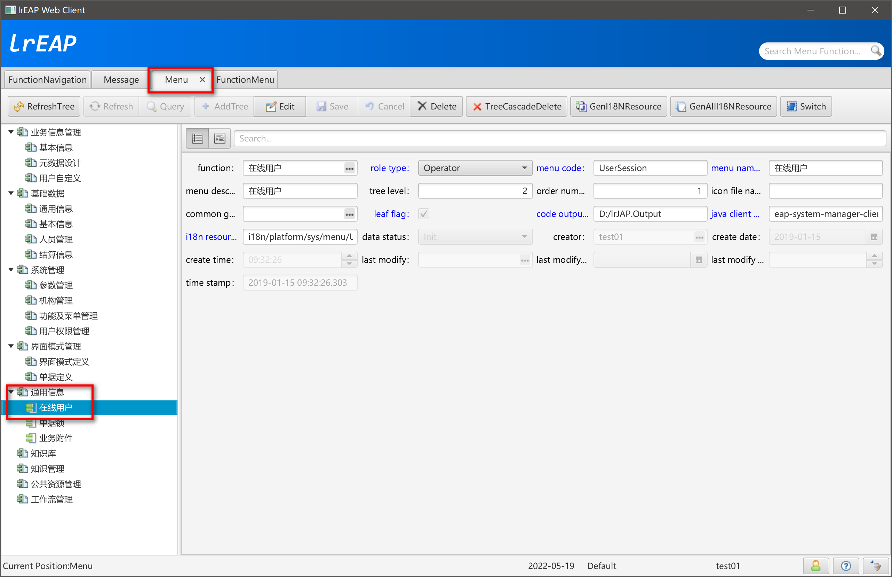

# FunctionDesigner功能定义

[返回](../../README.md)

## 简述

基于元数据（单一信息、树型结构、聚合对象、多对多对象）信息，在数据库中生成功能定义信息。

## FunctionModule

## 打开功能定义设计器

## 功能定义主界面

## 新增功能定义

### 选择单据定义

### 保存单据定义

### 生成菜单信息

### 查看生成菜单信息产生的资源信息

[返回](../../README.md)