# I18NDesigner国际化资源设计器

[返回](../../README.md)

## 简述

随着客户业务的发展以及规模的扩张，企业级应用系统的国际化问题日渐凸显。国际化指系统能够支持多个国家或地区的本地化应用，使得基于该框架开发的应用软件能适应多个地区的语言和文化风俗习惯：

1.	对于程序中的本地敏感数据（随用户区域信息而变化的数据称为本地信息敏感数据，如日期，货币，时间，返回给客户的文本信息等）能根据当前所在的国家或地区的文化习惯进行显示；
2.	对于文本元素(错误提示信息、状态信息等)不是直接硬编码写在应用程序中，而是存储在应用程序外部的资源文件中，在应用程序中通过程序代码来动态获得这些数据；
3.	无需修改和重新编译程序就能支持新的国家或地区的用户使用；
4.	提示、异常等信息不是硬编码在程序代码中，而是需要将它们从应用程序中分离出来，在软件运行时根据本地信息读取相应的文本内容进行显示；
5.	数值、货币、时间、日期等本地敏感数据可能在程序运行时动态产生，所以无法像文字一样简单地将它们从应用程序中分离出来，而是需要特殊处理。建议使用Java 中提供的API 类(位于 java.util 包和 java.text 包中) 解决这些问题。

## 实现机制说明

lrEAP把需要国际化的资源分为以下几个方面：一是界面字段显示名称的国际化；二是代码中提示信息、异常信息中字符串的国际化；三是一些配置文件信息的国际化；四是枚举信息的国际化。

上述资源国际化的实现方式，**没有**基于Spring的MessageSource机制。原因是我们发现Spring MessageSource在设计时，就约定一个项目只能有一份message信息。但lrEAP的应用场景中，这种约定是不合理的。因为对于一个功能，ValueObject的字段以及校验信息、提示信息、界面定义等信息，放到一个文件中是难以管理的，把所有功能等相关的国际化信息放到一个文件中，更加不合理。我们也基于Spring MessageSource，实现了加载多个资源文件的功能，但发现如果多个文件中key相同的信息，会被覆盖。

基于以上的问题，我们决定基于Java实现国际化机制。

### 资源文件位置

资源文件，统一存放在各项目resources/i18n目录下。

 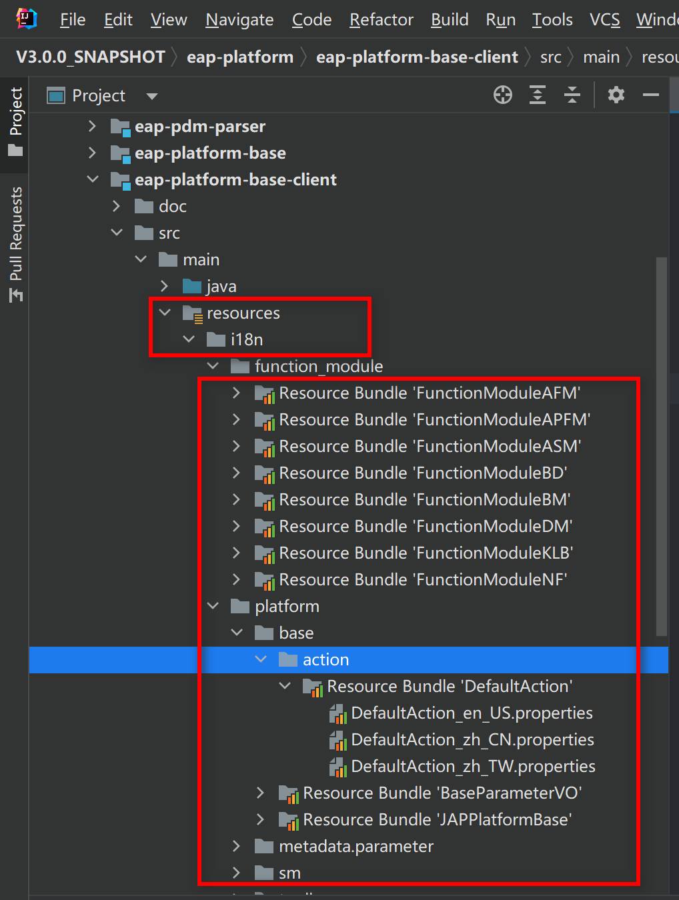

## Java代码提示信息的国际化

如果在开发前期或开发过程中，要求需求及开发人员同步实现资源国际化的配置，难度比较大，甚至是不切实际的。没有哪个开发人员希望或能够做到每写一个提示或异常信息，就同时编写该提示或异常信息的英文、法文等各种版本的资源。

所以我们希望先按中文写提示，然后使用“资源国际化工具”找到（所有或指定）代码中的提示信息，集中进行替换及实现各类国际化（外文）资源。即：对于提示、异常为类资源来说，资源国际化这件事，我们的观点是最好是在代码基本稳定后，再生成国际化资源框架文件，交由专业人员进行完善，并进行相应测试。这样有利于保证开发人员编程逻辑的连贯性和一致性，专业的事情让专业的人去做，减少出错概率。

### 功能说明

- 使用资源ID替换Java文件中的中文信息
- 生成资源ID相对应信息的国际化信息
- 默认生成英文、中文、中文繁体资源文件，英文资源信息需要手工完善

### 打开国际化资源设计器

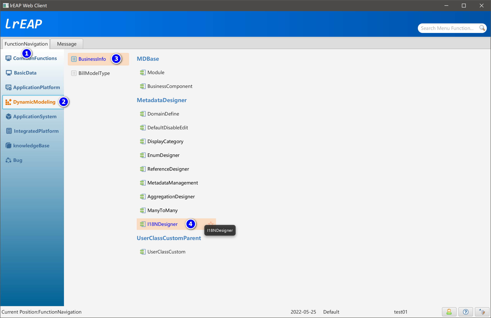

### 国际化资源管理设计器主界面

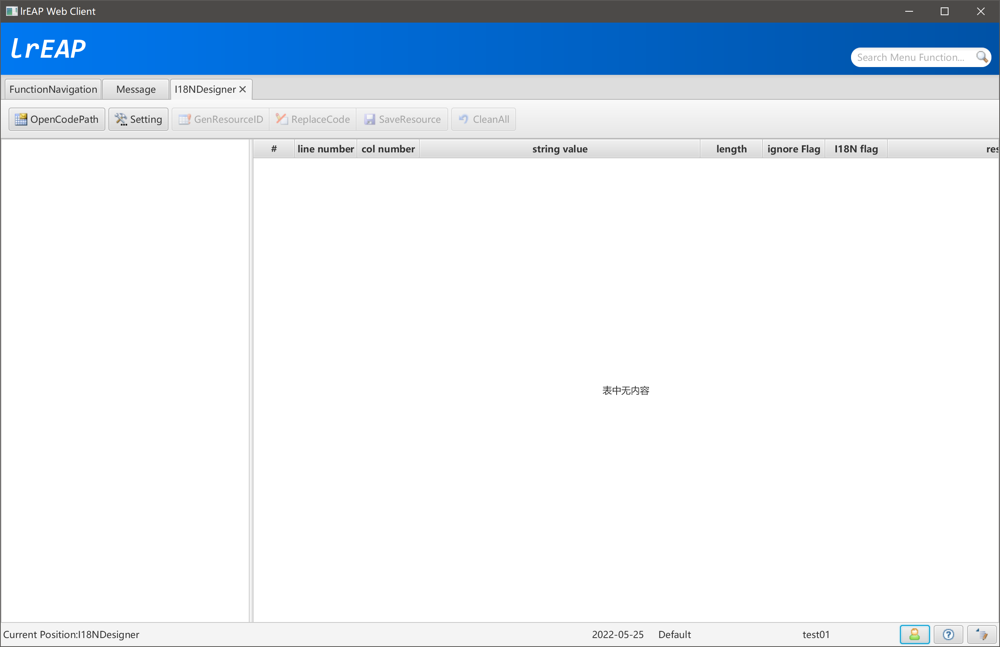

### 打开项目路径

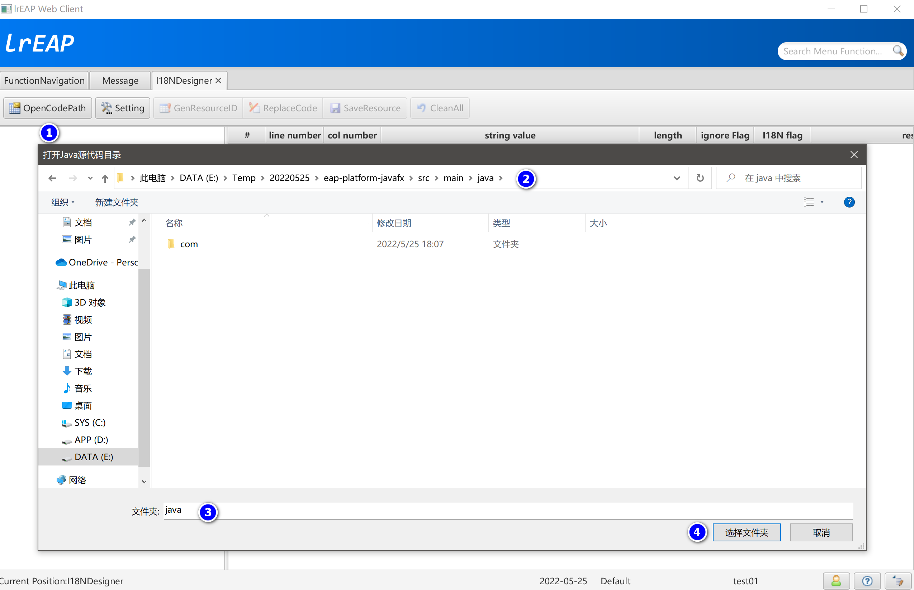

### 查看选中目录下的资源信息

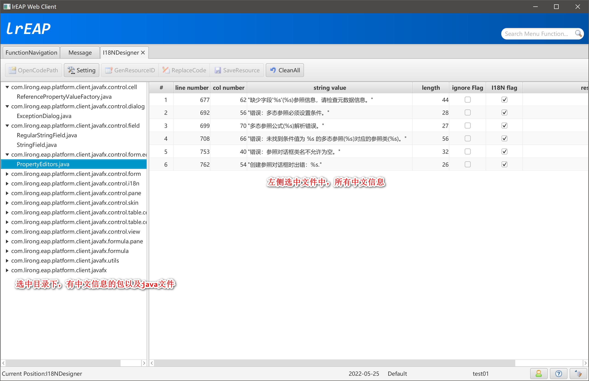

### 参数设置

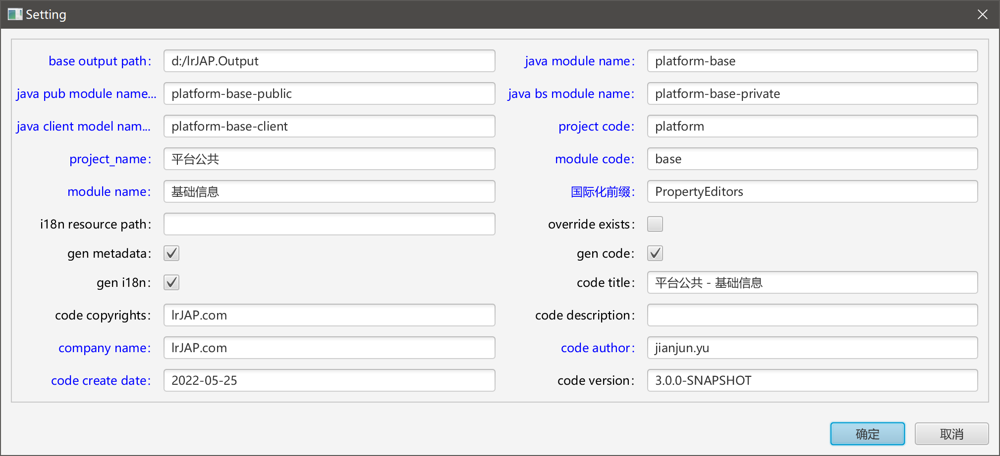

### 生成资源ID

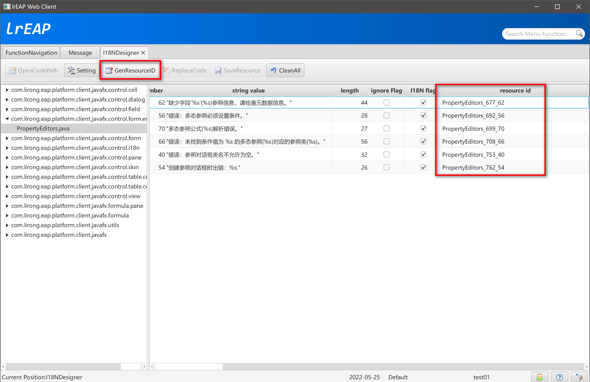

### 确认资源ID

系统自动生存的资源ID可读性比较差，如果有必要，可以不生成或自动生成后，手工修改资源ID。

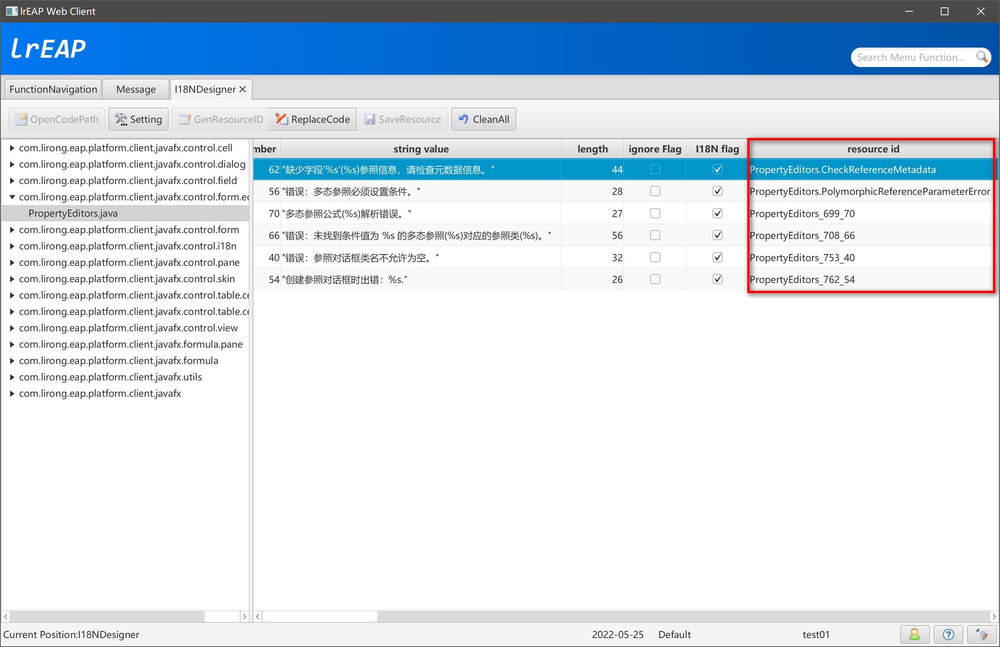

### 使用资源ID替换文件内容

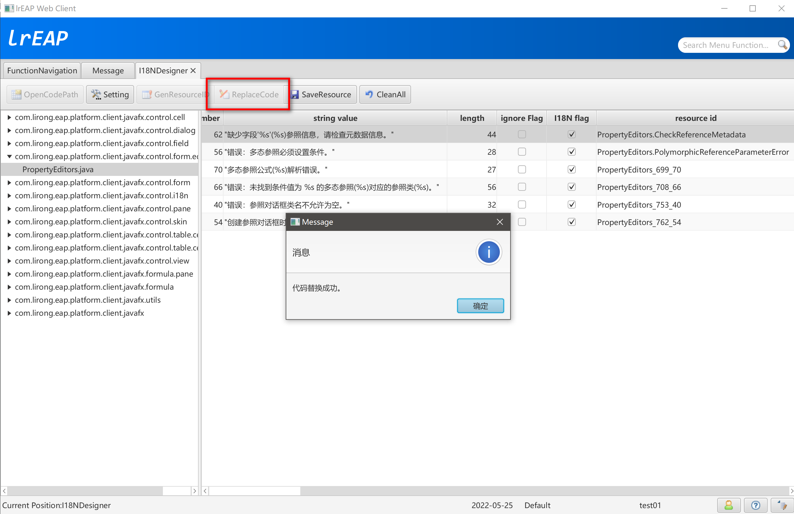

### 查看替换后的文件内容

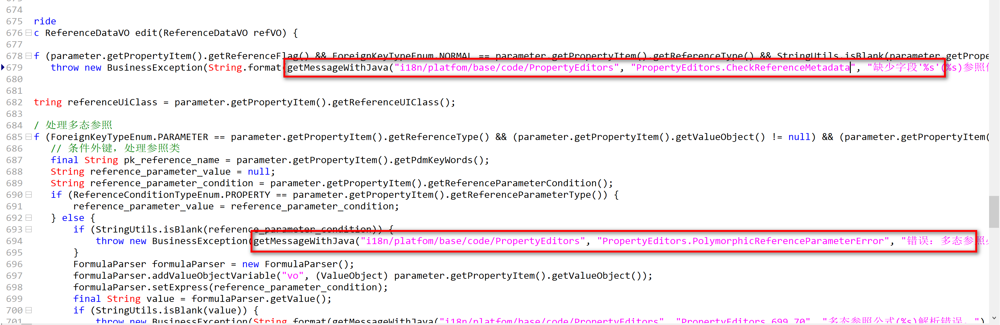

### 生成资源信息

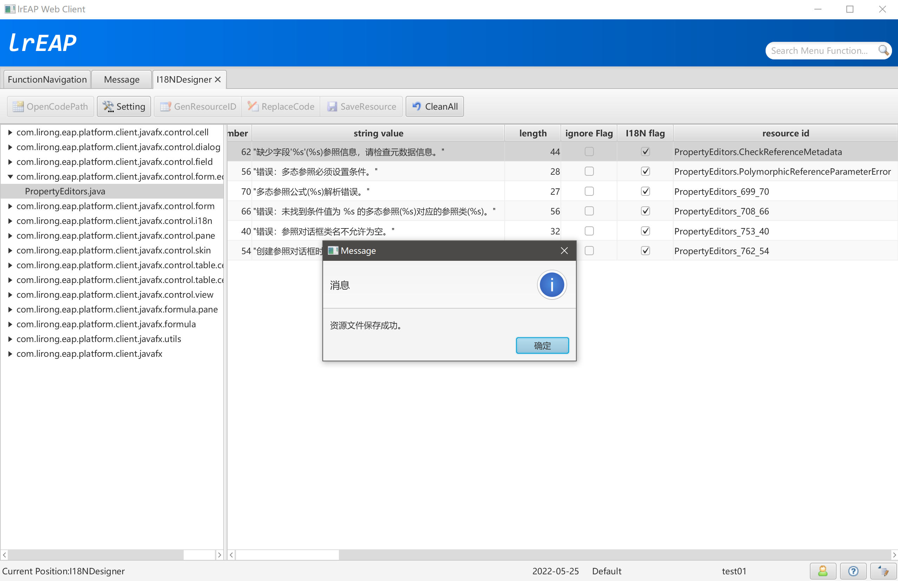

### 查看生成的资源信息

- PropertyEditors_en_US.properties

  ```ini
  # zh_CN Value=缺少字段'%s'(%s)参照信息，请检查元数据信息。
  PropertyEditors.CheckReferenceMetadata=
  # zh_CN Value=错误：多态参照必须设置条件。
  PropertyEditors.PolymorphicReferenceParameterError=
  # zh_CN Value=多态参照公式(%s)解析错误。
  PropertyEditors_699_70=
  # zh_CN Value=错误：未找到条件值为 %s 的多态参照(%s)对应的参照类(%s)。
  PropertyEditors_708_66=
  # zh_CN Value=错误：参照对话框类名不允许为空。
  PropertyEditors_753_40=
  # zh_CN Value=创建参照对话框时出错：%s.
  PropertyEditors_762_54=
  ```

  注意：英文资源文件需要根据中文注释信息，手工进行处理。系统无法自动把中文翻译成中文。

- PropertyEditors_zh_CN.properties

  ```ini
  PropertyEditors.CheckReferenceMetadata=缺少字段'%s'(%s)参照信息，请检查元数据信息。
  PropertyEditors.PolymorphicReferenceParameterError=错误：多态参照必须设置条件。
  PropertyEditors_699_70=多态参照公式(%s)解析错误。
  PropertyEditors_708_66=错误：未找到条件值为 %s 的多态参照(%s)对应的参照类(%s)。
  PropertyEditors_753_40=错误：参照对话框类名不允许为空。
  PropertyEditors_762_54=创建参照对话框时出错：%s.
  ```

  

- PropertyEditors_zh_TW.properties

  ```ini
  PropertyEditors.CheckReferenceMetadata=缺少字段'%s'(%s)參照信息，請檢查元數據信息。
  PropertyEditors.PolymorphicReferenceParameterError=錯誤：多態參照必須設置條件。
  PropertyEditors_699_70=多態參照公式(%s)解析錯誤。
  PropertyEditors_708_66=錯誤：未找到條件值爲 %s 的多態參照(%s)對應的參照類(%s)。
  PropertyEditors_753_40=錯誤：參照對話框類名不允許爲空。
  PropertyEditors_762_54=創建參照對話框時出錯：%s.
  ```

  
