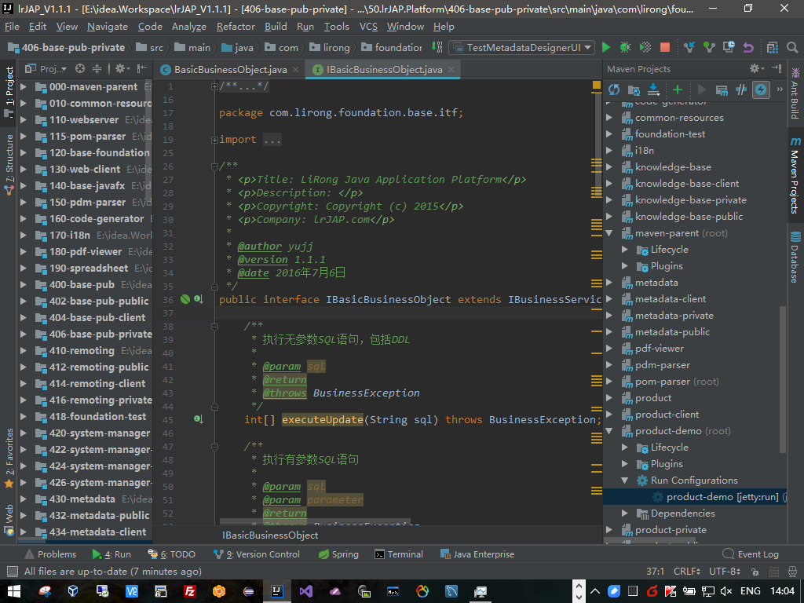
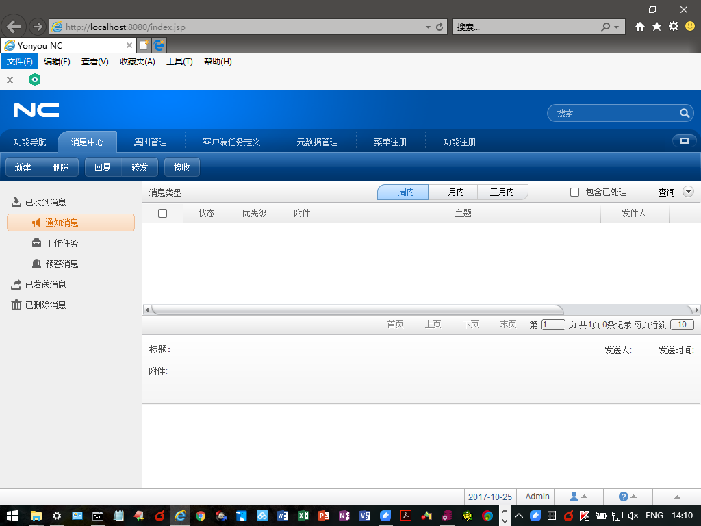
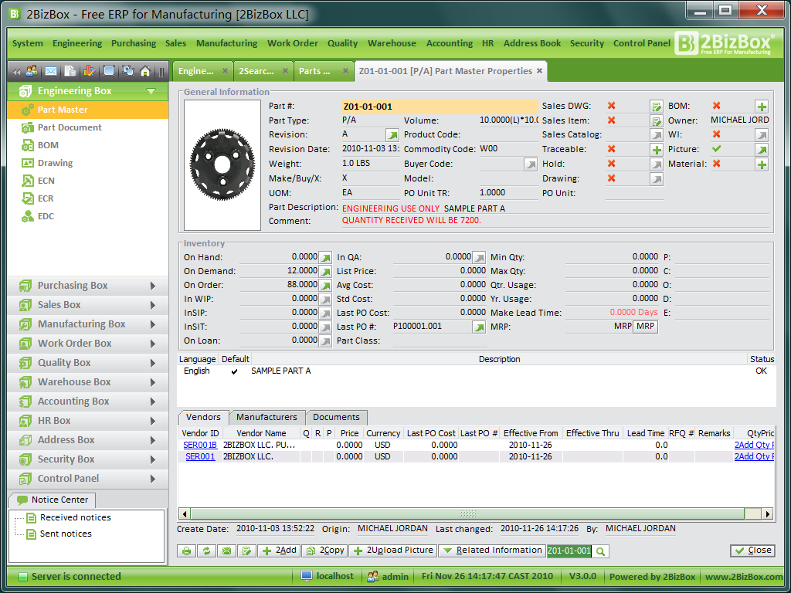
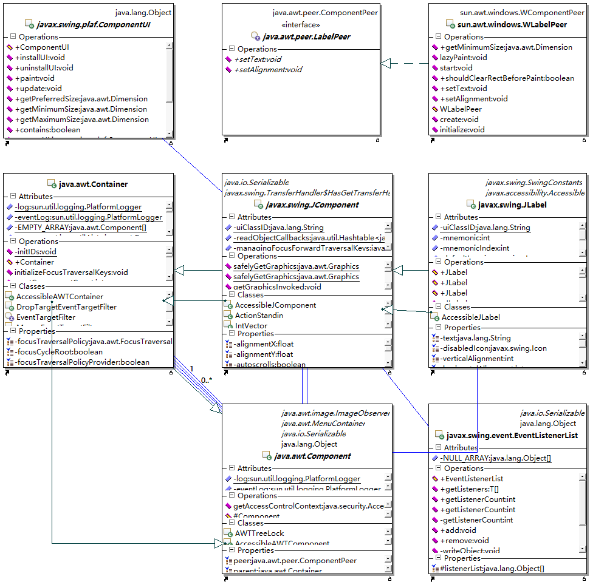
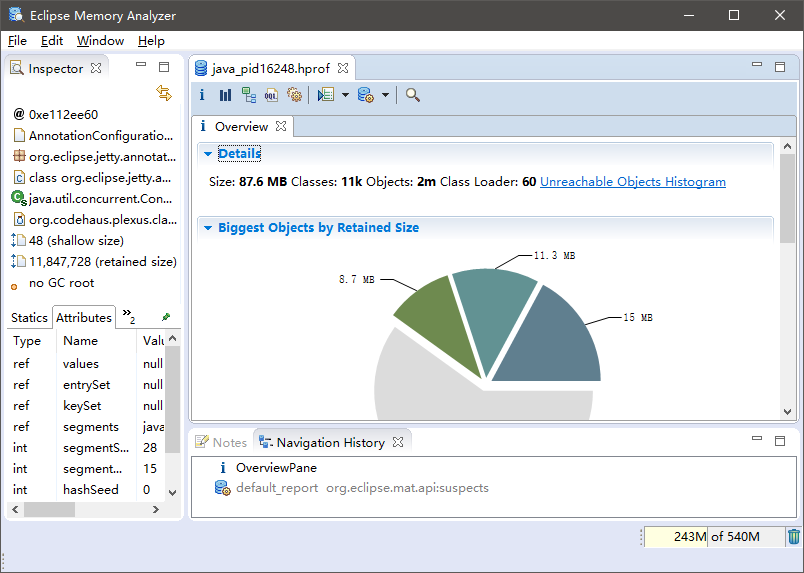

# J1001.Java原生桌面及Web开发浅谈

## 简述

自从Java问世以来，在服务端开发方面取得了巨大的发展。但是在桌面/Web开发方面，一直没有得到大的发展。从最初的AWT，到Swing，再到JavaFX，Java从来没有在桌面/Web解决方案中取得重要席位，更别提占居主导地位了。

## AWT

AWT(Abstract Window ToolKit，抽象窗口工具包)是SUN在1996年推出的UI框架。由于需要跨平台，所以AWT只能支持主流平台共有的界面组件和特性(交集），例如标签、按钮等，这就导致了AWT在组件丰富程度以及功能性等方面必然有欠缺。AWT通过创建一个与操作系统对应的Peer(对等组件)来实现组件在界面上的显示，依靠操作系统本地方法实现图形功能，属于重量级的UI框架。也就是说，当我们使用AWT构建图形界面时，实际上是调用操作系统图形库的功能，在不同的操作系统上有不同的表现。

AWT这种重型的UI框架，无论是历史还是将来，都只会作为基础设施，不会成为桌面应用的解决方案。

## Swing

Swing是在AWT基础上构建的UI框架，全部使用Java编写。Swing提供了比AWT更轻量级、更丰富的UI组件，如树、列表、表格等。AWT是基于操作系统本地方法，所以运行速度较快，Swing是基于AWT的Java程序，采用解释方法执行。Swing绘制的界面在不同的操作系统上表现一致。虽然SUN推出Swing是希望解决AWT面临的问题，然而并没有。

国内很多开发人员对Swing颇有微词，特别是.Net和基于JS的开发人员。即使Swing基于MVC优雅地对AWT进行轻量级封装，但由于一直以来需要跨平台等问题，导致默认情况下Swing构造的应用界面巨丑无比——个人或一般的公司没有能力也没有必要实现复杂的LookAndFeel。同时，Swing一直存在易用性问题，没有像Visual Studio这样的IDE提供可视化支持，一个简单的表格界面都需要手写n多个类才能实现，实在是不胜其烦，特别是对于初学者来说更是如此。

国内很少使用原生Java来开发Web应用的，估计桌面应用都很少。但是Swing在国外还是有一定市场占有的，特别是一些大型的软硬件公司，如IBM、Oracle等，他们的软件跨平台特性是刚需，所以我们经常可以看到一些基于Swing实现的安装程序、管理工具等等。

实际上，只要拥有一定的技术实力、愿意付出足够的资源和代价，Swing也可以做得很漂亮、易用性很好。比如说我们每天都要使用的Eclipse、IntelliJ IDEA，用友NC6，以及2BizBox ERP系统等。还有诸如提供皮肤和UI组件的Substance、SwingX等第三方开源库。

 

（上图：IntelliJ IDEA)

 

（上图：用友NC6)

 

（上图：2BizBox ERP）

上述列举的，是我见过的基于Swing实现的、效果比较炫酷的桌面应用和Web应用的代表。

 

相比于桌面应用，Swing在Web方面的应用效果印证了那句话：没有最惨，只有更惨。要想让Swing能够在浏览器中运行，除了最基础的JRE之外，还需要Applet作为Swing在浏览器中显示的容器——Applet显示在浏览器中，Swing显示在Applet中。Applet能够显示在浏览器中，是基于Netscape公司当年提出的NPAPI(Netscape Plugin Application Programming Interface)技术，这家公司是最早实现浏览器商业化的，但早已经被巨硬公司用免费的IE给搞死了。让我们永远有免费的浏览器可以使用，这是微软公司做过的好事之一，虽然它本意并非如此。

随着时代的发展和技术的进步，人们对网络安全的要求越来越高，对浏览器的安全性要求也越来越高。NPAPI这种十多年前的技术，已经明显不能满足如今的要求。Google Chrome已经连JRE都禁用了，这其中有没有Oracle基于Java告Google侵权要求巨额赔偿的因素就不得而知了；微软公司也在IE中提升了对JRE的限制级别——以前还有“低”选项，如今是“较高”起步。

实际上，就我个人看来，当年Sun公司是有机会对Java的Web开发进行尝试甚至试错的——只要它愿意。结果却是Sun公司把Java一并卖给了Oracle。在IT硬件公司还没有能够把“卖服务”作为自己的利润支撑时，像IBM、Sun这样的公司，软件是为硬件服务的，甚至可以买我的小型机送你软件。

中肯一点说，基于Java的主流的MVC框架，其基本概念都和SWing有千丝万缕的关系。如果作为企业内部网使用的管理型系统、网络环境有保证、允许把一些前台UI类下载到客户端（其实我认为这是优势，应用的入口都是通过浏览器，以一点空间换取相对加快的UI响应速度，我认为还是非常值得的），使用Swing作为界面展现技术还是有优势的。即使在广域网环境中，如果能够保证每客户端与服务器之间有一定的带宽、速率、安全性等前提条件，Swing也能够有较好的表现。

Sun在发展Java桌面/Web能力方面一直心不在焉，也没有实质性推动改进或重新制定Java与浏览器相关的协议和安全标准。反而是JavaScript、HTML5等脚本类语言伴随着浏览器的发展，逐渐成为Web前端开发的主流。从AWT，到Swing，再到JavaFX，其提供的UI组件看上去都是为了解决“有没有”的问题，并不没有真正站在用户，特别是企业级应用开发的角度上去考虑提供丰富、好用的组件，解决快速开发的问题。以最常见的表格为例，Swing要写一堆代码，如果不自己封装，开箱即用、复用性几乎为零。JavaFX应该说比较Swing有一些进步，但在数据类型、操作便利性方便，与企业级应用开发的基本要求仍相去甚远，需要写一堆的TableColumn，需要自己处理复杂数据类型等。再比如Swing的布局就过于技术化，易用性太差，扩展又太麻烦。界面越复杂，代码的复杂越是呈非线性增长。

如上面几个界面所示，Java在桌面开发方面，以Sun/Oracle的标准来讲，恐怕是什么效果都能实现的，但从实际开发人员的角度来讲，只有“狗带”了。

 

既不注重协议和标准，又不注重易用性，让我们这些不会写JS的老程序员想起来就愤怒——写了十多年的代码了，突然发现自己不会写界面。

从Java桌面/Web前端开发所处的尴尬地位，也能够看出，前端真是不好搞。

 

UI端框架的技术实现并不比服务端更复杂，但服务端主要是基于标准的容器，跟CPU、内存、存储、网络等这些具有标准、规范的基础设施打交道，而UI端的实现受制于操作系统，显得规范性不足，各显神通，所以就显得更琐碎、麻烦。有兴趣的同学，可以自行看一下JLabel这种基础Swing界面组件的实现代码。给大家瞻仰一张相关的类图：

 

只是一小部分主要的类和个别接口，这几个类，源代码超过5K行的也不少见。

## SWT

SWT(Standard Widget Toolkit，标准窗口部件）是IBM推出的开源UI组件库，希望解决AWT和Swing运用方面的问题。

SWT没有被包含在JDK或JRE中，不属性JAVA原生的UI框架。但SWT的运用较广泛，如Eclipse、WebSphere等安装程序、MAT等。SWT提供了比Swing更丰富好用的界面组件以及特性，与AWT一样，SWT通过Peer调用操作系统本地方法。同时，SWT通过使用特定操作系统的特性，加快UI组件响应时间，所以SWT需要为不同的操作系统准备安装包。与AWT一样，没有Swing的LookAndFeel功能。来看一张IBM MAT的界面：

 

## JavaFX

Sun在被Oracle收购前的2008年年底推出JavaFX 1.0，希望Java在RIA（RIch Internet Application）方面有所建树。JavaFX 1.0是一种Script，个人感觉巨丑无比。Oracle在2011年与JDK8一起推出了基于原生Java重构的JavaFX2.0，放弃了原先采用JavaFX Script机制。在2014年，与JDK8一起发布了JavaFX8，从此JavaFX成为JDK的一部分。

 

关于JavaFX的详细介绍以及特性，可以参考Oracle官网以及相关资料。之所以写这些文章，并尝试基于JavaFX开发一款应用框架，主要考虑到JavaFX和Swing、JavaScript相比，有以下优势：

1、JavaFX与JDK已经结合在一起(特指从JDK1.8开始的JavaFX8)，JavaFX可以直接使用所有的Java资源，包括第三方类库，这为开发提供了极大的便利——不再需要学习类似JS这类前台框架的语法和特性，从UI端到业务实现都使用Java，并且做到技术和经验通用，能够降低学习成本，开发人员也不必再分什么前后端，每个开发人员都可以具备从前做到后的基本技能。

2、有JRE就可以运行，有时候这是缺点，但在企业应用中应该是可以接受的。

3、提供比较丰富的基础组件库，如ListView、TableView、HTML编辑器等，能够较便捷地设计UI基类和基本框架。

4、提供了较丰富、易用的布局器。如果没有BorderPane（上下左右中布局）等特性，我们是不会使用JavaFX的。

5、提供了界面定义工具（Oracle Scene Builder），虽然还比较土，还没有好意思提供Eclipse Plugin，但对我们来说已经基本够用，况且我们也不会依赖Scene Builder来进行界面构建，而是使用基于Spring Bean实现的“模式+装配”的方式实现界面构建。

6、支持使用CSS自定义界面风格，支持HTML5。

7、提供了较丰富的图形组件。

8、原生打印支持。

9、便于实现Activiti流程图定义、基于Excel的BI工具等对UI要求比较高的组件，这是我们比较想实现的基础组件，在Swing上我们是不敢想象的，编码工作量会十分巨大。

10、JavFX可以很方便地使用到Eclipse Plugin开发中，不需要进行额外的配置等工作，有利于开发基于Eclipse Plugin体系的可视化MDE开发工具。

使用JavaFX + Spring Bean装配机制以利于实现UI模式化开发，是我们选择JavaFX主要的情结。

当然，必须得忍受以下不便或问题：

1、客户端必须安装JDK和JavaFX SDK。

2、JavaFX来得太晚，并且还不是很成熟。大家都在说RIA已经过时，必须使用HTML5了。要承担被人指为“老古板”的风险。但是我们认为，企业级应用中，稳定、高效才是首先要追求的目标。

3、会在客户端保存一些UI资源(jar包、配置信息等)作为Cache，以提升UI响应速度——虽然我们坚持认为在企业级应用中这是优点，但也有可能被攻击为“不是纯B/S”。

4、可能会存在安全性问题——虽然在企业级应用中，这是个大概率的伪命题。