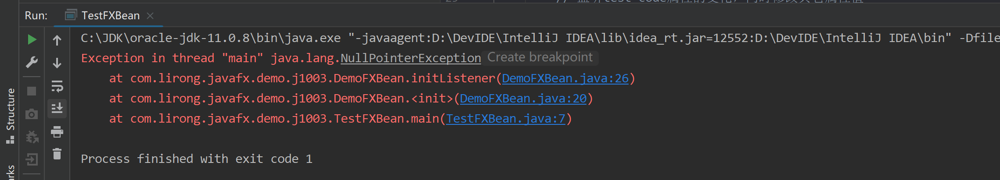
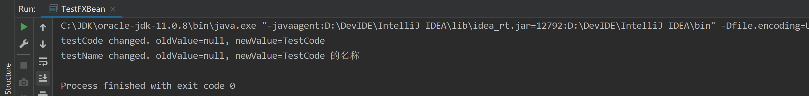
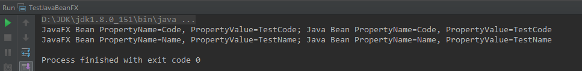
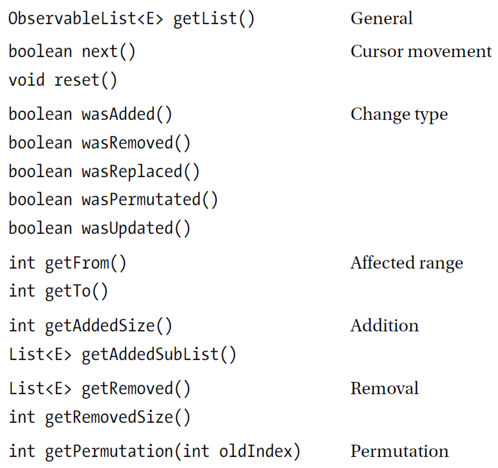
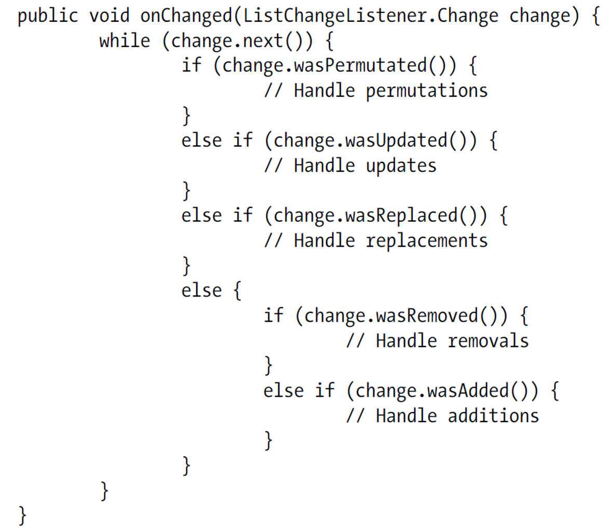
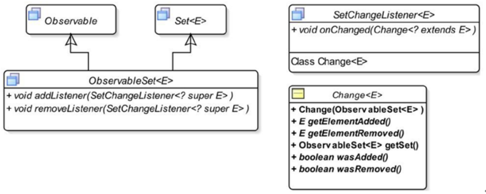
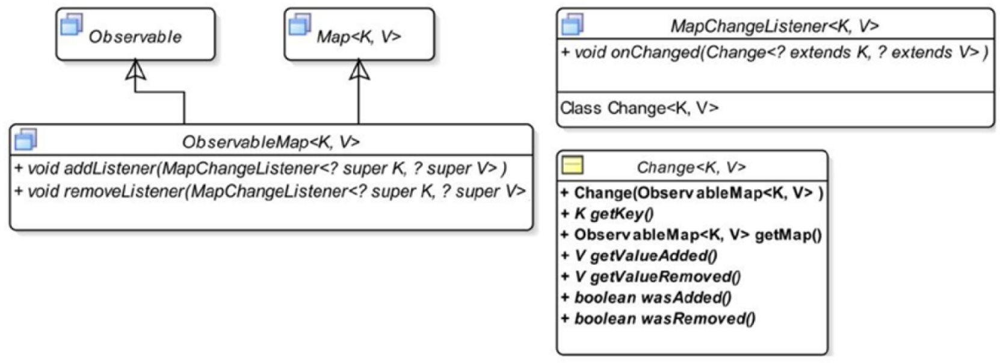

# J1003.JavaFX属性和绑定01——简单对象

## JavaBean扩展

为了实现基于JavaBean的属性、绑定以及事件机制，JavaFX对JavaBean进行了扩展，JavaBean不再是POJO，显得更加“重量级”一些。

## JavaFX属性

### 类图示例


Integer->ReadOnlyIntegerProperty->IntegerProperty->SimpleIntegerProperty->ReadOnlyIntegerWrapper

### JavaFX对简单类型的包装

JavaFX为Java通用包装类提供了通用的属性包装类，以实现事件监听、数据绑定等功能。如下表：

| **Java****包装类** | **JavaFX****虚拟类** | **JavaFX****属性类**  |
| ------------------ | -------------------- | --------------------- |
| Boolean            | BooleanProperty      | SimpleBooleanProperty |
| Double             | DoubleProperty       | SimpleDoubleProperty  |
| Float              | FloatProperty        | SimpleFloatProperty   |
| Integer            | IntegerProperty      | SimpleIntegerProperty |
| Long               | LongProperty         | SimpleLongProperty    |
| String             | StringProperty       | SimpleStringProperty  |
| Object             | ObjectProperty       | SimpleObjectProperty  |
|                    |                      |                       |
| Set                | SetProperty          | SimpleSetProperty     |
| List               | ListProperty         | SimpleListProperty    |
| Map                | MapProperty          | SimpleMapProperty     |

所有这些类都是Observable接口的实现类，以上只是示例了部分，详细类见javafx.beans.property包下。

JavaFX中的Property体系没有实现Serializable接口，所以无法跨JVM传递。也就是说，应用服务器无法向客户端返回这类信息；客户端也无法将这类信息传递给应用服务器。这给我们开发B/S应用系统造成了困扰。

由于需要进行值监听等操作，所以JavaFX的Property对空属性比较敏感，我们在写代码时要特别关注。

### 属性的三个方法

```java
    /**
     * 编码
     */
    private StringProperty testCode = new SimpleStringProperty();

    /**
     * getter
     *
     * @return
     */
    public String getTestCode() {

        return testCode.get();
    }

    /**
     * setter
     * @param testCode
     */
    public void setTestCode(String testCode) {

        this.testCode.set(testCode);
    }

    /**
     * get javafx property
     * @return
     */
    public StringProperty testCodeProperty() {

        return testCode;
    }
```

IDEA等IDE支持生成Property的三个方法。

### 属性监听

- InvalidationListener
- ChangeListener
- addListener

### 属性值初始化和监听器

- 初始化数据的方式（声明时赋值、构造器中赋值）
- 监听器的顺序

### 属性和null

- 属性不可为空。前述三个方法，都是直接针对property进行操作
- 属性值可为空

## 属性和绑定机制

### ObservableValue和Property


两大特性：绑定和监听

### JavaFX绑定(Bindings)

javafx.beans.binding

- 单向绑定/解除绑定（bind/unbind）

- 双向绑定/解除绑定（bindBidirectional/unbindBidirectional）

- javafx.beans.binding.Bindings工具类

  - create…

  - select…

  - bind…

  - unbind…

  - add…

  - subtract…

  - multiply…

  - divide…

  - equal…

  - notEqual…

  - greaterThan…

  - lessThan…

  - greaterThanOrEqual…

  - lessThanOrEqual…

  - min...

  - max...

  - and...

  - or...

  - not...

  - convert...

  - concat...

  - ...

###  属性和绑定机制的作用

- 属性：可观察值变化的对象；
- 绑定：基于属性体系和监听机制，实现属性之间的联动（变化、数值判断、逻辑判断等），同步界面组件和Bean之前的数值；

### JavaFX属性监听机制可能导致的内存泄漏

- 监听器造成泄漏的原因（示例代码）

- 如何避免（WeakChangeListener、WeakInvalidationListener）

  

  

## JavaFX Property对空属性的敏感

如果Property没有初始化，则对其操作时会报出空指针。

```java
package com.lirong.javafx.demo.j1003;

import javafx.beans.property.SimpleStringProperty;
import javafx.beans.property.StringProperty;

public class DemoFXBean {

    /**
     * 编码
     */
    private StringProperty testCode = new SimpleStringProperty();

    /**
     * 名称
     */
    private StringProperty testName = new SimpleStringProperty();

    public DemoFXBean() {

        super();
        initListener();
    }

    private void initListener() {

        // 监听test_code属性的变化，同时修改其它属性值
        testCodeProperty().addListener((observable, oldValue, newValue) -> {

            System.out.println(String.format("testCode changed. oldValue=%s, newValue=%s", oldValue, newValue));
            // 设置其它属性值
            setTestName(String.format("%s 的名称", newValue));
        });

        // 监听test_name属性的变化
        testNameProperty().addListener((observable, oldValue, newValue) -> {

            System.out.println(String.format("testName changed. oldValue=%s, newValue=%s", oldValue, newValue));
        });
    }

    public String getTestCode() {

        return testCode.get();
    }

    public StringProperty testCodeProperty() {

        return testCode;
    }

    public void setTestCode(String testCode) {

        this.testCode.set(testCode);
    }

    public String getTestName() {

        return testName.get();
    }

    public StringProperty testNameProperty() {

        return testName;
    }

    public void setTestName(String testName) {

        this.testName.set(testName);
    }
}
```

我们可以看到，J**avaFX Bean****中，每个属性都会有三个方法**：

1、getter值的方法，如getTest_code();

2、setter值的方法，如setTest_code(String test_code);

3、获取属性的方法，如test_codeProperty();

 

当我们使用以下代码进行测试时：

```java
package com.lirong.javafx.demo.j1003;

public class TestFXBean {

    public static void main(String[] args) {

        DemoFXBean demoFXBean = new DemoFXBean();
        demoFXBean.setTestCode("TestCode");
    }
}
```

控制台输出：

 

从DemoFXBean的代码可以看出，对属性操作的三个方法，都是基于Property进行的。所以如果不初始化Property，get、set时，就会发生空指针异常。

## 一个简单的JavaFX Bean

当Bean中某个字段值发生变化时，打印信息并修改其它值。我们把DemoFXBean修改一下，主要通过 new SimpleStringProperty 初始化两个属性：

```java
package com.lirong.javafx.demo.j1003;

import javafx.beans.property.SimpleStringProperty;
import javafx.beans.property.StringProperty;

public class DemoFXBean {

    /**
     * 编码
     */
    private StringProperty testCode = new SimpleStringProperty();

    /**
     * 名称
     */
    private StringProperty testName = new SimpleStringProperty();

    public DemoFXBean() {

        super();
        initListener();
    }

    private void initListener() {

        // 监听test_code属性的变化，同时修改其它属性值
        testCodeProperty().addListener((observable, oldValue, newValue) -> {

            System.out.println(String.format("testCode changed. oldValue=%s, newValue=%s", oldValue, newValue));
            // 设置其它属性值
            setTestName(String.format("%s 的名称", newValue));
        });

        // 监听test_name属性的变化
        testNameProperty().addListener((observable, oldValue, newValue) -> {

            System.out.println(String.format("testName changed. oldValue=%s, newValue=%s", oldValue, newValue));
        });
    }

    public String getTestCode() {

        return testCode.get();
    }

    public StringProperty testCodeProperty() {

        return testCode;
    }

    public void setTestCode(String testCode) {

        this.testCode.set(testCode);
    }

    public String getTestName() {

        return testName.get();
    }

    public StringProperty testNameProperty() {

        return testName;
    }

    public void setTestName(String testName) {

        this.testName.set(testName);
    }
}
```

主要修改了以下内容：

1、初始化Property；

2、增加监听器；

再运行TestFXBean测试类时，控制台打印如下信息：

 

可以看到，两个监听器都产生了预期的动作。

## JavaBean的属性监听机制

如前所述，JavaFX的Property由于没有实现序列化，所以无法跨JVM传递。所以我们要有一种JavaFX Bean和JavaBean之间的包装、转换机制，使Bean能够跨JVM。这种机制是我们后续在B/S框架中使用JavaFX的必要准备。

我们的方法是：改造javaBean，通过改造后的JavaBean包装生成JavaFX Bean，并使JavaBean和JavaFX Bean之间的属性实现双向联动。

### 增加一个DemoJavaBean，为其实现属性监听

```java
package com.lirong.javafx.demo.j1003;

import java.beans.PropertyChangeListener;
import java.beans.PropertyChangeSupport;
import java.io.Serializable;

public class DemoJavaBean implements Serializable {

    private static final long serialVersionUID = -6499105304636177551L;

    protected final PropertyChangeSupport propertyChangeSupport = new PropertyChangeSupport(this);

    /**
     * 编码
     */
    private String testCode;

    /**
     * 名称
     */
    private String testName;

    public String getTestCode() {

        return testCode;
    }

    public void setTestCode(String testCode) {

        final String oldValue = this.testCode;
        this.testCode = testCode;
        propertyChangeSupport.firePropertyChange("testCode", oldValue, this.testCode);
    }

    public String getTestName() {

        return testName;
    }

    public void setTestName(String testName) {

        final String oldValue = this.testName;
        this.testName = testName;
        propertyChangeSupport.firePropertyChange("testName", oldValue, this.testName);
    }

    public void addPropertyChangeListener(PropertyChangeListener listener) {

        propertyChangeSupport.addPropertyChangeListener(listener);
    }

    public void removePropertyChangeListener(PropertyChangeListener listener) {

        propertyChangeSupport.removePropertyChangeListener(listener);
    }
}
```

需要注意的是：

1、为DemoJavaBean增加了PropertyChangeSupport属性，并增加了两个相关方法addPropertyChangeListener和removePropertyChangeListener；

2、在setter中，产生属性变化事件，并传递修改前、修改后的值；

3、该类实现了序列化接口；

### 增加DemoJavaFXBean类

```java
package com.lirong.javafx.demo.j1003;

import javafx.beans.property.SimpleStringProperty;
import javafx.beans.property.StringProperty;
import javafx.beans.property.adapter.JavaBeanStringPropertyBuilder;

public class DemoJavaFXBean {

    private DemoJavaBean javaBean;

    /**
     * 编码
     */
    private StringProperty testCode = new SimpleStringProperty();

    /**
     * 名称
     */
    private StringProperty testName = new SimpleStringProperty();

    /**
     * DemoJavaFXBean的构造器，必须传入一个DemoJavaBean，用于初始化属性
     *
     * @param javaBean
     */
    public DemoJavaFXBean(DemoJavaBean javaBean) {

        super();
        this.javaBean = javaBean;
        initProperty();
    }

    /**
     * 通过 DemoJavaBean 初始化 DemoJavaFXBean 的属性
     */
    private void initProperty() {

        // 根据JavaBean初始化JavaFX Bean的属性
        try {
            /* 编码 */
            testCode = JavaBeanStringPropertyBuilder.create().bean(this.javaBean).name("testCode").build();
            /* 名称 */
            testName = JavaBeanStringPropertyBuilder.create().bean(this.javaBean).name("testName").build();
        } catch (Exception ex) {
            throw new RuntimeException(ex);
        }
    }

    public DemoJavaBean getJavaBean() {

        return javaBean;
    }

    public void setJavaBean(DemoJavaBean javaBean) {

        this.javaBean = javaBean;
        // 设置JavaBean后，需要重新初始化JavaFX Bean
        initProperty();
    }

    public String getTestCode() {

        return testCode.get();
    }

    public StringProperty testCodeProperty() {

        return testCode;
    }

    public void setTestCode(String testCode) {

        this.testCode.set(testCode);
    }

    public String getTestName() {

        return testName.get();
    }

    public StringProperty testNameProperty() {

        return testName;
    }

    public void setTestName(String testName) {

        this.testName.set(testName);
    }
}
```

需要注意的是：

1、DemoJavaFXBean的构造器，授受一个DemoJavaBean，以进行本类的属性初始化；

2、通过initProperty方法进行属性初始化；

3、该类没有实现序列化接口，JavaFX的Property等机制均未实现序列化接口；

 

### 测试类TestJavaBeanFX

主要用于测试属性修改是否在JavaFX Bean和JavaBean之间自动联动：

```java
package com.lirong.javafx.demo.j1003;

public class TestJavaBeanFX {

    public static void main(String[] args) {

        DemoJavaBean demoJavaBean = new DemoJavaBean();

        DemoJavaFXBean demoJavaFXBean = new DemoJavaFXBean(demoJavaBean);

        final String strFormatter = "JavaFX Bean PropertyName=%s, PropertyValue=%s; Java Bean PropertyName=%s, PropertyValue=%s";
        // 修改Java Bean的属性，查看JavaFX Bean相应的属性是否同步修改了
        demoJavaFXBean.getJavaBean().setTestCode("TestCode");
        System.out.println(String.format(strFormatter, "Code", demoJavaFXBean.getTestCode(), "Code", demoJavaFXBean.getJavaBean().getTestCode()));

        // 修改JavaFX Bean的属性，查看Java Bean相应的属性是否同步修改了
        demoJavaFXBean.setTestName("TestName");
        System.out.println(String.format(strFormatter, "Name", demoJavaFXBean.getTestName(), "Name", demoJavaFXBean.getJavaBean().getTestName()));
    }
}
```

控制台输出以下信息：

 

我们可以看到，修改JavaFX Bean或Java Bean的属性值，将同步两个Bean的属性值。

需要注意的是：

1、必须为JavaBean实现属性变化监听事件机制；

2、通过JavaBean构造JavaFX Bean，并实现属性初始化；

总结及说明：

1. 在JavaFX属性机制中，属性不可为空，属性值可以为空。我们在TestJavaBeanFX类中实例化DemoJavaBean时，没有为它的任何属性赋值。但在初始化DemoJavaFXBean时，通过JavaFX的PropertyBuilder产生属性值为空的非空属性。
2. JavaFX提供的Property等没有实现序列化接口，无法跨JVM传递，只能在客户端使用，无法从服务端传递给客户端。
3. 通过TestJavaBeanFX，说明FX Bean和Java Bean之间简单属性同步，说明fxEAP前后台数据传递的基础：
   - 后台把Bean传递给前台，前台基本Bean构造FX Bean，再用于前台处理
   - 前台把FX Bean中的Bean传递给后台，以完成数据交互

## JavaFX Bean和JavaBean

### JavaFX属性序列化问题

JavaFX中所有的Property类均没有实现java.io.Serializable接口，所以无法进行序列化和反序列化，也就无法跨JVM传递。

### 简单包装类型

见“JavaFX对简单类型的包装”

## Observable Collections

从Java Collections扩展，与Property机制一样，有绑定和监听的功能。

#### 类图结构


#### 常用方法



#### 监听示例



## ObservableSet



### ObservableMap



## FXCollections

是java.util.Collections的扩展。

