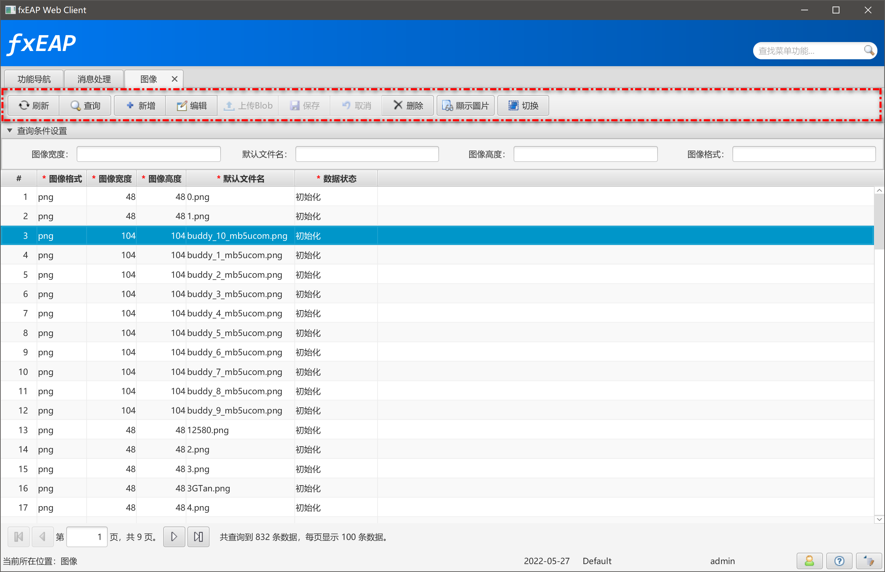
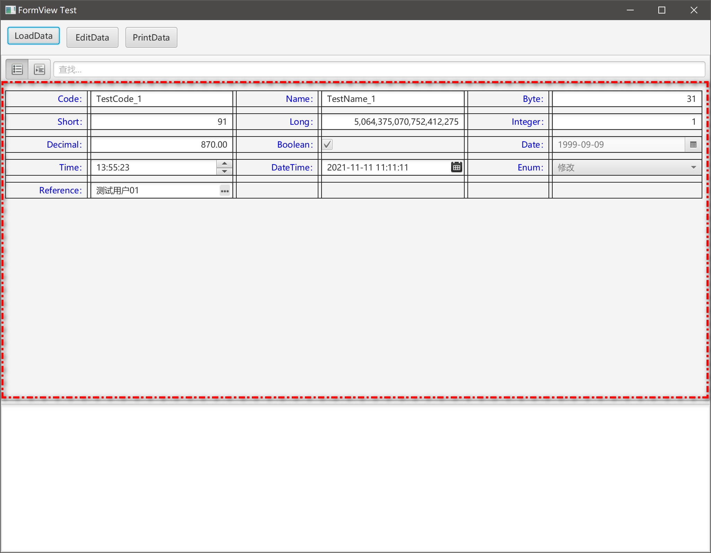

## 简述

lrEAP的UI模式中，GridPane、BorderPane是最基础、常用的两种布局方式。
Form组件使用GridPane布局，界面整体的组装使用BorderPane布局。并且lrEAP中任何布局都必须实现自适应屏幕的功能。

构建用户界面的最大挑战之一是在显示区域。在GUI应用程序中，允许用户在UI控件还可以调整大小，以提供较好的用户体验。与Java的Swing API类似JavaFXAPI具有库存布局，提供了在场景图。以下是常见的JavaFX布局：

```java
javafx.scene.layout.HBox
javafx.scene.layout.VBox
javafx.scene.layout.FlowPane
javafx.scene.layout.BorderPane
javafx.scene.layout.GridPane
```

### Toolbar

使用了HBox、VBox



### FormView


