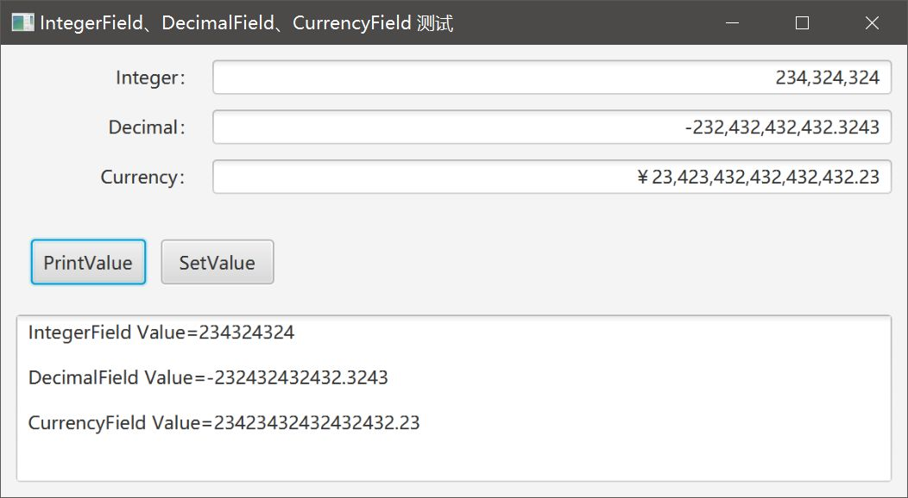

# IntegerField、DecimalField和CurrencyField

我们在处理界面展现时，对于整型、浮点型、金额类型的数据时，希望界面组件至少已经处理了以下事项：

1、不接受非法输入。如对于整型来说，只能输入数字、负号，并且不允许超过当前平台上整形数值的最大值。

2、使用千分位对输入的数据进行格式化。

3、如果是货币型，则获取当前所在区域的货币符号等信息，并据此进行数据格式化。

对于界面处理人员来说，这是对开发组件库最基本的要求。但是实际上，JavaFX没有提供这些或相似的组件。开源组件中也没有找到类似的组件。著名的ControlsFX组件库的开发者额外提供了一个MoneyField，但功能比较弱，并且支持也不算好。

使用Java做界面，你得有这样一种觉悟：JDK提供的界面功能，有时候是比较弱的，甚至是比较弱智的，得自行不断丰富、完善自己的组件库。有时可以采用一些第三方的类库，有时一些特别基础的组件，也得自己写。可能Oracle认为每一个Java界面开发者首先都是合格的界面组件开发人员。

想写这三个组件很久了，一直没有时间。昨天我下班后，坐在新电脑前，发了一会儿呆后，花了几个小时实现了这三个组件。今天上班前，测试完善了一下，感觉可以放出来，供大家参考了。

先看一下效果：

 

有三个输入框，分别只接受Integer、Decimal（4位小数）、Currency类型的数据。并提供两个按钮，一个是打印数值，一个是通过setText()的方式给Decimal赋值。

## NumberTypeEnum

用于区分不同类型的输入数据，以便于基类分别处理。

```java
package com.lirong.foundation.ui.javafx.control;

/**
 * <p>Title: LiRong Java Application Platform</p>
 * Description: AbstractNumberField及其子类支持的数据类型 <br>
 * Copyright: CorpRights lrjap.com<br>
 * Company: lrjap.com<br>
 *
 * @author yujj
 * @version 1.1.1
 * @date 2017-12-27
 */
public enum NumberTypeEnum {
    INTEGER,
    CURRENCY,
    DECIMAL;
}
```

## AbstractNumberField

基类，封装了大多数行为，这是最重要的一个类。

```java
package com.lirong.foundation.ui.javafx.control;

import java.math.BigDecimal;
import java.text.DecimalFormat;
import java.text.DecimalFormatSymbols;
import javafx.geometry.Pos;
import javafx.scene.control.TextField;
import javafx.scene.input.KeyEvent;
import org.apache.commons.lang3.StringUtils;

/**
 * <p>Title: LiRong Java Application Platform</p>
 * Description: 整数、高精度浮点数、货币 数值输入框的虚拟基类，自动校验输入合法性，自动增加货币符号、千分位 <br>
 * Copyright: CorpRights lrjap.com<br>
 * Company: lrjap.com<br>
 *
 * @author yujj
 * @version 1.1.1
 * @date 2017-12-27
 */
public abstract class AbstractNumberField extends TextField {

    private NumberTypeEnum numberType;

    private static final String DEFAULT_NUMBER_SEPARTOR_FORMAT = ",###";

    private final static DecimalFormatSymbols symbols = new DecimalFormatSymbols();

    public AbstractNumberField(NumberTypeEnum numberType) {

        super();
        this.numberType = numberType;
        setAlignment(Pos.CENTER_RIGHT);
        // 输入时的有效性检查
        addEventFilter(KeyEvent.KEY_TYPED, event -> {

            if (!isValid(getText())) {
                event.consume();
            }
        });
        // 格式化
        textProperty().addListener((observableValue, oldValue, newValue) -> {

            if (!isValid(newValue)) {
                setText(oldValue);
            }
            setText(formatValue(getFormatter()));
        });
    }

    /**
     * 格式化数值
     *
     * @param valueFormatter 格式
     * @return
     */
    private String formatValue(final String valueFormatter) {

        if ("-".equals(getText())) {
            return getText();
        }
        String currString = null;
        if (StringUtils.isNotBlank(getText())) {
            if (getText().endsWith(".") || getText().endsWith(getCurrencySymbols())) {
                return getText();
            }
            DecimalFormat numberFormatter = new DecimalFormat(valueFormatter);
            if (NumberTypeEnum.INTEGER == this.numberType) {
                Integer currValue = getIntegerValue();
                currString = numberFormatter.format(currValue);
            } else {
                BigDecimal currValue = getDecimalValue();
                currString = numberFormatter.format(currValue);
            }
        }
        return currString;
    }

    /**
     * 数值有效性检查
     *
     * @param value 带格式的字符串
     * @return
     */
    private boolean isValid(final String value) {

        if (StringUtils.isBlank(value) || value.equals("-")) {
            return true;
        }

        try {
            if (NumberTypeEnum.INTEGER == this.numberType) {
                getIntegerValue();
            } else if (NumberTypeEnum.CURRENCY == this.numberType) {
                getDecimalValue();
            } else {
                getCurrencyValue();
            }
            return true;
        } catch (NumberFormatException ex) {
            return false;
        }
    }

    /**
     * 转为整型
     *
     * @return
     */
    protected Integer getIntegerValue() {

        if (StringUtils.isBlank(getText()) || "-".equals(getText())) {
            return null;
        }
        return Integer.valueOf(getText().replace(",", ""));
    }

    /**
     * 转为BigDecimal
     *
     * @return
     */
    protected BigDecimal getDecimalValue() {

        return getDecimalValue('.');
    }

    /**
     * 转为货币
     *
     * @return
     */
    protected BigDecimal getCurrencyValue() {

        return getDecimalValue(getCurrencySeparator());
    }

    private BigDecimal getDecimalValue(final char separator) {

        if (StringUtils.isBlank(getText()) || "-".equals(getText())) {
            return null;
        }
        int pos = getText().indexOf(separator);
        if (pos > -1) {
            final String subStr = getText().substring(pos + 1, getText().length());
            if (subStr.length() > decimalScale()) {
                throw new NumberFormatException("Scale error.");
            }
        }
        return new BigDecimal(getText().replace(",", "").replace(getCurrencySymbols(), ""));
    }

    /**
     * 生成用于格式化数据的字符串
     *
     * @return
     */
    protected String getFormatter() {

        if (this.numberType == null) {
            throw new RuntimeException("Type error.");
        }
        if (NumberTypeEnum.INTEGER == this.numberType) {
            return getIntegerFormatter();
        } else if (NumberTypeEnum.CURRENCY == this.numberType) {
            return getCurrencyFormatter();
        } else {
            return getDecimalFormatter();
        }
    }

    protected String getIntegerFormatter() {

        return DEFAULT_NUMBER_SEPARTOR_FORMAT;
    }

    protected String getCurrencyFormatter() {

        return String.format("%s%s%s", getCurrencySymbols(), DEFAULT_NUMBER_SEPARTOR_FORMAT, getScaleFormatter());
    }

    protected String getDecimalFormatter() {

        return String.format("%s%s", DEFAULT_NUMBER_SEPARTOR_FORMAT, getScaleFormatter());
    }

    public abstract Integer decimalScale();

    /**
     * 为BigDecimal和货币型数据生成小数占位信息，有多少有效小数位就生成多少个占位符
     *
     * @return
     */
    protected String getScaleFormatter() {

        String currFormatter = "";
        if (decimalScale() == 0) {
            return currFormatter;
        } else {
            if (NumberTypeEnum.CURRENCY == this.numberType) {
                currFormatter += getCurrencySeparator();
            } else {
                currFormatter += ".";
            }
            Integer tempScale = decimalScale();
            while (tempScale > 0) {
                currFormatter += "#";
                tempScale--;
            }
            return currFormatter;
        }
    }

    /**
     * 获取货币符号
     *
     * @return
     */
    protected static String getCurrencySymbols() {

        return symbols.getCurrencySymbol();
    }

    /**
     * 获取货币分隔符
     *
     * @return
     */
    protected static char getCurrencySeparator() {

        return symbols.getMonetaryDecimalSeparator();
    }

    /**
     * 虚拟方法。用于子类返回指定类型的数值
     *
     * @return
     */
    public abstract Object getValue();
}
```

以下分别是三个实现类，主要是对小数位数、返回值的类型进行处理。

## CurrencyField

```java
package com.lirong.foundation.ui.javafx.control;

import java.math.BigDecimal;
import java.text.DecimalFormat;
import java.text.NumberFormat;
import java.util.Locale;

/**
 * <p>Title: LiRong Java Application Platform</p>
 * Description: <br>
 * Copyright: CorpRights lrjap.com<br>
 * Company: lrjap.com<br>
 *
 * @author yujj
 * @version 1.1.1
 * @date 2017-12-27
 */
public class CurrencyField extends AbstractNumberField {

    public CurrencyField() {

        super(NumberTypeEnum.CURRENCY);
    }

    @Override
    public Integer decimalScale() {

        Locale locale = Locale.getDefault();
        DecimalFormat formatter = (DecimalFormat) NumberFormat.getCurrencyInstance(locale);
        return formatter.getCurrency().getDefaultFractionDigits();
    }

    @Override
    public BigDecimal getValue() {

        return getCurrencyValue();
    }
}
```

## DecimalField

```java
package com.lirong.foundation.ui.javafx.control;

import java.math.BigDecimal;

/**
 * <p>Title: LiRong Java Application Platform</p>
 * Description: <br>
 * Copyright: CorpRights lrjap.com<br>
 * Company: lrjap.com<br>
 *
 * @author yujj
 * @version 1.1.1
 * @date 2017-12-27
 */
public class DecimalField extends AbstractNumberField {

    private Integer scale = 2;

    public DecimalField() {

        super(NumberTypeEnum.DECIMAL);
    }

    public DecimalField(final Integer scale) {

        this();
        if (scale < 0) {
            throw new NumberFormatException("Scale must great than equals to 0.");
        }
        this.scale = scale;
    }

    @Override
    public Integer decimalScale() {

        return this.scale;
    }

    @Override
    public BigDecimal getValue() {

        return getDecimalValue();
    }
}
```

## IntegerField

```java
package com.lirong.foundation.ui.javafx.control;

/**
 * <p>Title: LiRong Java Application Platform</p>
 * Description: <br>
 * Copyright: CorpRights lrjap.com<br>
 * Company: lrjap.com<br>
 *
 * @author yujj
 * @version 1.1.1
 * @date 2017-12-27
 */
public class IntegerField extends AbstractNumberField {

    public IntegerField() {

        super(NumberTypeEnum.INTEGER);
    }

    @Override
    public Integer decimalScale() {

        return Integer.valueOf(0);
    }

    @Override
    public Integer getValue() {

        return getIntegerValue();
    }
}
```

## 测试类

```java
package com.lirong.test.ui.javafx.decimalfiled;

import com.lirong.foundation.ui.javafx.control.CurrencyField;
import com.lirong.foundation.ui.javafx.control.DecimalField;
import com.lirong.foundation.ui.javafx.control.IntegerField;
import java.math.BigDecimal;
import javafx.application.Application;
import javafx.geometry.HPos;
import javafx.geometry.Insets;
import javafx.scene.Scene;
import javafx.scene.control.Button;
import javafx.scene.control.Label;
import javafx.scene.control.TextArea;
import javafx.scene.layout.*;
import javafx.stage.Stage;

/**
 * <p>Title: LiRong Java Application Platform</p>
 * Description: <br>
 * Copyright: CorpRights lrjap.com<br>
 * Company: lrjap.com<br>
 *
 * @author yujj
 * @version 1.1.1
 * @date 2017-12-27
 */
public class TestNumberField extends Application {

    public static void main(String[] args) {

        launch(args);
    }

    @Override
    public void start(Stage primaryStage) {

        ColumnConstraints columnLabel = new ColumnConstraints();
        columnLabel.setPrefWidth(120);
        columnLabel.setHalignment(HPos.RIGHT);

        ColumnConstraints columnControll = new ColumnConstraints();
        columnControll.setHgrow(Priority.ALWAYS);

        GridPane gridPane = new GridPane();
        gridPane.setPadding(new Insets(10));
        gridPane.setHgap(10);
        gridPane.setVgap(10);
        gridPane.getColumnConstraints().addAll(columnLabel, columnControll);

        Label lblInteger = new Label("Integer：");
        IntegerField integerTextField = new IntegerField();
        integerTextField.setPromptText("Please input a integer value");
        gridPane.add(lblInteger, 0, 0);
        gridPane.add(integerTextField, 1, 0);

        Label lblDecimal = new Label("Decimal：");
        DecimalField decimalField = new DecimalField(4);
        decimalField.setPromptText("Please input a decimal value");
        gridPane.add(lblDecimal, 0, 1);
        gridPane.add(decimalField, 1, 1);

        Label lblCurrency = new Label("Currency：");
        CurrencyField currencyField = new CurrencyField();
        currencyField.setPromptText("Please input a currency value");
        gridPane.add(lblCurrency, 0, 2);
        gridPane.add(currencyField, 1, 2);

        TextArea textConsole = new TextArea();
        textConsole.setEditable(Boolean.FALSE);
        gridPane.add(textConsole, 0, 6, 2, 6);

        HBox toolBar = new HBox();
        toolBar.setPadding(new Insets(10));
        toolBar.setSpacing(10);

        Button buttonPrintValue = new Button("PrintValue");
        buttonPrintValue.setMinSize(75, 30);
        buttonPrintValue.setOnAction(action -> {

            final String LINE_SEP = System.getProperty("line.separator");

            StringBuilder sbInfo = new StringBuilder();
            sbInfo.append(String.format("%s=%s", "IntegerField Value", integerTextField.getValue())).append(LINE_SEP).append(LINE_SEP);
            sbInfo.append(String.format("%s=%s", "DecimalField Value", decimalField.getValue())).append(LINE_SEP).append(LINE_SEP);
            sbInfo.append(String.format("%s=%s", "CurrencyField Value", currencyField.getValue())).append(LINE_SEP);
            textConsole.setText(sbInfo.toString());
        });

        Button buttonSetValue = new Button("SetValue");
        buttonSetValue.setMinSize(75, 30);
        buttonSetValue.setOnAction(action -> decimalField.setText(new BigDecimal("2080280808.2223").toString()));

        toolBar.getChildren().addAll(buttonPrintValue, buttonSetValue);
        gridPane.add(toolBar, 0, 4, 2, 2);

        BorderPane container = new BorderPane();
        container.setCenter(gridPane);

        Scene scene = new Scene(container, 600, 300);
        primaryStage.setTitle("IntegerField、DecimalField、CurrencyField 测试");
        primaryStage.setScene(scene);
        primaryStage.show();
    }
}
```

