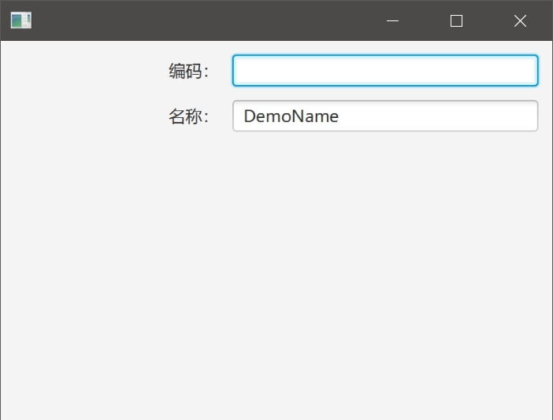

# StringField

 我们在界面上处理String类型的数据时，一般需要做到以下基本控制：

一、提供默认值；

二、确认是否可以为空；

三、限定最大输入长度（支持中文判断）；

JavaFX提供的TextField并没有提供上述功能，所以我们需要对其进行扩展。

## StringField

```java
package com.lirong.javafx.demo.j3002;

import javafx.beans.property.IntegerProperty;
import javafx.beans.property.SimpleIntegerProperty;
import javafx.scene.control.TextField;

/**
 * <p>Title: LiRong Java Application Platform</p>
 * Description: <br>
 * Copyright: CorpRights lrJAP.com<br>
 * Company: lrJAP.com<br>
 *
 * @author yujj
 * @version 1.1.1
 * @date 2018-04-29
 * @since 9.0.4
 */
public class StringField extends TextField {

    private IntegerProperty maxLength = new SimpleIntegerProperty();

    public StringField() {

        this(-1, null);
    }

    public StringField(final Integer maxLength) {

        this(maxLength, null);
    }

    public StringField(Integer maxLength, final String defaultValue) {

        super();
        // 限制输入最大长度
        textProperty().addListener((observableValue, oldValue, newValue) -> {

            if (!checkValueLengthValid(newValue)) {
                setText(oldValue);
            }
        });
        // 设置最大允许长度
        if (maxLength == null) {
            maxLength = -1;
        }
        setMaxLength(maxLength);
        if (isNotBlank(defaultValue)) {
            // 设置默认值
            setText(defaultValue);
        }
    }

    protected boolean checkValueLengthValid(final String value) {

        if (getMaxLength() != null && getMaxLength() > 0 && isNotBlank(getText()) && lenOfChinesString(value) > getMaxLength()) {
            return Boolean.FALSE;
        }
        return Boolean.TRUE;
    }

    public Integer getMaxLength() {

        return maxLength.get();
    }

    public IntegerProperty maxLengthProperty() {

        return maxLength;
    }

    public void setMaxLength(Integer maxLength) {

        this.maxLength.set(maxLength);
    }

    // 建议使用apache commons-lang3中提供的StringUtils类
    public static boolean isNotBlank(final String str) {

        return (str != null && !"".equalsIgnoreCase(str));
    }

    // 应作为工具方法
    public static int lenOfChinesString(final String str) {

        int len = 0;
        for (int i = 0; i < str.length(); i++) {
            char c = str.charAt(i);
            if (c >= '\u4e00' && c <= '\u9fa5') {
                len += 2;
            } else {
                len++;
            }
        }
        return len;
    }
}
```

## 测试类

```java
package com.lirong.javafx.demo.j3002;

import javafx.application.Application;
import javafx.geometry.HPos;
import javafx.geometry.Insets;
import javafx.scene.Scene;
import javafx.scene.control.Label;
import javafx.scene.layout.ColumnConstraints;
import javafx.scene.layout.GridPane;
import javafx.stage.Stage;

/**
 * <p>Title: LiRong Java Application Platform</p>
 * Description: <br>
 * Copyright: CorpRights lrJAP.com<br>
 * Company: lrJAP.com<br>
 *
 * @author yujj
 * @version 1.1.1
 * @date 2018-04-29
 * @since 9.0.4
 */
public class TestStringField extends Application {

    public static void main(String[] args) {

        launch(args);
    }

    @Override
    public void start(Stage primaryStage) throws Exception {

        GridPane gridPane = new GridPane();
        gridPane.setPadding(new Insets(10));
        gridPane.setVgap(10);
        gridPane.setHgap(10);

        ColumnConstraints col1 = new ColumnConstraints();
        col1.setPercentWidth(40);

        ColumnConstraints col2 = new ColumnConstraints();
        col2.setPercentWidth(60);

        gridPane.getColumnConstraints().addAll(col1, col2);

        // 在GridPane中放置两个StringField
        Label lblCode = new Label("编码：");
        StringField stringCode = new StringField();
        // 设置最大输入长度
        stringCode.setMaxLength(8);

        Label lblName = new Label("名称：");
        // 设置最大输入长度以及默认值
        StringField stringName = new StringField(16, "DemoName");

        // label右对齐
        GridPane.setHalignment(lblCode, HPos.RIGHT);
        GridPane.setHalignment(lblName, HPos.RIGHT);

        gridPane.addRow(0, lblCode, stringCode);
        gridPane.addRow(1, lblName, stringName);

        Scene scene = new Scene(gridPane, 400, 300);
        primaryStage.setScene(scene);
        primaryStage.show();
    }
}
```

## 运行效果

 