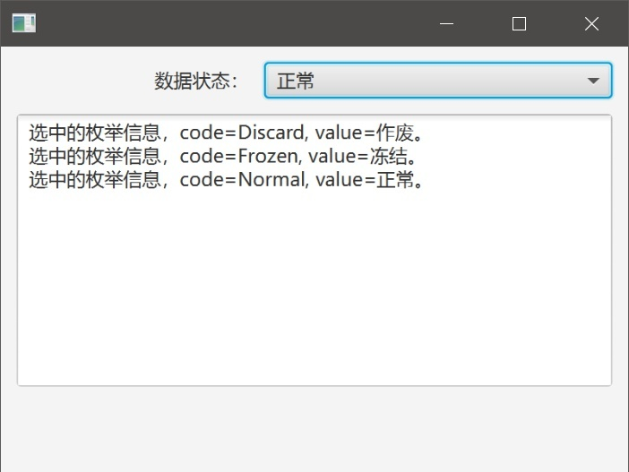

# EnumComboBox

对于枚举类，我们希望在数据库中存放一个有意义的英文字符串，在界面上显示一个有意义的中文字符串。所以为枚举类设置两个属性。

如以下DataStatusEnum（数据状态枚举）。

## DataStatusEnum

```java
package com.lirong.eap.platform.base.pub.enumtype;

import com.fasterxml.jackson.databind.annotation.JsonDeserialize;
import com.fasterxml.jackson.databind.annotation.JsonSerialize;
import com.lirong.eap.platform.base.pub.enumtype.deserializer.DataStatusEnumJsonDeserializer;
import com.lirong.eap.platform.base.pub.vo.BaseEnumJsonSerializer;
import com.lirong.eap.platform.base.pub.vo.IEnumType;

import static com.lirong.eap.platform.base.pub.i18n.LRResourceManager.getMessageWithJava;

/**
 * <p>Title: LiRong Java Enterprise Application Platform </p>
 * <p>Description: DataStatusEnum(数据状态) 枚举类 </p>
 * <p>CorpRights: lrJAP.com</p>
 * <p>Company: lrJAP.com</p>
 *
 * @author jianjun.yu
 * @version 3.0.0-SNAPSHOT
 * @date 2022-04-19
 * @since 1.0.0-SNAPSHOT
 */
@JsonSerialize(using = BaseEnumJsonSerializer.class)
@JsonDeserialize(using = DataStatusEnumJsonDeserializer.class)
public enum DataStatusEnum implements IEnumType {

    INIT("Init", getMessageWithJava(getResourceFileInfo(), "DataStatusEnum.Init", "初始化")), // $NON-NLS$
    NORMAL("Normal", getMessageWithJava(getResourceFileInfo(), "DataStatusEnum.Normal", "正常")), // $NON-NLS$
    FROZEN("Frozen", getMessageWithJava(getResourceFileInfo(), "DataStatusEnum.Frozen", "冻结")), // $NON-NLS$
    DISCARD("Discard", getMessageWithJava(getResourceFileInfo(), "DataStatusEnum.Discard", "作废")); // $NON-NLS$

    private final String code;
    private final String value;

    /* 用于在SQL中进行Decode */
    public static final String DECODE_SQL = "'Init', '初始化', 'Normal', '正常', 'Frozen', '冻结', 'Discard', '作废'"; // $NON-NLS$

    DataStatusEnum(String code, String value) {

        this.code = code;
        this.value = value;
    }

    @Override
    public String getCode() {

        return code;
    }

    /**
     * 通过国际化机制，获取当前区域需要显示的枚举值
     *
     * @return
     */
    @Override
    public String getValue() {

        return getMessageWithJava(getResourceFileInfo(), String.format("DataStatusEnum.%s", getCode()), this.value); // $NON-NLS$
    }

    /**
     * 国际化资源信息
     *
     * @return
     */
    public static String getResourceFileInfo() {

        return "i18n/platform/base/pub/enumtype/DataStatusEnum"; // $NON-NLS$
    }
}
```

DataStatusEnum中，code用于持久化到数据库中，value用于在界面上展示。其中有四个枚举值。

## 测试类

```java
package com.lirong.javafx.demo.j3003;

import javafx.application.Application;
import javafx.geometry.HPos;
import javafx.geometry.Insets;
import javafx.scene.Scene;
import javafx.scene.control.ComboBox;
import javafx.scene.control.Label;
import javafx.scene.control.TextArea;
import javafx.scene.layout.ColumnConstraints;
import javafx.scene.layout.GridPane;
import javafx.scene.layout.Priority;
import javafx.stage.Stage;


/**
 * <p>Title: LiRong Java Application Platform</p>
 * Description: <br>
 * Copyright: CorpRights lrJAP.com<br>
 * Company: lrJAP.com<br>
 *
 * @author yujj
 * @version 1.1.1
 * @date 2018-04-29
 * @since 9.0.4
 */
public class TestEnumComboBox extends Application {

    public static void main(String[] args) {

        launch(args);
    }

    @Override
    public void start(Stage primaryStage) throws Exception {

        Label lblEnum = new Label("数据状态：");
        ComboBox<DataStatusEnum> comboEnum = new ComboBox<>();

        TextArea textConsole = new TextArea();

        GridPane gridPane = new GridPane();
        gridPane.setPadding(new Insets(10));
        gridPane.setVgap(10);
        gridPane.setHgap(10);

        ColumnConstraints col1 = new ColumnConstraints();
        col1.setPercentWidth(40);

        ColumnConstraints col2 = new ColumnConstraints();
        col2.setPercentWidth(60);

        gridPane.getColumnConstraints().addAll(col1, col2);
        gridPane.addRow(0, lblEnum, comboEnum);

        // label右对齐
        GridPane.setHalignment(lblEnum, HPos.RIGHT);
        // 使用Combobox充满整个Cell
        comboEnum.setMaxWidth(Double.MAX_VALUE);
        GridPane.setHgrow(comboEnum, Priority.ALWAYS);
        // 为ComboBox赋值
        comboEnum.getItems().setAll(DataStatusEnum.values());

        // 监听ComboBox变化
        comboEnum.getSelectionModel().selectedItemProperty().addListener((observable, oldValue, newValue) ->
                textConsole.appendText(String.format("选中的枚举信息，code=%s, value=%s。%s", newValue.getCode(), newValue.getValue(), System.getProperty("line.separator"))))
        ;

        gridPane.add(textConsole, 0, 1, 2, 2);

        Scene scene = new Scene(gridPane, 400, 300);
        primaryStage.setScene(scene);
        primaryStage.show();
    }
}
```

## 运行效果

 
