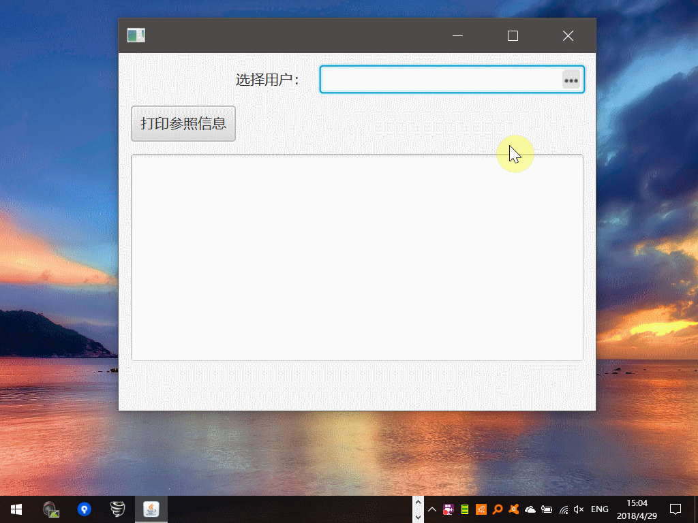

# ReferenceField

在前面几篇文章中，基于普遍的业务需求，对JavaFX提供的基础组件进行扩展，以满足不同业务场景下，对数据展现及控制的要求。

像StringField、各种NumbricField以及EnumComboBox这类组件，比较常用，实现起来也比较容易。但对于参照来说，如果只是特定的参照，实现方式也可以比较简单，如果需要设计比较通用的、能够大范围复用的参照组件，感觉基于JavaFX的实现就比较繁琐了。

但前述这些组件在企业级应用开发中属性最基础的组件，如果没有它们，则我们在处理基于TableView、FormView就会比较棘手，几乎什么数据类型都无法很好地处理，或者相同的代码需要到处拷贝。

## 参照示例

参照(Reference)是数据库外键在代码层面的映射，不同的人可能有不同的定义。看一下就知道了：

 

先来看一下示例工程的代码结构：

 

ialog：点击“...”按钮，弹出的（模态）窗口。

field：参照TextField的基类。

user.ref：基于“用户信息”实现的ReferenceField示例。

vo：参照对象基类。

我们的目标是：所有ReferenceDataVO的子类，都可以比较方便地实现参照管理机制。

## 参照基类

我们约定，一个参照至少要有pk、code、name这三个字段。pk用于持久化，实现外键关系，code和name用于在界面上展现：

### 接口类

```java
package com.lirong.javafx.demo.j3004.vo;

/**
 * <p>Title: LiRong Java Application Platform</p>
 * Description: <br>
 * Copyright: CorpRights lrJAP.com<br>
 * Company: lrJAP.com<br>
 *
 * @author yujj
 * @version 1.1.1
 * @date 2018-04-29
 * @since 9.0.4
 */
public interface IReferenceData extends Comparable<Object> {

    String getPk();

    void setPk(String pk);

    void setCode(String code);

    String getCode();

    void setName(String name);

    String getName();
}
```

### 参照基类

```java
package com.lirong.javafx.demo.j3004.vo;

import java.io.Serializable;

/**
 * <p>Title: LiRong Java Application Platform</p>
 * Description: <br>
 * Copyright: CorpRights lrJAP.com<br>
 * Company: lrJAP.com<br>
 *
 * @author yujj
 * @version 1.1.1
 * @date 2018-04-29
 * @since 9.0.4
 */
public class ReferenceDataVO implements IReferenceData, Serializable {

    public String pk;

    public String code;

    public String name;

    public ReferenceDataVO() {

        super();
    }

    public ReferenceDataVO(String pk) {

        super();
        this.pk = pk;
    }

    public ReferenceDataVO(String pk, String code, String name) {

        super();
        this.pk = pk;
        this.code = code;
        this.name = name;
    }

    @Override
    public int compareTo(Object o) {

        ReferenceDataVO oldvp = (ReferenceDataVO) o;
        String pk = getPk();
        String oldpk = oldvp.getPk();
        return pk.compareTo(oldpk);
    }

    public String getCode() {

        return code;
    }

    public String getName() {

        return name;
    }

    public String getPk() {

        return pk;
    }

    public void setCode(String code) {

        this.code = code;
    }

    public String getPrimaryKey() {

        return pk;
    }

    public void setName(String name) {

        this.name = name;
    }

    public void setPk(String pk) {

        this.pk = pk;
    }

    @Override
    public String toString() {

        return pk;
    }

    public boolean equals(Object anObject) {

        if (this == anObject) {
            return true;
        }

        if (anObject == null) {
            return false;
        }

        if (!this.getClass().equals(anObject.getClass())) {
            return false;
        }

        ReferenceDataVO aRefVO = (ReferenceDataVO) anObject;
        if (aRefVO.getPk() == null || this.getPk() == null) {
            return false;
        }
        return aRefVO.getPk().equals(this.getPk());

    }
}
```

## 参照弹出对话框

### 对话框返回数据约定

```java
package com.lirong.javafx.demo.j3004.dialog;

import com.lirong.javafx.demo.j3004.vo.ReferenceDataVO;

/**
 * <p>Title: LiRong Java Application Platform</p>
 * Description: <br>
 * Copyright: CorpRights lrJAP.com<br>
 * Company: lrJAP.com<br>
 *
 * @author yujj
 * @version 1.1.1
 * @date 2018-04-29
 * @since 9.0.4
 */
public interface ReferenceResult<T extends ReferenceDataVO> {

    T getReferenceDataVO();
}
```

### 对话框

```java
package com.lirong.javafx.demo.j3004.dialog;

import com.lirong.javafx.demo.j3004.vo.ReferenceDataVO;
import javafx.scene.Node;
import javafx.scene.control.ButtonType;
import javafx.scene.control.Dialog;
import javafx.scene.control.DialogPane;

/**
 * <p>Title: LiRong Java Application Platform</p>
 * <p>Description: </p>
 * <p>Copyright: Copyright (c) 2015</p>
 * <p>Company: lrJAP.com</p>
 *
 * @author yujj
 * @version 1.1.1
 * @date 2016年7月29日
 */
public class ReferenceValueSelectDialog<T extends ReferenceDataVO> extends Dialog {

    public ReferenceValueSelectDialog(final String headerText, ReferenceResult referencePane) {

        if (!(referencePane instanceof Node)) {
            throw new RuntimeException("错误：参照容器必须是Node类的子类。");
        }

        final DialogPane dialogPane = getDialogPane();

        setTitle("参照选择");
        dialogPane.setHeaderText(headerText);
        dialogPane.getButtonTypes().addAll(ButtonType.OK, ButtonType.CANCEL);
        dialogPane.setContent((Node) referencePane);

        // 设置对话框的返回数据
        setResultConverter(dialogButton -> dialogButton == ButtonType.OK ? referencePane.getReferenceDataVO() : null);
    }
}
```

## 参照Field基类

### Field定义

```java
package com.lirong.javafx.demo.j3004.field;

import com.lirong.javafx.demo.j3002.StringField;
import javafx.beans.property.ObjectProperty;
import javafx.beans.property.SimpleObjectProperty;
import javafx.scene.Node;
import javafx.scene.control.Skin;

/**
 * <p>Title: LiRong Java Application Platform</p>
 * Description: <br>
 * Copyright: CorpRights lrJAP.com<br>
 * Company: lrJAP.com<br>
 *
 * @author yujj
 * @version 1.1.1
 * @date 2018-04-29
 * @since 9.0.4
 */
public class ReferenceTextField extends StringField {

    private ObjectProperty<Node> left = new SimpleObjectProperty<>(this, "left");

    private ObjectProperty<Node> right = new SimpleObjectProperty<>(this, "right");

    public ReferenceTextField() {

        super();
        getStylesheets().add(ReferenceTextField.class.getClassLoader().getResource("css/control/reference-textfield.css").toExternalForm());
        getStyleClass().add("reference-text-field");
    }

    public final ObjectProperty<Node> leftProperty() {

        return left;
    }

    public final Node getLeft() {

        return left.get();
    }

    public final void setLeft(Node value) {

        left.set(value);
    }

    public final ObjectProperty<Node> rightProperty() {

        return right;
    }

    public final Node getRight() {

        return right.get();
    }

    public final void setRight(Node value) {

        right.set(value);
    }

    @Override
    protected Skin<?> createDefaultSkin() {

        return new ReferenceTextFieldSkin(this) {

            @Override
            public ObjectProperty<Node> leftProperty() {

                return left;
            }

            @Override
            public ObjectProperty<Node> rightProperty() {

                return right;
            }
        };
    }
}
```

### 皮肤，用于控制显示位置等

```java
package com.lirong.javafx.demo.j3004.field;

import javafx.beans.property.ObjectProperty;
import javafx.css.PseudoClass;
import javafx.geometry.Pos;
import javafx.scene.Node;
import javafx.scene.control.TextField;
import javafx.scene.control.skin.TextFieldSkin;
import javafx.scene.layout.StackPane;
import javafx.scene.text.HitInfo;

/**
 * <p>Title: LiRong Java Application Platform</p>
 * <p>Description: </p>
 * <p>Copyright: Copyright (c) 2015</p>
 * <p>Company: lrJAP.com</p>
 *
 * @author yujj
 * @version 1.1.1
 * @date 2016年9月6日
 */
public abstract class ReferenceTextFieldSkin extends TextFieldSkin {

    private static final PseudoClass HAS_NO_SIDE_NODE = PseudoClass.getPseudoClass("no-side-nodes");
    private static final PseudoClass HAS_LEFT_NODE = PseudoClass.getPseudoClass("left-node-visible");
    private static final PseudoClass HAS_RIGHT_NODE = PseudoClass.getPseudoClass("right-node-visible");

    private Node left;
    private StackPane leftPane;
    private Node right;
    private StackPane rightPane;

    private final TextField control;

    public ReferenceTextFieldSkin(final TextField control) {

        super(control);

        this.control = control;
        updateChildren();

        registerChangeListener(leftProperty(), e -> updateChildren());
        registerChangeListener(rightProperty(), e -> updateChildren());
    }

    public abstract ObjectProperty<Node> leftProperty();

    public abstract ObjectProperty<Node> rightProperty();

    private void updateChildren() {

        Node newLeft = leftProperty().get();
        if (newLeft != null) {
            getChildren().remove(leftPane);
            leftPane = new StackPane(newLeft);
            leftPane.setAlignment(Pos.CENTER_LEFT);
            leftPane.getStyleClass().add("left-pane");
            getChildren().add(leftPane);
            left = newLeft;
        }

        Node newRight = rightProperty().get();
        if (newRight != null) {
            getChildren().remove(rightPane);
            rightPane = new StackPane(newRight);
            rightPane.setAlignment(Pos.CENTER_RIGHT);
            rightPane.getStyleClass().add("right-pane");
            getChildren().add(rightPane);
            right = newRight;
        }

        control.pseudoClassStateChanged(HAS_LEFT_NODE, left != null);
        control.pseudoClassStateChanged(HAS_RIGHT_NODE, right != null);
        control.pseudoClassStateChanged(HAS_NO_SIDE_NODE, left == null && right == null);
    }

    @Override
    protected void layoutChildren(double x, double y, double w, double h) {

        final double fullHeight = h + snappedTopInset() + snappedBottomInset();

        final double leftWidth = leftPane == null ? 0.0 : snapSize(leftPane.prefWidth(fullHeight));
        final double rightWidth = rightPane == null ? 0.0 : snapSize(rightPane.prefWidth(fullHeight));

        final double textFieldStartX = snapPosition(x) + snapSize(leftWidth);
        final double textFieldWidth = w - snapSize(leftWidth) - snapSize(rightWidth);

        super.layoutChildren(textFieldStartX, 0, textFieldWidth, fullHeight);

        if (leftPane != null) {
            final double leftStartX = 0;
            leftPane.resizeRelocate(leftStartX, 0, leftWidth, fullHeight);
        }

        if (rightPane != null) {
            final double rightStartX = rightPane == null ? 0.0 : w - rightWidth + snappedLeftInset();
            rightPane.resizeRelocate(rightStartX, 0, rightWidth, fullHeight);
        }
    }

    @Override
    public HitInfo getIndex(double x, double y) {

        final double leftWidth = leftPane == null ? 0.0 : snapSize(leftPane.prefWidth(getSkinnable().getHeight()));
        return super.getIndex(x - leftWidth, y);
    }

    @Override
    protected double computePrefWidth(double h, double topInset, double rightInset, double bottomInset, double leftInset) {

        final double pw = super.computePrefWidth(h, topInset, rightInset, bottomInset, leftInset);
        final double leftWidth = leftPane == null ? 0.0 : snapSize(leftPane.prefWidth(h));
        final double rightWidth = rightPane == null ? 0.0 : snapSize(rightPane.prefWidth(h));

        return pw + leftWidth + rightWidth;
    }

    @Override
    protected double computePrefHeight(double w, double topInset, double rightInset, double bottomInset, double leftInset) {

        final double ph = super.computePrefHeight(w, topInset, rightInset, bottomInset, leftInset);
        final double leftHeight = leftPane == null ? 0.0 : snapSize(leftPane.prefHeight(-1));
        final double rightHeight = rightPane == null ? 0.0 : snapSize(rightPane.prefHeight(-1));

        return Math.max(ph, Math.max(leftHeight, rightHeight));
    }
}
```

### 使用到的css

```css
.reference-text-field {
    -fx-text-fill: -fx-text-inner-color;
    -fx-highlight-fill: derive(-fx-control-inner-background, -20%);
    -fx-highlight-text-fill: -fx-text-inner-color;
    -fx-prompt-text-fill: derive(-fx-control-inner-background, -30%);
    -fx-background-color: linear-gradient(to bottom, derive(-fx-text-box-border, -10%), -fx-text-box-border),
    linear-gradient(from 0px 0px to 0px 5px, derive(-fx-control-inner-background, -9%), -fx-control-inner-background);
    -fx-background-insets: 0, 1;
    -fx-background-radius: 3, 2;
}

.reference-text-field:no-side-nodes {
    -fx-padding: 0.333333em 0.583em 0.333333em 0.583em;
}

.reference-text-field:left-node-visible {
    -fx-padding: 0.333333em 0.583em 0.333333em 0;
}

.reference-text-field:right-node-visible {
    -fx-padding: 0.333333em 0 0.333333em 0.583em;
}

.reference-text-field:left-node-visible:right-node-visible {
    -fx-padding: 0.333333em 0 0.333333em 0;
}

.reference-text-field:left-node-visible .left-pane {
    -fx-padding: 0 3 0 3;
}

.reference-text-field:right-node-visible .right-pane {
    -fx-padding: 0 3 0 3;
}

.reference-text-field:focused,
.reference-text-field:text-field-has-focus {
    -fx-highlight-fill: -fx-accent;
    -fx-highlight-text-fill: white;
    -fx-background-color: -fx-focus-color,
    -fx-control-inner-background,
    -fx-faint-focus-color,
    linear-gradient(from 0px 0px to 0px 5px, derive(-fx-control-inner-background, -9%), -fx-control-inner-background);
    -fx-background-insets: -0.2, 1, -1.4, 3;
    -fx-background-radius: 3, 2, 4, 0;
    -fx-prompt-text-fill: transparent;
}

.clearable-field .clear-button {
    -fx-padding: 0 3 0 0;
}

.clearable-field .clear-button > .graphic {
    -fx-background-color: #949494;
    -fx-scale-shape: false;
    -fx-padding: 4.5 4.5 4.5 4.5; /* Graphic is 9x9 px */
    -fx-shape: "M395.992,296.758l1.794-1.794l7.292,7.292l-1.795,1.794 L395.992,296.758z M403.256,294.992l1.794,1.794l-7.292,7.292l-1.794-1.795 L403.256,294.992z";
}

.clearable-field .clear-button:hover > .graphic {
    -fx-background-color: #ee4444;
}

.clearable-field .clear-button:pressed > .graphic {
    -fx-background-color: #ff1111;
}
```

### 组合Field和Dialog

```java
package com.lirong.javafx.demo.j3004.field;

import com.lirong.javafx.demo.j3004.dialog.ReferenceValueSelectDialog;
import com.lirong.javafx.demo.j3004.user.ref.UserReferenceTableView;
import com.lirong.javafx.demo.j3004.user.ref.UserReferenceVO;
import com.lirong.javafx.demo.j3004.vo.ReferenceDataVO;
import javafx.beans.property.ObjectProperty;
import javafx.beans.property.SimpleObjectProperty;
import javafx.beans.property.StringProperty;
import javafx.scene.Cursor;
import javafx.scene.image.Image;
import javafx.scene.image.ImageView;
import javafx.scene.input.MouseButton;
import javafx.scene.layout.HBox;
import javafx.scene.layout.Priority;
import javafx.scene.layout.StackPane;

import java.util.Optional;

/**
 * <p>Title: LiRong Java Application Platform</p>
 * Description: <br>
 * Copyright: CorpRights lrJAP.com<br>
 * Company: lrJAP.com<br>
 *
 * @author yujj
 * @version 1.1.1
 * @date 2018-04-29
 * @since 9.0.4
 */
public abstract class AbstractReferenceValueField<T extends ReferenceDataVO> extends HBox {

    private static final Image image = loadImage("images/commons/open-editor.png");

    private final ReferenceTextField textField = new ReferenceTextField();

    // 参照信息
    private ObjectProperty<T> objectProperty = new SimpleObjectProperty<>();

    public AbstractReferenceValueField() {

        super(1);
        setFocusTraversable(Boolean.TRUE);
        textField.setFocusTraversable(Boolean.TRUE);

        StackPane button = new StackPane(new ImageView(image));
        button.setCursor(Cursor.DEFAULT);

        button.setOnMouseReleased(e -> {
            if (MouseButton.PRIMARY == e.getButton()) {
                final T result = edit(objectProperty.get());
                objectProperty.set(result);
            }
        });

        textField.setRight(button);
        getChildren().add(textField);
        HBox.setHgrow(textField, Priority.ALWAYS);

        objectProperty.addListener((o, oldValue, newValue) -> textProperty().set(objectToString(newValue)));

        focusedProperty().addListener((observable, oldValue, newValue) -> {
            if (newValue) {
                textField.requestFocus();
            }
        });
    }

    protected StringProperty textProperty() {

        return textField.textProperty();
    }

    public ObjectProperty<T> getObjectProperty() {

        return objectProperty;
    }

    protected String objectToString(T object) {

        return object == null ? "" : object.toString();
    }

    protected abstract Class<T> getType();

    protected T edit(T object) {

        ReferenceValueSelectDialog<UserReferenceVO> dlg = new ReferenceValueSelectDialog("请选择一个用户信息：", new UserReferenceTableView());
        Optional<T> optionalRef = dlg.showAndWait();
        if (optionalRef.isPresent()) {
            return optionalRef.get();
        } else {
            return object;
        }
    }

    public void setText(String text) {

        textField.setText(text);
    }

    public ReferenceTextField getTextField() {

        return textField;
    }

    // 应该工具化
    public static Image loadImage(String absFileName) {

        try {
            return new Image(AbstractReferenceValueField.class.getClassLoader().getResourceAsStream(absFileName));
        } catch (Exception ex) {
            ex.printStackTrace();
            return null;
        }
    }
}
```

## 用户参照示例

### 用户参照类

只有pk、code、name。所以直接继承基类

```java
package com.lirong.javafx.demo.j3004.user.ref;

import com.lirong.javafx.demo.j3004.vo.ReferenceDataVO;

/**
 * <p>Title: LiRong Java Application Platform</p>
 * Description: <br>
 * Copyright: CorpRights lrJAP.com<br>
 * Company: lrJAP.com<br>
 *
 * @author yujj
 * @version 1.1.1
 * @date 2018-04-29
 * @since 9.0.4
 */
public class UserReferenceVO extends ReferenceDataVO {

}
```

### 用户参照TableView

用于在Dialog中显示，以便于操作人员选择。来源数据随机生成，仅用于测试。

```java
package com.lirong.javafx.demo.j3004.user.ref;

import com.lirong.javafx.demo.j3004.dialog.ReferenceResult;
import com.lirong.javafx.demo.j3004.vo.ReferenceDataVO;
import javafx.beans.property.ListProperty;
import javafx.beans.property.SimpleListProperty;
import javafx.collections.FXCollections;
import javafx.scene.control.TableColumn;
import javafx.scene.control.TableView;
import javafx.scene.control.cell.PropertyValueFactory;


/**
 * <p>Title: LiRong Java Application Platform</p>
 * Description: <br>
 * Copyright: CorpRights lrJAP.com<br>
 * Company: lrJAP.com<br>
 *
 * @author yujj
 * @version 1.1.1
 * @date 2018-04-29
 * @since 9.0.4
 */
public class UserReferenceTableView extends TableView implements ReferenceResult {

    // 用于展示在TableView中的待选数据
    private ListProperty<UserReferenceVO> listDatas = new SimpleListProperty<>(FXCollections.observableArrayList());

    public UserReferenceTableView() {

        super();
        initColumns();
        initListData();
        itemsProperty().bind(this.listDatas);
    }

    /**
     * 返回选中的数据
     *
     * @return
     */
    @Override
    public ReferenceDataVO getReferenceDataVO() {

        return (ReferenceDataVO) getSelectionModel().getSelectedItem();
    }

    // 初始化Columns
    private void initColumns() {

        TableColumn<String, UserReferenceVO> col_pk = new TableColumn<>("主键");
        col_pk.setCellValueFactory(new PropertyValueFactory<>("pk"));

        TableColumn<String, UserReferenceVO> col_code = new TableColumn<>("编码");
        col_code.setCellValueFactory(new PropertyValueFactory<>("code"));

        TableColumn<String, UserReferenceVO> col_name = new TableColumn<>("名称");
        col_name.setCellValueFactory(new PropertyValueFactory<>("name"));

        getColumns().setAll(col_pk, col_code, col_name);
    }

    // 初始化用于参照选择的数据
    private void initListData() {

        for (int i = 0; i < 10; i++) {
            UserReferenceVO vo = new UserReferenceVO();
            vo.setPk(String.format("pk_%d", i));
            vo.setCode(String.format("code_%d", i));
            vo.setName(String.format("name_%d", i));

            listDatas.add(vo);
        }
    }
}
```

### 用户参照Field

```java
package com.lirong.javafx.demo.j3004.user.ref;

import com.lirong.javafx.demo.j3004.field.AbstractReferenceValueField;

/**
 * <p>Title: LiRong Java Application Platform</p>
 * Description: <br>
 * Copyright: CorpRights lrJAP.com<br>
 * Company: lrJAP.com<br>
 *
 * @author yujj
 * @version 1.1.1
 * @date 2018-04-29
 * @since 9.0.4
 */
public class UserReferenceField extends AbstractReferenceValueField<UserReferenceVO> {

    private UserReferenceTableView userReferenceTableView;

    public UserReferenceField(UserReferenceTableView userReferenceTableView) {

        super();
        this.userReferenceTableView = userReferenceTableView;
    }

    @Override
    protected Class<UserReferenceVO> getType() {

        return UserReferenceVO.class;
    }
}
```

### 测试类

```java
package com.lirong.javafx.demo.j3004;

import com.lirong.javafx.demo.j3004.user.ref.UserReferenceField;
import com.lirong.javafx.demo.j3004.user.ref.UserReferenceTableView;
import com.lirong.javafx.demo.j3004.user.ref.UserReferenceVO;
import javafx.application.Application;
import javafx.geometry.HPos;
import javafx.geometry.Insets;
import javafx.scene.Scene;
import javafx.scene.control.Button;
import javafx.scene.control.Label;
import javafx.scene.control.TextArea;
import javafx.scene.layout.ColumnConstraints;
import javafx.scene.layout.GridPane;
import javafx.stage.Stage;


/**
 * <p>Title: LiRong Java Application Platform</p>
 * Description: <br>
 * Copyright: CorpRights lrJAP.com<br>
 * Company: lrJAP.com<br>
 *
 * @author yujj
 * @version 1.1.1
 * @date 2018-04-29
 * @since 9.0.4
 */
public class TestReferenceField extends Application {

    public static void main(String[] args) {

        launch(args);
    }

    @Override
    public void start(Stage primaryStage) throws Exception {

        Label lblUser = new Label("选择用户：");
        UserReferenceField userReferenceField = new UserReferenceField(new UserReferenceTableView());

        GridPane gridPane = new GridPane();
        gridPane.setPadding(new Insets(10));
        gridPane.setVgap(10);
        gridPane.setHgap(10);

        ColumnConstraints col1 = new ColumnConstraints();
        col1.setPercentWidth(40);

        ColumnConstraints col2 = new ColumnConstraints();
        col2.setPercentWidth(60);

        gridPane.getColumnConstraints().addAll(col1, col2);

        gridPane.add(lblUser, 0, 0);
        gridPane.add(userReferenceField, 1, 0);

        GridPane.setHalignment(lblUser, HPos.RIGHT);

        Button buttonPrint = new Button("打印参照信息");
        buttonPrint.setPrefHeight(30);
        gridPane.add(buttonPrint, 0, 1);

        TextArea textConsole = new TextArea();
        gridPane.add(textConsole, 0, 2, 2, 2);

        buttonPrint.setOnAction(action -> {
            UserReferenceVO userReferenceVO = userReferenceField.getObjectProperty().get();
            if (userReferenceVO != null) {
                textConsole.appendText(String.format("Reference pk=%s, code=%s, name=%s.%s", userReferenceVO.getPk(), userReferenceVO.getCode(), userReferenceVO.getName(), System.getProperty("line.separator")));
            }
        });


        Scene scene = new Scene(gridPane, 400, 300);
        primaryStage.setScene(scene);
        primaryStage.show();
    }
}
```

运行效果见本文最上方。
