# ManyToManyDesigner多对多对象设计

[返回](../../README.md)

## 简述

多多对关系，是指两个业务实体之间存在的交叉引用关系。例如，用户实体和角色实体。一个用户可以拥有多个角色，一个角色也可以分配给多个用户。多对多关系一般使用一张独立的对照表来保存为种关系。

## 打开多对多对象设计器

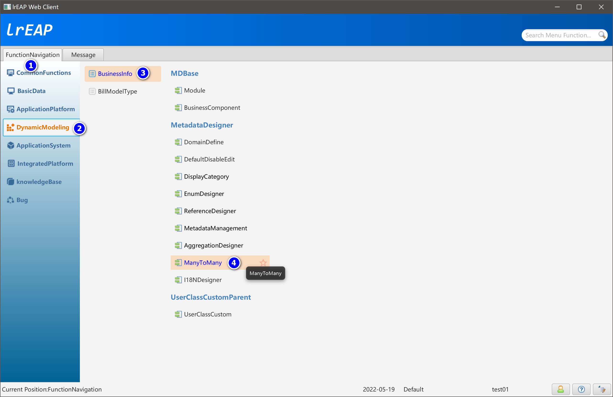

## 多对多对象设计器主界面

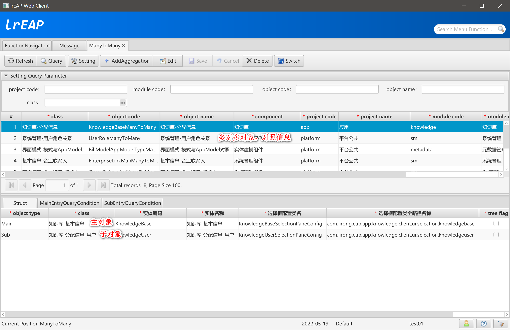

## 参照设置

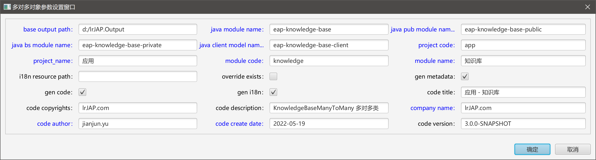

## 新增多对多对象

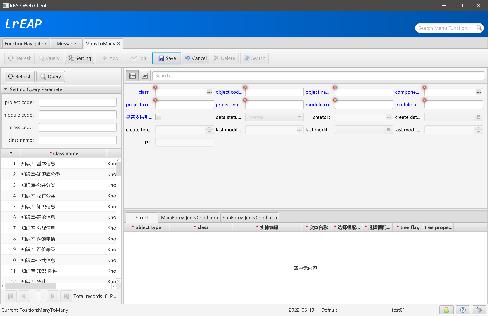

### 选择多对多对照表

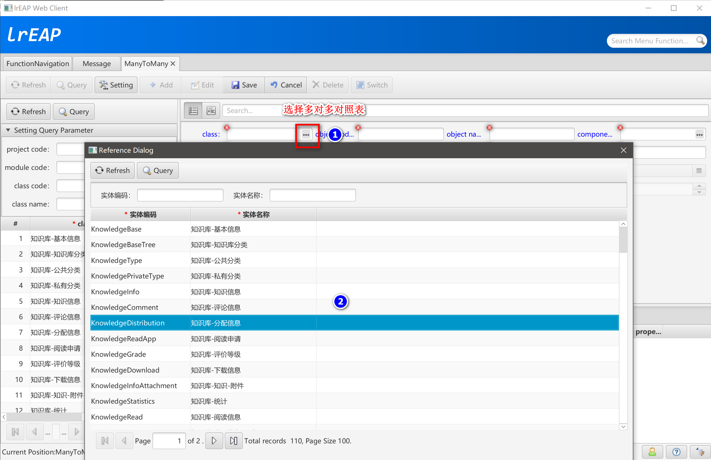

### 完善对照信息

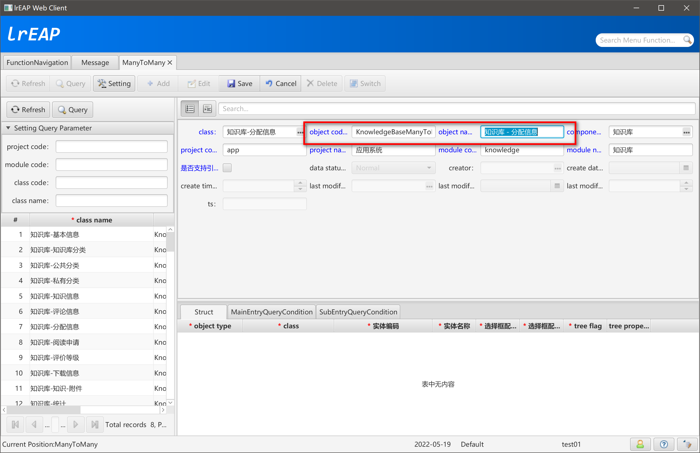

### 添加主实体

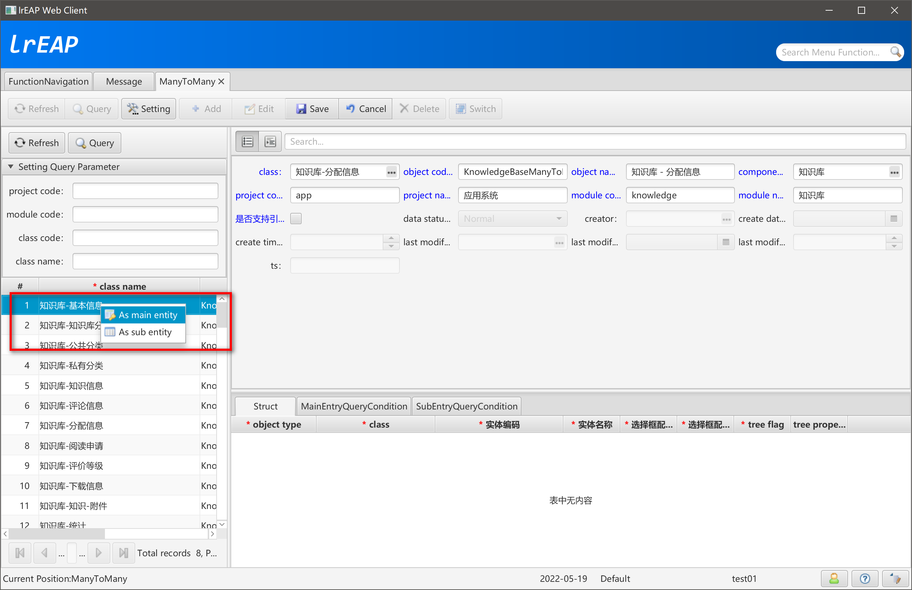

### 添加子实体

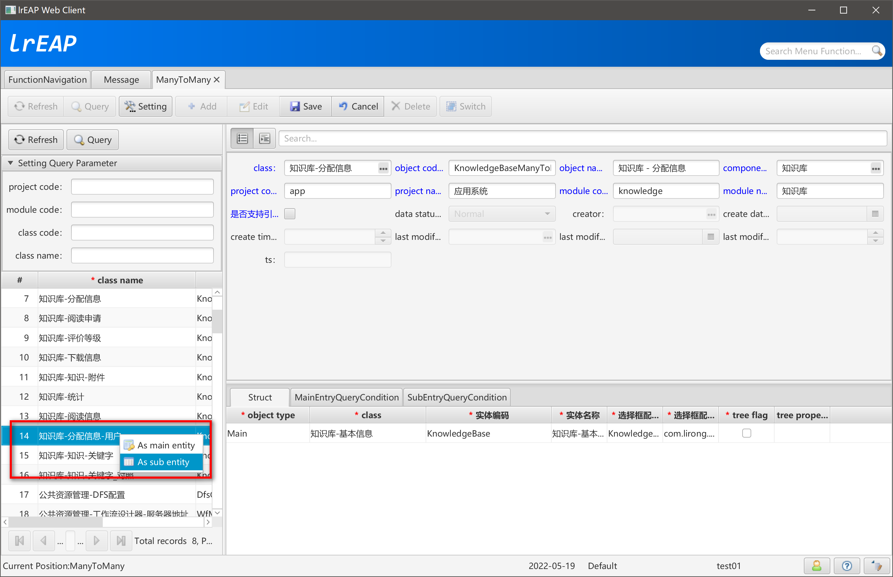

## 多对多实体结构

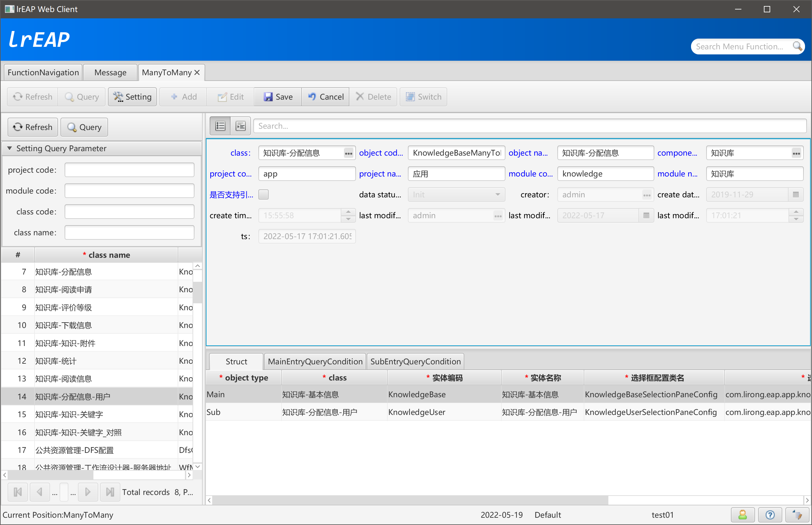

### 主实体查询条件

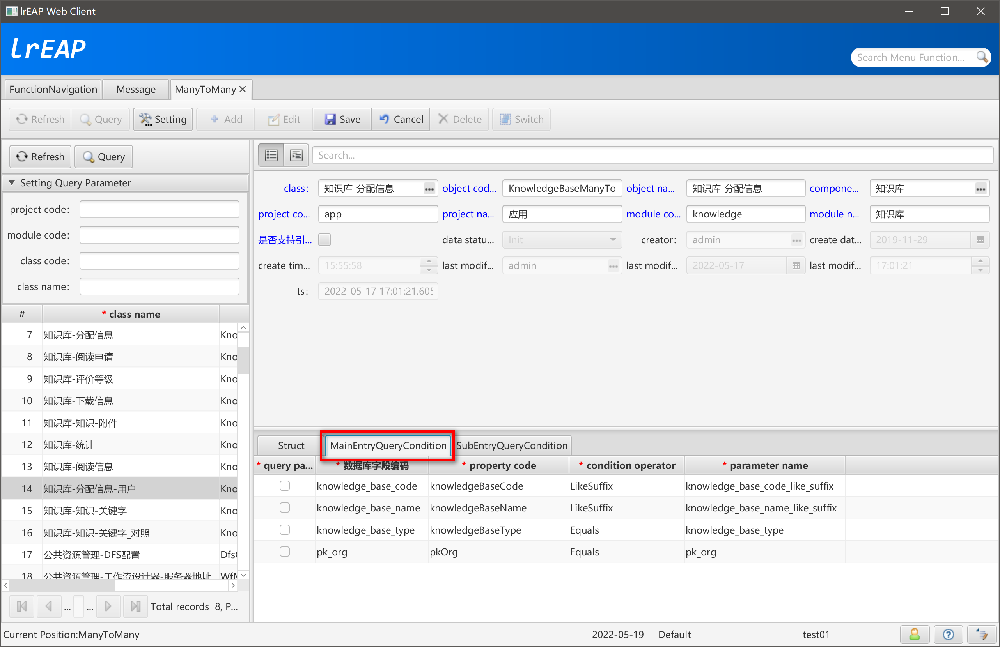

### 子实体查询条件

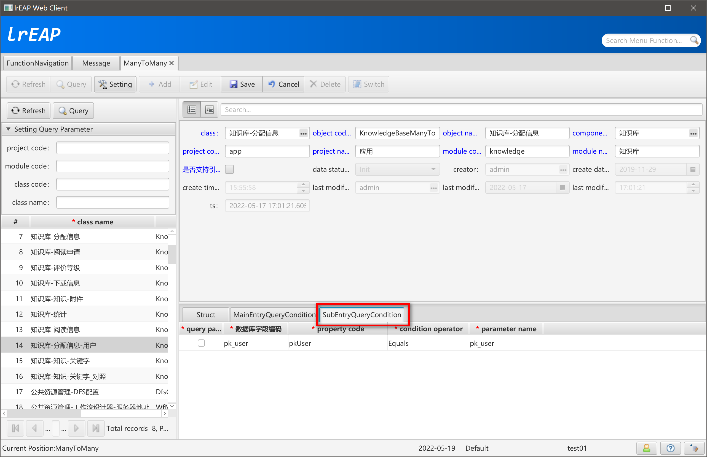

## 查询生成的多对多对象资源信息

### 公共模块（eap-knowledge-base-public）

#### KnowledgeBaseManyToManyVO

```java
/**
 * <p>Title: LiRong Java Enterprise Application Platform</p>
 * <p>应用 - 知识库</p>
 * Description: KnowledgeBaseManyToManyVO 的 ValueObject类<br>
 * Copyright: lrJAP.com<br>
 * Company: lrJAP.com<br>
 *
 * @author jianjun.yu
 * @version 3.0.0-SNAPSHOT
 * @date 2022-05-19
 */
public class KnowledgeBaseManyToManyVO extends KnowledgeBaseVO implements IBaseManyToManyVO {

    private static final long serialVersionUID = -3979680949515042630L;

    @DoNotPersistent
    private List<KnowledgeUserVO> listSubEntry = new ArrayList<>();

    @Override
    public String getMainEntryPrimaryKeyName() {

        return "pk_knowledge_base"; // $NON-NLS$
    }

    @Override
    public String getSubEntryPrimaryKeyName() {

        return "pk_knowledge_user"; // $NON-NLS$
    }

    @Override
    public String getMainEntryClassCode() {

        return "KnowledgeBase"; // $NON-NLS$
    }

    @Override
    public String getSubEntryClassCode() {

        return "KnowledgeUser"; // $NON-NLS$
    }

    @Override
    public String getRelationClassCode() {

        return "KnowledgeDistribution"; // $NON-NLS$
    }

    @Override
    public List<KnowledgeUserVO> getListSubEntry() {

        return listSubEntry;
    }

    public void setListSubEntry(List<KnowledgeUserVO> listSubEntry) {

        this.listSubEntry = listSubEntry;
    }

    /******************************************************************************************************************/
    /********************************************** fxEAP Code Generator **********************************************/
    /******************************************************************************************************************/
}
```

#### IKnowledgeBaseManyToMany

```java
/**
 * <p>Title: LiRong Java Enterprise Application Platform</p>
 * <p>应用 - 知识库</p>
 * Description: KnowledgeBaseManyToManyVO 的 业务接口类<br>
 * Copyright: lrJAP.com<br>
 * Company: lrJAP.com<br>
 *
 * @author jianjun.yu
 * @version 3.0.0-SNAPSHOT
 * @date 2022-05-19
 */
public interface IKnowledgeBaseManyToMany<T extends KnowledgeBaseManyToManyVO, S extends KnowledgeUserVO, R extends KnowledgeDistributionVO> extends IManyToManyBusinessService<T, S, R>  {

    String SERVICE_NAME = "knowledgeBaseManyToManyService"; // $NON-NLS$

    String REMOTING_SERVICE_NAME = "/app-knowledge/knowledgeBaseManyToManyHttpInvokerService"; // $NON-NLS$

    /******************************************************************************************************************/
    /********************************************** fxEAP Code Generator **********************************************/
    /******************************************************************************************************************/
}
```

### 业务处理模块（eap-knowledge-base-private）

#### KnowledgeBaseManyToManyBO

```java
/**
 * <p>Title: LiRong Java Enterprise Application Platform</p>
 * <p>应用 - 知识库</p>
 * Description: KnowledgeBaseManyToManyVO 的 业务服务类<br>
 * Copyright: lrJAP.com<br>
 * Company: lrJAP.com<br>
 *
 * @author jianjun.yu
 * @version 3.0.0-SNAPSHOT
 * @date 2022-05-19
 */
@Service(IKnowledgeBaseManyToMany.SERVICE_NAME)
@Transactional
public class KnowledgeBaseManyToManyBO
    extends BasicManyToManyBO<KnowledgeBaseManyToManyVO, KnowledgeUserVO, KnowledgeDistributionVO>
    implements IKnowledgeBaseManyToMany<KnowledgeBaseManyToManyVO, KnowledgeUserVO, KnowledgeDistributionVO> {

    @Autowired
    private IKnowledgeBaseManyToManyMapper mapper;

    @Override
    public Boolean deleteManyToMany(String mainPrimarykeyValue) throws BusinessException {

        return deleteManyToManyRelation(mainPrimarykeyValue);
    }

    @Override
    public Boolean deleteManyToManyRelation(String mainPrimarykeyValue) throws BusinessException {

        deleteManyToManyMainEntry(mainPrimarykeyValue);
        return Boolean.TRUE;
    }

    @Override
    public void deleteManyToManyMainEntry(String mainPrimarykeyValue) {

        if (StringUtils.isBlank(mainPrimarykeyValue)) {
            throw new BusinessException("参数错误。");
        }

        super.deleteManyToManyManEntry("kb_knowledge_distribution", "pk_knowledge_base", mainPrimarykeyValue); // $NON-NLS$
    }

    @Override
    public void deleteManyToManySubEntry(String mainPrimarykeyValue, List<String> listSubPK) {

        super.deleteManyToManySubEntry("kb_knowledge_distribution", "pk_knowledge_base", mainPrimarykeyValue, "pk_knowledge_user", listSubPK); // $NON-NLS$
    }

    @Override
    public List<KnowledgeDistributionVO> createAllRelationList(String mainPrimaryKeyName, String mainPrimarykeyValue, String sub_pk_name, List<String> listChild) throws BusinessException {

        List<KnowledgeDistributionVO> list = new ArrayList<>();

        if (StringUtils.isBlank(mainPrimaryKeyName) || StringUtils.isBlank(mainPrimarykeyValue) || StringUtils.isBlank(sub_pk_name) || listChild == null || listChild.isEmpty()) {
            throw new BusinessException("参数错误。");
        }

        for (String subPrimaryKeyValue : listChild) {

            KnowledgeDistributionVO relationVO = new KnowledgeDistributionVO();
            relationVO.setProperty(mainPrimaryKeyName, mainPrimarykeyValue);
            relationVO.setProperty(sub_pk_name, subPrimaryKeyValue);

            // TODO set other property value

            list.add(relationVO);
        }

        return list;
    }

     @Override
     public IKnowledgeBaseManyToManyMapper getBaseModelService() {

        return this.mapper;
    }

    @Override
    public List<String> getClassCode() throws BusinessException {

        return Arrays.asList("KnowledgeBase", "KnowledgeDistribution"); // $NON-NLS$
    }

    /******************************************************************************************************************/
    /********************************************** fxEAP Code Generator **********************************************/
    /******************************************************************************************************************/
}
```

#### IKnowledgeBaseManyToManyMapper

```java
/**
 * <p>Title: LiRong Java Enterprise Application Platform</p>
 * <p>应用 - 知识库</p>
 * Description: KnowledgeBaseManyToManyVO 的 DAO 类<br>
 * Copyright: lrJAP.com<br>
 * Company: lrJAP.com<br>
 *
 * @author jianjun.yu
 * @version 3.0.0-SNAPSHOT
 * @date 2022-05-19
 */
@Repository
public interface IKnowledgeBaseManyToManyMapper extends IManyToManyModelService {

    /**
     * 根据主键查询
     *
     * @param pk String
     * @return KnowledgeBaseManyToManyVO
     * @throws BusinessException 业务异常
     */
    KnowledgeBaseManyToManyVO  queryByPrimaryKey(final String pk) throws BusinessException;

    /******************************************************************************************************************/
    /********************************************** fxEAP Code Generator **********************************************/
    /******************************************************************************************************************/
}
```

#### IKnowledgeBaseManyToManyMapper

```xml
<?xml version="1.0" encoding="UTF-8" ?>
<!DOCTYPE mapper PUBLIC "-//mybatis.org//DTD Mapper 3.0//EN" "http://mybatis.org/dtd/mybatis-3-mapper.dtd">

<mapper namespace="com.lirong.eap.app.knowledge.bs.dao.IKnowledgeBaseManyToManyMapper">

    <!-- 不包括SubEntry -->
    <resultMap id="KnowledgeBaseManyToManyMainVO" type="com.lirong.eap.app.knowledge.pub.vo.KnowledgeBaseManyToManyVO"
               extends="com.lirong.eap.app.knowledge.bs.dao.IKnowledgeBaseMapper.KnowledgeBaseVO">

    </resultMap>

    <!-- 包括SubEntry -->
        <resultMap id="KnowledgeBaseManyToManyVO" type="com.lirong.eap.app.knowledge.pub.vo.KnowledgeBaseManyToManyVO"
               extends="com.lirong.eap.app.knowledge.bs.dao.IKnowledgeBaseMapper.KnowledgeBaseVO">

        <collection property="listSubEntry" column="PK_KNOWLEDGE_BASE" javaType="ArrayList"
                    select="com.lirong.eap.app.knowledge.bs.dao.IKnowledgeBaseManyToManyMapper.querySubEntryList"/>
    </resultMap>

    <!-- 分页查询 总数 -->
    <select id="queryPaginationCount" resultType="int" parameterType="Map" flushCache="true">
        <include refid="com.lirong.eap.app.knowledge.bs.dao.IKnowledgeBaseManyToManyMapper.sqlQueryMainEntryPaginationCount"/>
    </select>

    <!-- @formatter:off -->
    <sql id="sqlQueryMainEntryPaginationCount">
select
  count(*)
from kb_knowledge_base t
<include refid="com.lirong.eap.app.knowledge.bs.dao.IKnowledgeBaseMapper.ref_table_join"/>
<where>
    <include refid="com.lirong.eap.app.knowledge.bs.dao.IKnowledgeBaseManyToManyMapper.query_main_entry_condition"/>
</where>
    </sql>
    <!-- @formatter:on -->

    <!-- 分页查询 记录 Oracle -->
    <select id="queryPaginationList" resultMap="KnowledgeBaseManyToManyMainVO" parameterType="Map" databaseId="oracle" flushCache="true">
        <include refid="com.lirong.eap.app.knowledge.bs.dao.IKnowledgeBaseManyToManyMapper.sqlQueryMainEntryPaginationListOracleDB2"/>
    </select>

    <!-- 分页查询 记录 DB2 -->
    <select id="queryPaginationList" resultMap="KnowledgeBaseManyToManyMainVO" parameterType="Map" databaseId="db2" flushCache="true">
        <include refid="com.lirong.eap.app.knowledge.bs.dao.IKnowledgeBaseManyToManyMapper.sqlQueryMainEntryPaginationListOracleDB2"/>
    </select>

    <!-- @formatter:off -->
    <sql id="sqlQueryMainEntryPaginationListOracleDB2">
select * from (
  select
    sum(1) over() dataCounter,
    row_number() over (order by t.pk_knowledge_base) rn,
    <include refid="com.lirong.eap.app.knowledge.bs.dao.IKnowledgeBaseMapper.select_ref_fields"/>
    t.*
  from kb_knowledge_base t
  <include refid="com.lirong.eap.app.knowledge.bs.dao.IKnowledgeBaseMapper.ref_table_join"/>
  <where>
      <include refid="com.lirong.eap.app.knowledge.bs.dao.IKnowledgeBaseManyToManyMapper.query_main_entry_condition"/>
  </where>
) a where rn &lt;= (#{pageIndex} * #{pageSize}) and rn &gt;= ((#{pageIndex} - 1) * #{pageSize} + 1)
    </sql>
    <!-- @formatter:on -->

    <!-- 分页查询 记录 MySQL -->
    <select id="queryPaginationList" resultMap="KnowledgeBaseManyToManyMainVO" parameterType="Map" databaseId="db2" flushCache="true">
        <include refid="com.lirong.eap.app.knowledge.bs.dao.IKnowledgeBaseManyToManyMapper.sqlQueryMainEntryPaginationListMySQL"/>
    </select>

    <!-- @formatter:off -->
    <sql id="sqlQueryMainEntryPaginationListMySQL">
select
  <include refid="com.lirong.eap.app.knowledge.bs.dao.IKnowledgeBaseMapper.select_ref_fields"/>
  t.*
from kb_knowledge_base t
<include refid="com.lirong.eap.app.knowledge.bs.dao.IKnowledgeBaseMapper.ref_table_join"/>
<where>
    <include refid="com.lirong.eap.app.knowledge.bs.dao.IKnowledgeBaseManyToManyMapper.query_main_entry_condition"/>
</where>
order by t.pk_knowledge_base
limit #{pageBeginIndex}, #{pageEndIndex}
    </sql>
    <!-- @formatter:on -->

    <!-- 查询一个完整的多对多对象 -->
    <select id="queryManyToMany" resultMap="KnowledgeBaseManyToManyVO" parameterType="String" flushCache="true">
        <include refid="com.lirong.eap.app.knowledge.bs.dao.IKnowledgeBaseManyToManyMapper.sqlQueryManyToMany"/>
    </select>

    <!-- 通用查询，不包括查询条件和Order By -->
    <!-- @formatter:off -->
    <sql id="sqlQueryManyToMany">
select
  <include refid="com.lirong.eap.app.knowledge.bs.dao.IKnowledgeBaseMapper.select_ref_fields"/>
  t.*
from kb_knowledge_base t
inner join kb_knowledge_distribution relationTable on relationTable.pk_knowledge_base = t.pk_knowledge_base
<include refid="com.lirong.eap.app.knowledge.bs.dao.IKnowledgeBaseMapper.ref_table_join"/>
where t.pk_knowledge_base = #{pkKnowledgeBase, jdbcType=CHAR}
    </sql>
    <!-- @formatter:on -->

    <!-- query main entry for select -->

    <!-- 查询所有可供选择的MainEntry -->
    <select id="queryMainEntryPaginationCountForSelect" resultType="int" parameterType="Map" flushCache="true">
        <include refid="com.lirong.eap.app.knowledge.bs.dao.IKnowledgeBaseManyToManyMapper.sqlQueryMainEntryPaginationCountForSelectCount"/>
    </select>

    <!-- @formatter:off -->
    <sql id="sqlQueryMainEntryPaginationCountForSelectCount">
select
  count(*)
from kb_knowledge_base t
<include refid="com.lirong.eap.app.knowledge.bs.dao.IKnowledgeBaseMapper.ref_table_join"/>
<where>
    <include refid="com.lirong.eap.app.knowledge.bs.dao.IKnowledgeBaseManyToManyMapper.query_main_entry_condition_for_select"/>
</where>
    </sql>
    <!-- @formatter:on -->

    <select id="queryMainEntryPaginationListForSelect" resultMap="com.lirong.eap.app.knowledge.bs.dao.IKnowledgeBaseMapper.KnowledgeBaseVO" parameterType="Map"
            databaseId="oracle" flushCache="true">
        <include refid="com.lirong.eap.app.knowledge.bs.dao.IKnowledgeBaseManyToManyMapper.sqlQueryMainEntryPaginationListForSelectOracleDB2"/>
    </select>

    <select id="queryMainEntryPaginationListForSelect" resultMap="com.lirong.eap.app.knowledge.bs.dao.IKnowledgeBaseMapper.KnowledgeBaseVO" parameterType="Map"
            databaseId="db2" flushCache="true">
        <include refid="com.lirong.eap.app.knowledge.bs.dao.IKnowledgeBaseManyToManyMapper.sqlQueryMainEntryPaginationListForSelectOracleDB2"/>
    </select>

    <!-- @formatter:off -->
    <sql id="sqlQueryMainEntryPaginationListForSelectOracleDB2">
select * from (
  select
    sum(1) over() dataCounter,
    row_number() over (order by t.pk_knowledge_base) rn,
    <include refid="com.lirong.eap.app.knowledge.bs.dao.IKnowledgeBaseMapper.select_ref_fields"/>
    t.*
  from kb_knowledge_base t
  <include refid="com.lirong.eap.app.knowledge.bs.dao.IKnowledgeBaseMapper.ref_table_join"/>
  <where>
      <include refid="com.lirong.eap.app.knowledge.bs.dao.IKnowledgeBaseManyToManyMapper.query_main_entry_condition_for_select"/>
  </where>
) a where rn &lt;= (#{pageIndex} * #{pageSize}) and rn &gt;= ((#{pageIndex} - 1) * #{pageSize} + 1)
    </sql>
    <!-- @formatter:on -->

    <select id="queryMainEntryPaginationListForSelect" resultMap="com.lirong.eap.app.knowledge.bs.dao.IKnowledgeBaseMapper.KnowledgeBaseVO" parameterType="Map"
            databaseId="mysql" flushCache="true">
        <include refid="com.lirong.eap.app.knowledge.bs.dao.IKnowledgeBaseManyToManyMapper.sqlQueryMainEntryPaginationListForSelectMySQL"/>
    </select>

    <!-- @formatter:off -->
    <sql id="sqlQueryMainEntryPaginationListForSelectMySQL">
select
  <include refid="com.lirong.eap.app.knowledge.bs.dao.IKnowledgeBaseMapper.select_ref_fields"/>
  t.*
from kb_knowledge_base t
<include refid="com.lirong.eap.app.knowledge.bs.dao.IKnowledgeBaseMapper.ref_table_join"/>
<where>
    <include refid="com.lirong.eap.app.knowledge.bs.dao.IKnowledgeBaseManyToManyMapper.query_main_entry_condition_for_select"/>
</where>
order by t.pk_knowledge_user
limit #{pageBeginIndex}, #{pageEndIndex}
    </sql>
    <!-- @formatter:on -->

    <!-- query sub entry for select -->

    <!-- 查询所有可供选择的SubEntry -->
    <select id="querySubEntryPaginationCountForSelect" resultType="int" parameterType="Map" flushCache="true">
        <include refid="com.lirong.eap.app.knowledge.bs.dao.IKnowledgeBaseManyToManyMapper.sqlQuerySubEntryPaginationCountForSelectCount"/>
    </select>

    <!-- @formatter:off -->
    <sql id="sqlQuerySubEntryPaginationCountForSelectCount">
select
  count(*)
from kb_knowledge_user t
<include refid="com.lirong.eap.app.knowledge.bs.dao.IKnowledgeUserMapper.ref_table_join"/>
<where>
    <include refid="com.lirong.eap.app.knowledge.bs.dao.IKnowledgeBaseManyToManyMapper.query_sub_entry_condition_for_select"/>
</where>
    </sql>
    <!-- @formatter:on -->

    <select id="querySubEntryPaginationListForSelect" resultMap="com.lirong.eap.app.knowledge.bs.dao.IKnowledgeUserMapper.KnowledgeUserVO" parameterType="Map"
            databaseId="oracle" flushCache="true">
        <include refid="com.lirong.eap.app.knowledge.bs.dao.IKnowledgeBaseManyToManyMapper.sqlQuerySubEntryPaginationListForSelectOracleDB2"/>
    </select>

    <select id="querySubEntryPaginationListForSelect" resultMap="com.lirong.eap.app.knowledge.bs.dao.IKnowledgeUserMapper.KnowledgeUserVO" parameterType="Map"
            databaseId="db2" flushCache="true">
        <include refid="com.lirong.eap.app.knowledge.bs.dao.IKnowledgeBaseManyToManyMapper.sqlQuerySubEntryPaginationListForSelectOracleDB2"/>
    </select>

    <!-- @formatter:off -->
    <sql id="sqlQuerySubEntryPaginationListForSelectOracleDB2">
select * from (
  select
    sum(1) over() dataCounter,
    row_number() over (order by t.pk_knowledge_user) rn,
    <include refid="com.lirong.eap.app.knowledge.bs.dao.IKnowledgeUserMapper.select_ref_fields"/>
    t.*
  from kb_knowledge_user t
  <include refid="com.lirong.eap.app.knowledge.bs.dao.IKnowledgeUserMapper.ref_table_join"/>
  <where>
      <include refid="com.lirong.eap.app.knowledge.bs.dao.IKnowledgeBaseManyToManyMapper.query_sub_entry_condition_for_select"/>
  </where>
) a where rn &lt;= (#{pageIndex} * #{pageSize}) and rn &gt;= ((#{pageIndex} - 1) * #{pageSize} + 1)
    </sql>
    <!-- @formatter:on -->

    <select id="querySubEntryPaginationListForSelect" resultMap="com.lirong.eap.app.knowledge.bs.dao.IKnowledgeUserMapper.KnowledgeUserVO" parameterType="Map"
            databaseId="mysql" flushCache="true">
        <include refid="com.lirong.eap.app.knowledge.bs.dao.IKnowledgeBaseManyToManyMapper.sqlQuerySubEntryPaginationListForSelectMySQL"/>
    </select>

    <!-- @formatter:off -->
    <sql id="sqlQuerySubEntryPaginationListForSelectMySQL">
select
  <include refid="com.lirong.eap.app.knowledge.bs.dao.IKnowledgeUserMapper.select_ref_fields"/>
  t.*
from kb_knowledge_user t
<include refid="com.lirong.eap.app.knowledge.bs.dao.IKnowledgeUserMapper.ref_table_join"/>
<where>
    <include refid="com.lirong.eap.app.knowledge.bs.dao.IKnowledgeBaseManyToManyMapper.query_sub_entry_condition_for_select"/>
</where>
order by t.pk_knowledge_user
limit #{pageBeginIndex}, #{pageEndIndex}
    </sql>
    <!-- @formatter:on -->

    <!-- 查询指定主实体的子实体 -->
    <select id="querySubEntryList" resultMap="com.lirong.eap.app.knowledge.bs.dao.IKnowledgeUserMapper.KnowledgeUserVO" parameterType="String"
            flushCache="true">
        <include refid="com.lirong.eap.app.knowledge.bs.dao.IKnowledgeBaseManyToManyMapper.sqlQuerySubEntryList"/>
    </select>

    <!-- 根据主键查询信息 -->
    <select id="queryByPrimaryKey" resultMap="KnowledgeBaseManyToManyMainVO" parameterType="String" flushCache="true">
        <include refid="com.lirong.eap.app.knowledge.bs.dao.IKnowledgeBaseMapper.sqlCommonQueryForList"/>
        where t.pk_knowledge_base = #{pkKnowledgeBase, jdbcType=CHAR}
    </select>

    <!-- 根据主实体主键查询子实体主键 -->
    <!-- @formatter:off -->
    <select id="querySubPrimaryKeyWithMainPrimaryKey" resultType="String" parameterType="String">
select
  t.pk_knowledge_user
from kb_knowledge_distribution t
where t.pk_knowledge_base = #{pkKnowledgeBase, jdbcType=CHAR}
    </select>
    <!-- @formatter:on -->

    <!-- 根据子实体主键查询主实体主键 -->
    <!-- @formatter:off -->
    <select id="queryMainPrimaryKeyWithSubPrimaryKey" resultType="String" parameterType="String">
select
  t.pk_knowledge_base
from kb_knowledge_distribution t
where t.pk_knowledge_user = #{pkKnowledgeUser, jdbcType=CHAR}
    </select>
    <!-- @formatter:on -->

    <!-- @formatter:off -->
    <sql id="sqlQuerySubEntryList">
select
  <include refid="com.lirong.eap.app.knowledge.bs.dao.IKnowledgeUserMapper.select_ref_fields"/>
  t.*
from kb_knowledge_user t
inner join kb_knowledge_distribution relationTable on relationTable.pk_knowledge_user = t.pk_knowledge_user
inner join kb_knowledge_base mainEntry on mainEntry.pk_knowledge_base = relationTable.pk_knowledge_base
<include refid="com.lirong.eap.app.knowledge.bs.dao.IKnowledgeUserMapper.ref_table_join"/>
where mainEntry.pk_knowledge_base = #{pkKnowledgeBase, jdbcType=CHAR}
    </sql>
    <!-- @formatter:on -->

    <!-- 从表分页查询.获取总行数 -->
    <select id="querySubEntryPaginationCount" resultType="int" parameterType="HashMap" flushCache="true">
        <include refid="com.lirong.eap.app.knowledge.bs.dao.IKnowledgeBaseManyToManyMapper.sqlQuerySubEntryPaginationCount"/>
    </select>

    <!-- 从表分页查询.获取数据 Oracle -->
    <select id="querySubEntryPaginationList" resultMap="com.lirong.eap.app.knowledge.bs.dao.IKnowledgeUserMapper.KnowledgeUserVO" parameterType="HashMap" databaseId="oracle"
            flushCache="true">
        <include refid="com.lirong.eap.app.knowledge.bs.dao.IKnowledgeBaseManyToManyMapper.sqlQuerySubEntryPaginationOracleDB2"/>
    </select>

    <!-- 从表分页查询.获取数据 db2 -->
    <select id="querySubEntryPaginationList" resultMap="com.lirong.eap.app.knowledge.bs.dao.IKnowledgeUserMapper.KnowledgeUserVO" parameterType="HashMap" databaseId="db2"
            flushCache="true">
        <include refid="com.lirong.eap.app.knowledge.bs.dao.IKnowledgeBaseManyToManyMapper.sqlQuerySubEntryPaginationOracleDB2"/>
    </select>

    <!-- 从表分页查询.获取数据 mysql -->
    <select id="querySubEntryPaginationList" resultMap="com.lirong.eap.app.knowledge.bs.dao.IKnowledgeUserMapper.KnowledgeUserVO" parameterType="HashMap" databaseId="mysql"
            flushCache="true">
        <include refid="com.lirong.eap.app.knowledge.bs.dao.IKnowledgeBaseManyToManyMapper.sqlQuerySubEntryPaginationMySQL"/>
    </select>

    <!-- 用于Oracle/DB2/MySQL查询数据总数的SQL -->
    <!-- @formatter:off -->
    <sql id="sqlQuerySubEntryPaginationCount">
select
  count(*)
from kb_knowledge_user t
inner join kb_knowledge_distribution relationTable on relationTable.pk_knowledge_user = t.pk_knowledge_user
inner join kb_knowledge_base mainEntry on mainEntry.pk_knowledge_base = relationTable.pk_knowledge_base
<include refid="com.lirong.eap.app.knowledge.bs.dao.IKnowledgeUserMapper.ref_table_join"/>
<where>
  mainEntry.pk_knowledge_base = #{pkKnowledgeBase, jdbcType=CHAR}
  <include refid="com.lirong.eap.app.knowledge.bs.dao.IKnowledgeUserMapper.query_condition"/>
</where>
    </sql>
    <!-- @formatter:on -->

    <!-- 用于Oracle/DB2分页查询的SQL -->
    <!-- @formatter:off -->
    <sql id="sqlQuerySubEntryPaginationOracleDB2">
select * from (
  select
    sum(1) over() dataCounter,
    row_number() over (order by t.pk_knowledge_user) rn,
    <include refid="com.lirong.eap.app.knowledge.bs.dao.IKnowledgeUserMapper.select_ref_fields"/>
    t.*
  from kb_knowledge_user t
  inner join kb_knowledge_distribution relationTable on relationTable.pk_knowledge_user = t.pk_knowledge_user
  inner join kb_knowledge_base mainEntry on mainEntry.pk_knowledge_base = relationTable.pk_knowledge_base
  <include refid="com.lirong.eap.app.knowledge.bs.dao.IKnowledgeUserMapper.ref_table_join"/>
<where>
  mainEntry.pk_knowledge_base = #{pkKnowledgeBase, jdbcType=CHAR}
  <include refid="com.lirong.eap.app.knowledge.bs.dao.IKnowledgeUserMapper.query_condition"/>
</where>
) a where rn &lt;= (#{pageIndex} * #{pageSize}) and rn &gt;= ((#{pageIndex} - 1) * #{pageSize} + 1)
    </sql>
    <!-- @formatter:on -->

    <!-- 用于MySQL分页查询的SQL -->
    <!-- @formatter:off -->
    <sql id="sqlQuerySubEntryPaginationMySQL">
select
  <include refid="com.lirong.eap.app.knowledge.bs.dao.IKnowledgeUserMapper.select_ref_fields"/>
  t.*
from kb_knowledge_user t
inner join kb_knowledge_distribution relationTable on relationTable.pk_knowledge_user = t.pk_knowledge_user
inner join kb_knowledge_base mainEntry on mainEntry.pk_knowledge_base = relationTable.pk_knowledge_base
<include refid="com.lirong.eap.app.knowledge.bs.dao.IKnowledgeUserMapper.ref_table_join"/>
<where>
  mainEntry.pk_knowledge_base = #{pkKnowledgeBase, jdbcType=CHAR}
  <include refid="com.lirong.eap.app.knowledge.bs.dao.IKnowledgeUserMapper.query_condition"/>
</where>
order by t.pk_knowledge_user
limit #{pageBeginIndex}, #{pageEndIndex}
    </sql>
    <!-- @formatter:on -->

    <!-- main entry query -->
    <sql id="query_main_entry_condition">
        <include refid="com.lirong.eap.app.knowledge.bs.dao.IKnowledgeBaseMapper.query_condition"/>
        <!-- 特殊处理多对多 主实体查询 -->
        and exists (select 1 from kb_knowledge_distribution ur where t.pk_knowledge_base = ur.pk_knowledge_base)
    </sql>

    <!-- main entry query for select query condition -->
    <sql id="query_main_entry_condition_for_select">
        <include refid="com.lirong.eap.app.knowledge.bs.dao.IKnowledgeBaseMapper.query_condition"/>
        <!-- 特殊处理多对多 主实体查询 -->
        and not exists (select 1 from kb_knowledge_distribution ur where t.pk_knowledge_base = ur.pk_knowledge_base)
    </sql>

    <!-- sub entry query for select query condition -->
    <sql id="query_sub_entry_condition_for_select">
        <include refid="com.lirong.eap.app.knowledge.bs.dao.IKnowledgeUserMapper.query_condition"/>
        <!-- 特殊处理多对多 子实体查询 -->
        <choose>
            <when test="sub_entry_query_parameter_name != null and sub_entry_query_parameter_name == 'ByPrimaryKey'">
                and not exists (select 1 from kb_knowledge_distribution ur where ur.pk_knowledge_user = t.pk_knowledge_user and ur.pk_knowledge_base = ${sub_entry_query_parameter_value})
            </when>
            <otherwise>
                and not exists (select 1 from temp_update_delete_pks tmp where t.pk_knowledge_user = tmp.pk)
            </otherwise>
        </choose>
    </sql>
</mapper>
```

#### KnowledgeBaseManyToManyHttpInvokerServiceConfig

```java
/**
 * <p>Title: LiRong Java Enterprise Application Platform</p>
 * <p>应用 - 知识库</p>
 * Description: KnowledgeBaseManyToManyVO 的HttpInvokerConfig类<br>
 * Copyright: lrJAP.com<br>
 * Company: lrJAP.com<br>
 *
 * @author jianjun.yu
 * @version 3.0.0-SNAPSHOT
 * @date 2022-05-19
 */
@Configuration
public class KnowledgeBaseManyToManyHttpInvokerServiceConfig {

    @Autowired
    private IKnowledgeBaseManyToMany knowledgeBaseManyToManyService;

    @Bean(IKnowledgeBaseManyToMany.REMOTING_SERVICE_NAME)
    public JAPHttpInvokerServiceExporter knowledgeBaseManyToManyHttpInvokerService() {

        return new JAPHttpInvokerServiceExporter(IKnowledgeBaseManyToMany.class, knowledgeBaseManyToManyService);
    }

    /******************************************************************************************************************/
    /********************************************** fxEAP Code Generator **********************************************/
    /******************************************************************************************************************/
}
```

### 前端模块（eap-knowledge-base-client）

#### KnowledgeBaseManyToManyFXVO

```java
/**
 * <p>Title: LiRong Java Enterprise Application Platform</p>
 * <p>应用 - 知识库</p>
 * Copyright: lrJAP.com<br>
 * Company: lrJAP.com<br>
 *
 * @author jianjun.yu
 * @version 3.0.0-SNAPSHOT
 * @date 2022-05-19
 */
public class KnowledgeBaseManyToManyFXVO extends KnowledgeBaseFXVO implements IBaseManyToManyFXVO {

    private static final long serialVersionUID = 3737115349906706379L;

    private ListProperty<KnowledgeUserFXVO> listSubEntry;

    public KnowledgeBaseManyToManyFXVO() {

        this(new KnowledgeBaseManyToManyVO());
    }

    public KnowledgeBaseManyToManyFXVO(KnowledgeBaseManyToManyVO vo) {

        super(vo);
    }

    @Override
    public KnowledgeBaseManyToManyVO getValueObject() {

        return (KnowledgeBaseManyToManyVO) super.getValueObject();
    }

    @Override
    protected void initProperty() {

        super.initProperty();

        listSubEntry = new SimpleListProperty<>(FXCollections.observableArrayList());

        getValueObject().getListSubEntry().forEach(vo ->
            getListSubEntry().add(new KnowledgeUserFXVO(vo))
        );

        // fxvo -> vo
        listSubEntry.addListener((ListChangeListener<KnowledgeUserFXVO>) change -> {

            while (change.next()) {
                if (change.wasAdded()) {
                    for (KnowledgeUserFXVO subFXVO : change.getAddedSubList()) {
                        getValueObject().getListSubEntry().add(subFXVO.getValueObject());
                    }
                } else if (change.wasRemoved()) {
                    for (KnowledgeUserFXVO subFXVO : change.getRemoved()) {
                        getValueObject().getListSubEntry().remove(subFXVO.getValueObject());
                    }
                }
            }
        });
    }

    protected void initPropertyChangeListener() {

        super.initPropertyChangeListener();
    }

    @Override
    public String getMainEntryPrimaryKeyName() {

        return "pk_knowledge_base"; // $NON-NLS$
    }

    @Override
    public String getSubEntryPrimaryKeyName() {

        return "pk_knowledge_user"; // $NON-NLS$
    }

    @Override
    public String getMainEntryClassCode() {

        return "KnowledgeBase"; // $NON-NLS$
    }

    @Override
    public String getSubEntryClassCode() {

        return "KnowledgeUser"; // $NON-NLS$
    }

    @Override
    public String getRelationClassCode() {

        return "KnowledgeDistribution"; // $NON-NLS$
    }

    @Override
    public String manyToManyValidate() {

        return getValueObject().manyToManyValidate();
    }

    public ListProperty<KnowledgeUserFXVO> listSubEntryProperty() {

        return listSubEntry;
    }

    public void setListSubEntry(ObservableList<KnowledgeUserFXVO> listSubEntry) {

        this.listSubEntry.set(listSubEntry);
    }

    public ObservableList<KnowledgeUserFXVO> getListSubEntry() {

        return listSubEntry.get();
    }

    /******************************************************************************************************************/
    /********************************************** fxEAP Code Generator **********************************************/
    /******************************************************************************************************************/
}
```

#### KnowledgeUserSelectionPaneConfig

```java
/**
 * <p>Title: LiRong Java Enterprise Application Platform</p>
 * <p>应用 - 知识库</p>
 * Copyright: lrJAP.com<br>
 * Company: lrJAP.com<br>
 *
 * @author jianjun.yu
 * @version 3.0.0-SNAPSHOT
 * @date 2022-05-19
 */
@Configuration
@Lazy
public class KnowledgeUserSelectionPaneConfig {

    public static final String SELECTION_DIALOG_ID = "knowledgeUserSelectionDialog"; // $NON-NLS$

    @ClientBean
    public KnowledgeUserSelectionPane knowledgeUserSelectionPane() {

        return new KnowledgeUserSelectionPane();
    }

    @ClientBean(SELECTION_DIALOG_ID)
    public SelectionDialog knowledgeUserSelectionDialog(@Qualifier("knowledgeUserSelectionPane") KnowledgeUserSelectionPane knowledgeUserSelectionPane) { // $NON-NLS$

        return new SelectionDialog(knowledgeUserSelectionPane, true, SelectionDialog.VALUE_OBJECT_RETURN_TYPE);
    }

    /******************************************************************************************************************/
    /********************************************** fxEAP Code Generator **********************************************/
    /******************************************************************************************************************/
}
```

#### KnowledgeBaseSelectionPaneConfig

```java
/**
 * <p>Title: LiRong Java Enterprise Application Platform</p>
 * <p>应用 - 知识库</p>
 * Copyright: lrJAP.com<br>
 * Company: lrJAP.com<br>
 *
 * @author jianjun.yu
 * @version 3.0.0-SNAPSHOT
 * @date 2022-05-19
 */
@Configuration
@Lazy
public class KnowledgeBaseSelectionPaneConfig {

    public static final String SELECTION_DIALOG_ID = "knowledgeBaseSelectionDialog"; // $NON-NLS$

    @ClientBean
    public KnowledgeBaseSelectionPane knowledgeBaseSelectionPane() {

        return new KnowledgeBaseSelectionPane();
    }

    @ClientBean(SELECTION_DIALOG_ID)
    public SelectionDialog knowledgeBaseSelectionDialog(@Qualifier("knowledgeBaseSelectionPane") KnowledgeBaseSelectionPane knowledgeBaseSelectionPane) { // $NON-NLS$

        return new SelectionDialog(knowledgeBaseSelectionPane, false, SelectionDialog.VALUE_OBJECT_RETURN_TYPE);
    }

    /******************************************************************************************************************/
    /********************************************** fxEAP Code Generator **********************************************/
    /******************************************************************************************************************/
}
```

#### KnowledgeBaseManyToManyClientConfig

```java
/**
 * <p>Title: LiRong Java Enterprise Application Platform</p>
 * <p>应用 - 知识库</p>
 * Description: KnowledgeBaseManyToManyVO 的HttpInvokerConfig类<br>
 * Copyright: lrJAP.com<br>
 * Company: lrJAP.com<br>
 *
 * @author jianjun.yu
 * @version 3.0.0-SNAPSHOT
 * @date 2022-05-19
 */
@Configuration
public class KnowledgeBaseManyToManyClientConfig {

    @Bean(IKnowledgeBaseManyToMany.SERVICE_NAME)
    public JAPHttpInvokerProxyFactoryBean knowledgeBaseManyToManyService() {

        return createHttpInvokerPropertyFactoryBean(IKnowledgeBaseManyToMany.REMOTING_SERVICE_NAME, IKnowledgeBaseManyToMany.class);
    }

    /******************************************************************************************************************/
    /********************************************** fxEAP Code Generator **********************************************/
    /******************************************************************************************************************/
}
```

#### KnowledgeBaseSelectionPane

```java
/**
 * <p>Title: LiRong Java Enterprise Application Platform</p>
 * <p>应用 - 知识库</p>
 * Copyright: lrJAP.com<br>
 * Company: lrJAP.com<br>
 *
 * @author jianjun.yu
 * @version 3.0.0-SNAPSHOT
 * @date 2022-05-19
 */
public class KnowledgeBaseSelectionPane extends AbstractPaginationSelectionPane {

    @Autowired
    private IKnowledgeBaseManyToMany knowledgeBaseService;

    public KnowledgeBaseSelectionPane() {

        super(ManyToManyObjectTypeEnum.MAIN, "KnowledgeBase", Arrays.asList(), null, null, false); // $NON-NLS$
    }

    @Override
    public IKnowledgeBaseManyToMany getBusinessModelService() {

        return this.knowledgeBaseService;
    }

    @Override
    public void iniQueryParameterVO() {

        setQueryParameterVO(new KnowledgeBaseFXVO());
    }

    /******************************************************************************************************************/
    /********************************************** fxEAP Code Generator **********************************************/
    /******************************************************************************************************************/
}
```

#### KnowledgeUserSelectionPane

```java
/**
 * <p>Title: LiRong Java Enterprise Application Platform</p>
 * <p>应用 - 知识库</p>
 * Copyright: lrJAP.com<br>
 * Company: lrJAP.com<br>
 *
 * @author jianjun.yu
 * @version 3.0.0-SNAPSHOT
 * @date 2022-05-19
 */
public class KnowledgeUserSelectionPane extends AbstractPaginationSelectionPane {

    @Autowired
    private IKnowledgeBaseManyToMany knowledgeUserService;

    public KnowledgeUserSelectionPane() {

        super(ManyToManyObjectTypeEnum.SUB, "KnowledgeUser", Arrays.asList(), null, null, true); // $NON-NLS$
    }

    @Override
    public IKnowledgeBaseManyToMany getBusinessModelService() {

        return this.knowledgeUserService;
    }

    @Override
    public void iniQueryParameterVO() {

        setQueryParameterVO(new KnowledgeUserFXVO());
    }

    /******************************************************************************************************************/
    /********************************************** fxEAP Code Generator **********************************************/
    /******************************************************************************************************************/
}
```


[返回](../../README.md)
