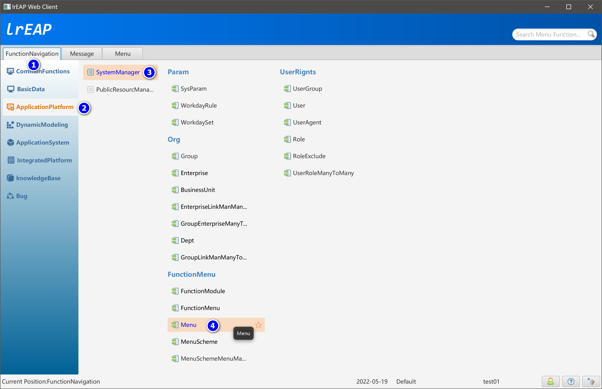

# MenuDesigner菜单设计

[返回](../../README.md)

## 简述

基于功能定义信息，在数据库中生成菜单信息，以及菜单国际化资源信息。一个功能定义可以生成多个菜单定义信息。

## 打开菜单设计器



## 生成菜单国际化信息


## 查看菜单的国际化信息

### UserSessionMenu_en_US

```ini
MENU_TEXT=UserSession
MENU_DESCRIPTION=UserSession
```

### UserSessionMenu_zh_CN

```ini
MENU_TEXT=在线用户
MENU_DESCRIPTION=在线用户
```

### UserSessionMenu_zh_TW

```ini
MENU_TEXT=在線用戶
MENU_DESCRIPTION=在線用戶
```


[返回](../../README.md)
