# MetadataDesigner元数据设计

[返回](../../README.md)

## 简述

元数据，又称中介数据、中继数据，是用来描述数据的数据(Data that describes other data)，主要是描述数据的详细属性信息。

在lrEAP中引入元数据体系，主有由于以下原因及考虑：
1、为实现模式化开发提供基础支撑，实现基于元数据的建模功能。
2、为界面模式化开发提供基础支持。
3、为界面国际化、界面自定义等前端功能提供基础支撑。
4、为实现主数据、指标体系、基于Word/Excel的可视化报表/报告等应用组件提供基础支撑。

我们把lrEAP的元数据分为两类进行管理。
一类是“业务元数据”，用于描述系统模块、组件、实体、实体属性等与业务数据对象相关的属性信息。例如，对“集团”业务对象相关属性的描述。
一类是“操作元数据”，用于描述对业务对象的操作属性。例如，对“新增操作员”业务操作的属性描述。

## 使用PowerDesigner设计数据库模型

为了提高数据建模过程的便捷性，我们建议使用类似PowerDesigner这种专业的工具完成数据模型的建设，通过lrEAP建模工具生成代码到工程中，并在此基础上进一步完善，形成元数据等信息，完成面向业务的数据建模操作。

采用这种方式时，数据物理模型(PDM)设计的合理性、合规性就显得极端重要，数据库表以及其它对象的结构设计不但要满足业务处理、展现的要求，同时也要满足lrEAP平台对模式化开发的要求。

为便于开发人员实现基于lrEAP平台的模式化开发，并取得最好效果，必须使用平台提供的（或相同名称、类似类型的）PDM模板进行数据库设计。

## Domain定义

 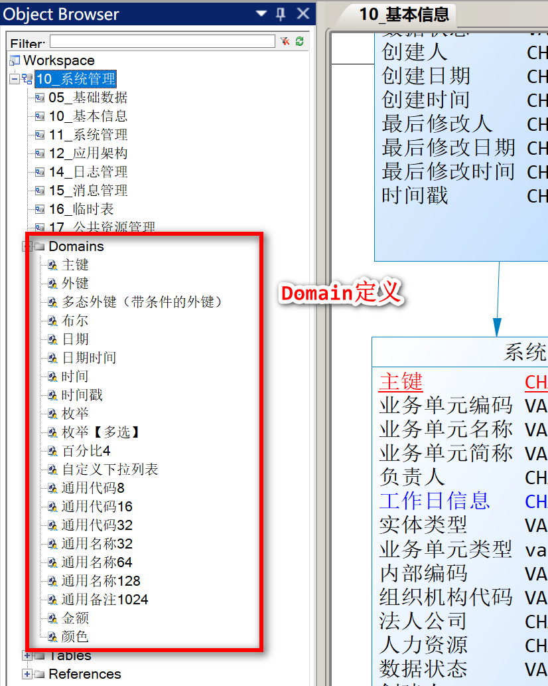

基于数据类型标准化的考虑，lrEAP提供的PDM模板中定义了上述一些Domain，供设计表时选用，也可以根据实际业务需求添加其它Domain。

有一些预设的Domain是不能修改的。如主键，固定为char(20)类型，即所有选用“主键”Domain作为域属性的字段，在基于ValueObject体系进行持久化时，都将根据指定的规则为其生成唯一的20位的字符串作为主键。同样类型的Domain还有时间戳(ts)，固定为“yyyy-MM-dd hh:mm:ss.SSS”格式。

有一些预设的Domain是有业务含义的。如枚举，如果数据库表中一个字段的字段类型的Domain属性设置为“枚举”，则必须在“Keywords”栏中为其指定相应的枚举类名称，否则在使用建模工具生成元数据及代码时将不会得到我们希望的结果。

还有一些预设的Domain，对应为Java的数据类型。例如，布尔对应Boolean，日期对应LocalDate，时间对应LocalTime等。这类Domain并不是强制约定，可以根据实际的业务需求，决定是否选用。

有一些预设的Domain只是约定统一的数据类型，便于统一控制。如通用代码、通用名称、金额、百分比等。平台对这类Domain的限制更少。

## 表设计

 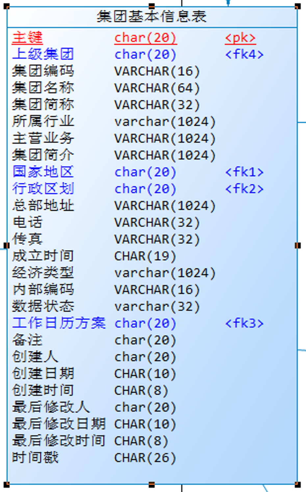

主键显示为红色字体，外键显示为蓝色字体。设置方式：

ToolsDisplay Preferences…出现以下窗口：

 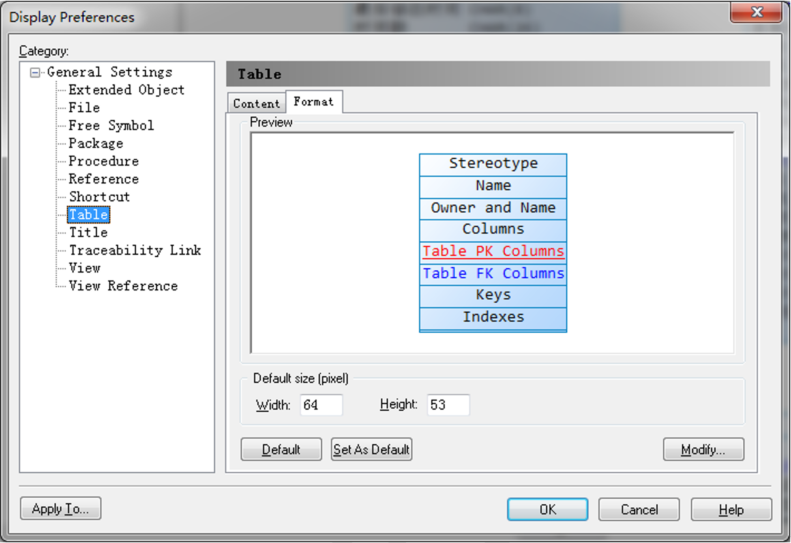

选择Table，在右边页签中，选择Format，点击右下的Modify…，出现以下窗口：

 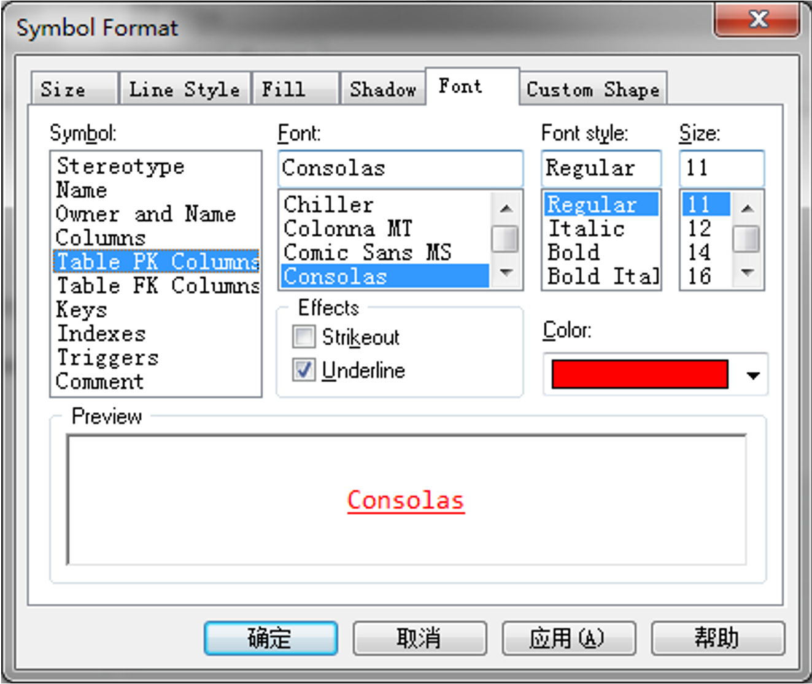

选择Font。Symbol列表中：

Table PK Colums:用于设计主键的显示样式。

Table FK columsn:用于设置外键的显示样式。

其它属性类似。

该表有自引用关系（即对应为树形结构）。双击打开表设计界面并切换到“Columns”页签：

 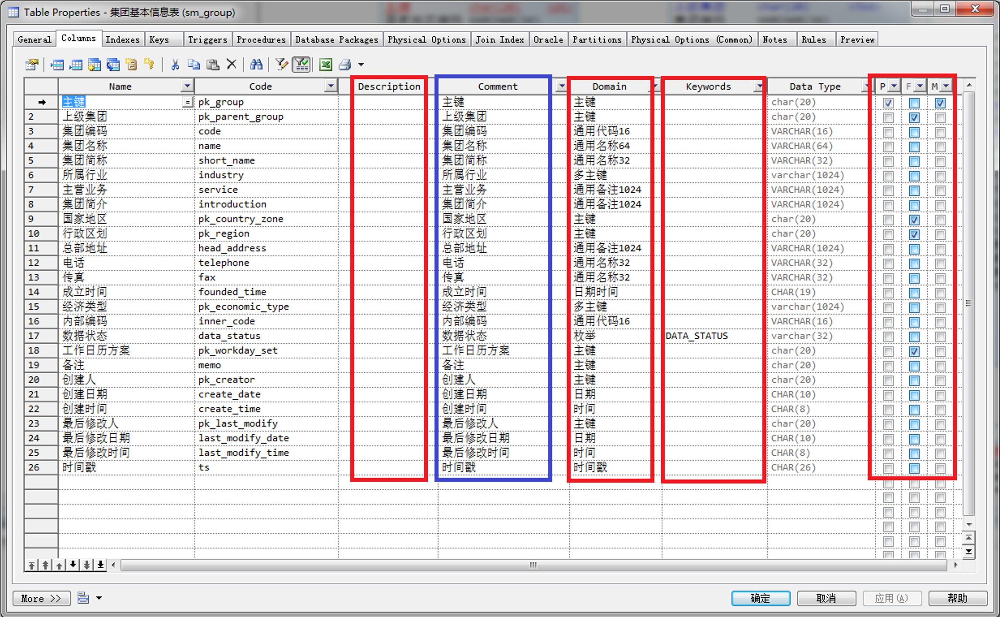

我们希望在生成的PDM文件中，保存一些供后续生成代码工具使用的、有重要作用的栏位信息，但是PowerDesigner标准版中没有提供自定义数据栏位的功能，所以只能占用两个不常用的预设栏位：

- Description：实际含义是用于描述该字段在卡片界面显示时所属的分组。如果为空，默认为“基本信息”。
- keywords：用于标识枚举、参照与其相应配置的映射。如果该字段的Domain为“外键”，则keywords中的值必须为该字段对应的参照类名称；如果该字段的Domain为“枚举”，则Keywords中的值必须为该字段对应的枚举类名称。这是lrEAP平台在数据物理模型中最重要、最关键的强限制。
- Comment：用于生成Oracle、DB2数据库数据字典中字段对应的注释信息，不需要手工填写，通过vbs脚本（见4.1.6）生成，从name栏中复制值。

主键、外键：根据业务需求指定即可。

## 外键指定

以为“集团基本信息表”生成“国家地区”外键为例：
1.	打开“集团基本信息表”所在的视图，使其可见；
2.	在左边的“Object Browser”中的“Tables”找到“国家地区表”，右键“Edit->Copy”或直接Ctl+C复制。
3.	在右边视图中，右键“Edit->Paste as Shotcut”
4.	在“Toolbox”中使用“Reference”从“集团基本信息表”到“国家地区表”设置引用关系。

注意：PDM中的外键仅用于展现实体关系，生成的SQL脚本中不包括外键约束相关的语句。也就是说，lrEAP平台外键约束不依赖数据库。

## 复合主键

lrEAP平台中，不允许使用复合主键。复合主键必须改为唯一索引，再增加单一主键字段。同时，不建议使用具有业务含义的字段作为主键。
关于“是否应该使用具有业务含义的字段作为数据库表主键”这个问题，我看到网上有相关的讨论。对于这类问题，我们的原则是不讨论，更不争论，而是依照民主集中制的原则制定前述强制约定。

## 自引用

以“集团基本信息表”为例，它在界面上展现为树形结构，所以表中有“上级集团”字段用于实现树形关系。这种自引用的设定，使用“Toolbox”中的“Reference”设置从“集团基本信息表”到“集团基本信息表”的引用即可。

## 表名和主键约定

例如，“集团基本信息表”的数据库表名为SM_GROUP，则其主键名约定为PK_GROUP。即表名第一个“_”前的内容替换为“PK”作为该表的主键。类似这种约定规矩，我们希望大家能够遵照执行。

- 表名

 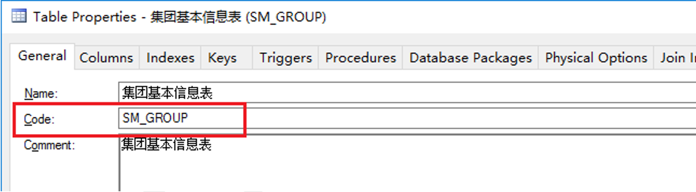

- 主键名

 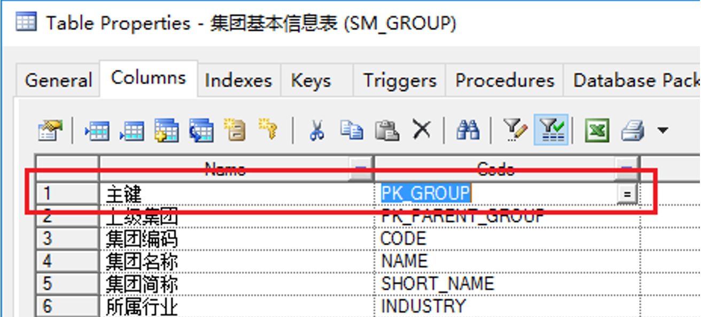

再次强调：lrEAP模式化开发中，数据库表不允许使用复合主键。必须使用唯一索引替代复合主键，并增加单一主键字段。对于需要基于ValueObject体系进行删除、修改操作的数据库表必须有且仅有一个主键字段。

## 字段名约束

对于整个应用中的任意表来说，作为枚举、参照等共用字段的名称及其含义必须有唯一性，不允许存在二义性。

例如，我们使用“bill_status”作为“单据状态”的字段名称，其在Java代码层面对应BillStatusEnum枚举类型。那么bill_status在整个应用中的任意表中出现时，都表示“单据状态”这个含义，不能有其它含义。

## 不生成外键约束

我们希望自行管理而不是由数据库实现外键约束（如级联更新、删除等情况）的管理，所以在生成脚本时需要指定不生成外键约束的参数：

“Database->Generated Database”，出现以下窗口：

 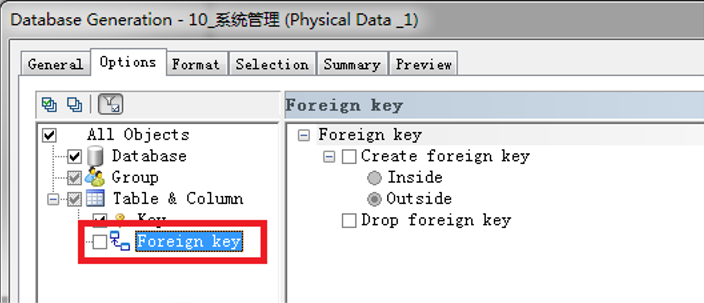

不选中“Foreign Key”选项。

## 时间戳（TS）

对于需要通过界面管理（新增、修改、删除等操作）的数据库表，必须包括ts字段，作为数据的版本号，用于更新控制，防止更新丢失。

## 打开元数据设计器

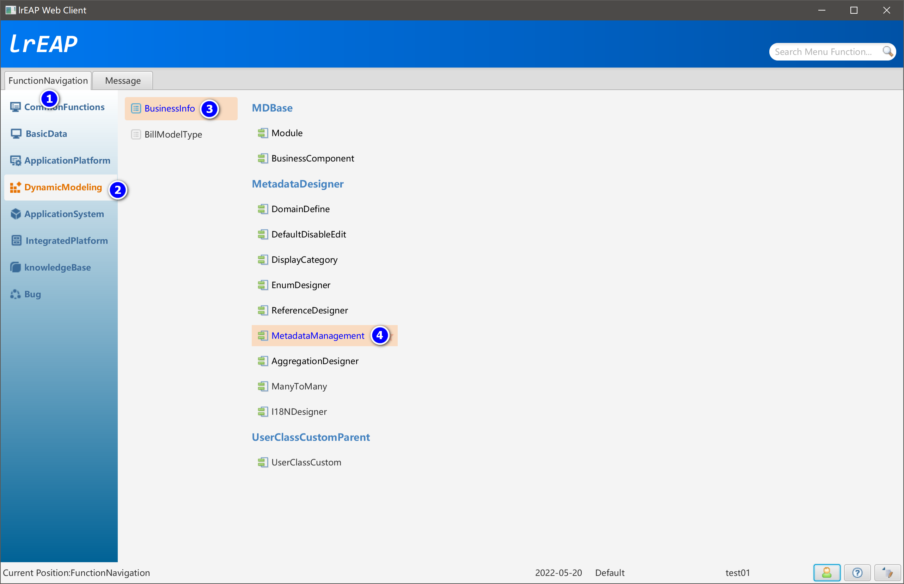

## 元数据设计器主界面

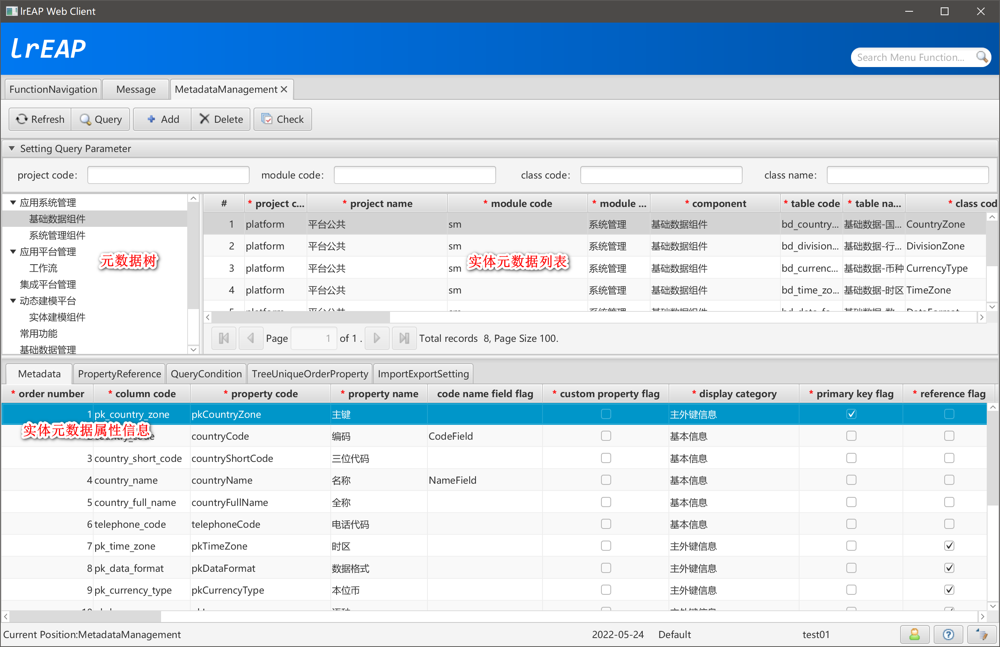

- Metadata
- PropertyReference
- QueryCondition
- TreeUniqueOrderProperty
- ImportExportSetting

## 新增元数据信息

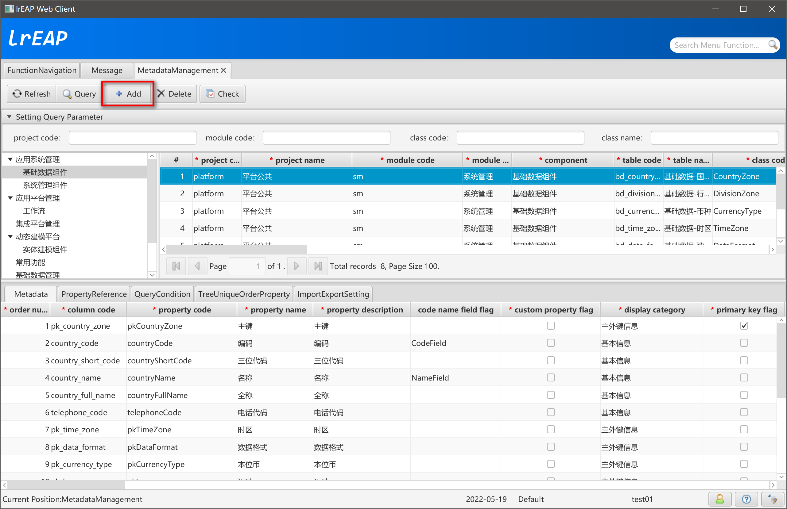

## 选择所属的业务组件

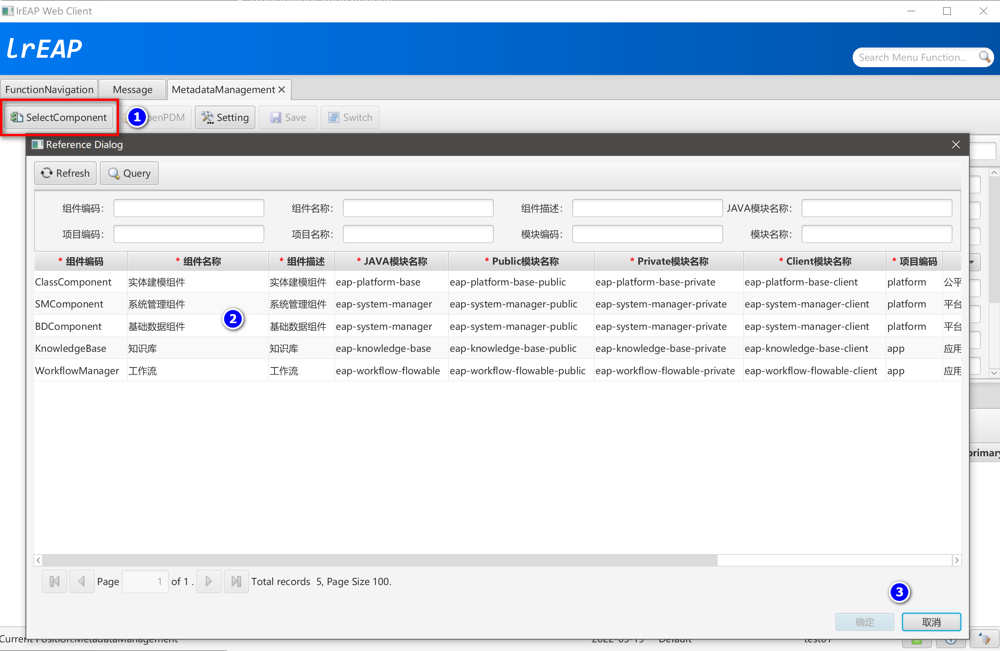

## 打开PDM文件


## 参数设置

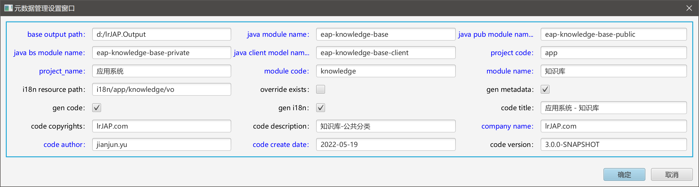

## 选择需要生成元数据的对象

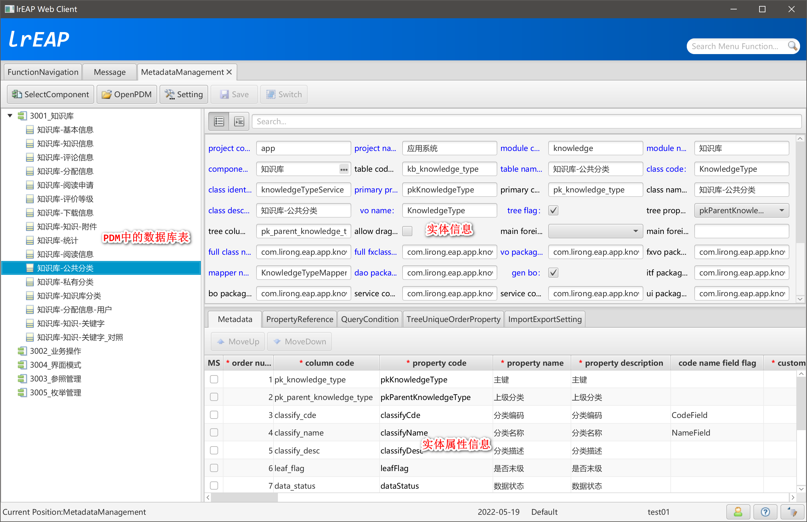

### 树型结构

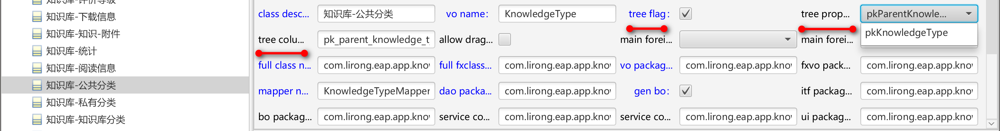

### 添加树型结构唯一排序条件

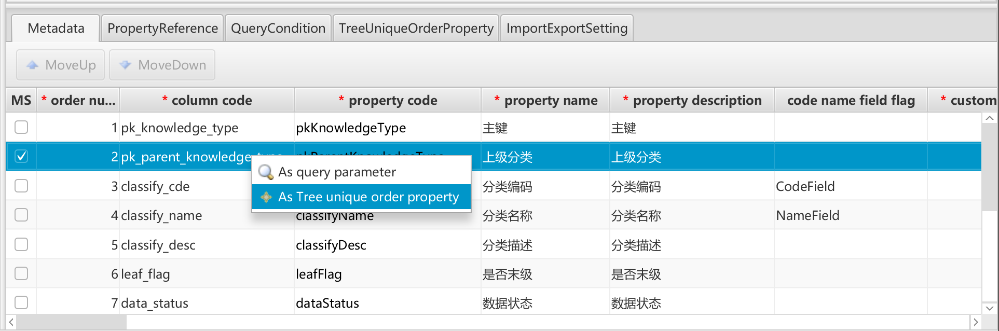

### 查看树型结构唯一排序条件

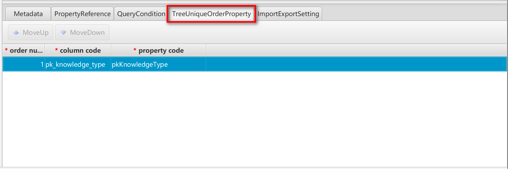

## 添加查询条件

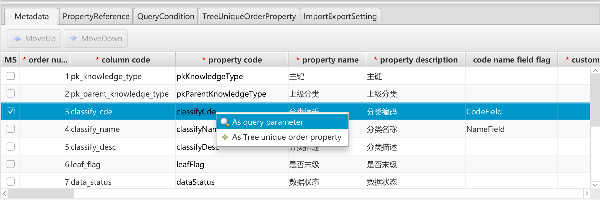

## 查询条件列表

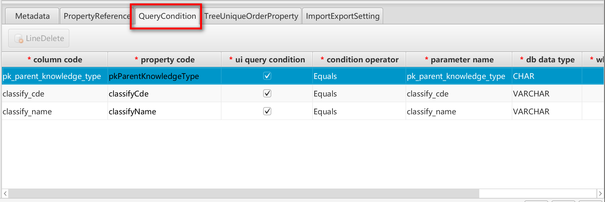

## 保存元数据信息

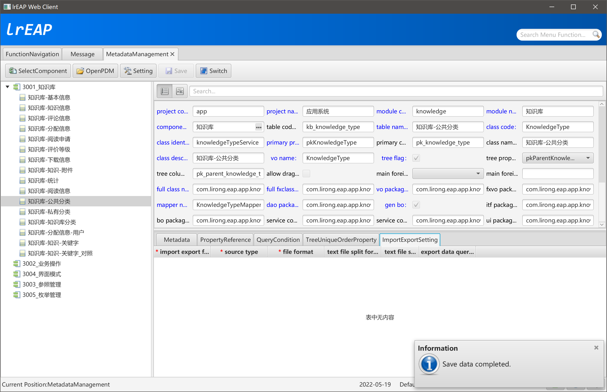

## 查看生成的资源信息

### 公共模块（eap-knowledge-base-public）

## KnowledgeTypeVO

```java
/**
 * <p>Title: LiRong Java Enterprise Application Platform</p>
 * <p>应用系统 - 知识库</p>
 * Description: 知识库-公共分类 的 ValueObject类<br>
 * Copyright: lrJAP.com<br>
 * Company: lrJAP.com<br>
 *
 * @author jianjun.yu
 * @version 3.0.0-SNAPSHOT
 * @date 2022-05-19
 * @since 1.0.0-SNAPSHOT
 */
@TableDefine(value = "kb_knowledge_type", classCode = "KnowledgeType", primaryPropertyCode = "pkKnowledgeType", primaryColumnCode = "pk_knowledge_type")
@TypeName("知识库-公共分类")
public class KnowledgeTypeVO extends BasicVO implements ITreeTableVO {

    private static final long serialVersionUID = -3352347518755582341L;

    /**
     * 主键 String
     */
    public static final String PK_KNOWLEDGE_TYPE_COLUMN_CODE = "pk_knowledge_type"; // $NON-NLS$
    public static final String PK_KNOWLEDGE_TYPE_PROPERTY_CODE = "pkKnowledgeType"; // $NON-NLS$
    public static final String PK_KNOWLEDGE_TYPE_PROPERTY_NAME = "主键"; // $NON-NLS$
    @Id
    @PropertyName(PK_KNOWLEDGE_TYPE_PROPERTY_NAME)
    private String pkKnowledgeType;

    /**
     * 上级分类 String
     */
    public static final String PK_PARENT_KNOWLEDGE_TYPE_COLUMN_CODE = "pk_parent_knowledge_type"; // $NON-NLS$
    public static final String PK_PARENT_KNOWLEDGE_TYPE_PROPERTY_CODE = "pkParentKnowledgeType"; // $NON-NLS$
    public static final String PK_PARENT_KNOWLEDGE_TYPE_PROPERTY_NAME = "上级分类"; // $NON-NLS$
    @PropertyName(PK_PARENT_KNOWLEDGE_TYPE_PROPERTY_NAME)
    private String pkParentKnowledgeType;

    /**
     * 分类编码 String
     */
    public static final String CLASSIFY_CDE_COLUMN_CODE = "classify_cde"; // $NON-NLS$
    public static final String CLASSIFY_CDE_PROPERTY_CODE = "classifyCde"; // $NON-NLS$
    public static final String CLASSIFY_CDE_PROPERTY_NAME = "分类编码"; // $NON-NLS$
    @PropertyName(CLASSIFY_CDE_PROPERTY_NAME)
    @NotBlank(message = "{APP.KNOWLEDGE.KnowledgeTypeVO.ClassifyCde.NotBlank}")
    @ChineseLength(max = 32, message = "{APP.KNOWLEDGE.KnowledgeTypeVO.ClassifyCde.MaxLength}")
    private String classifyCde;

    /**
     * 分类名称 String
     */
    public static final String CLASSIFY_NAME_COLUMN_CODE = "classify_name"; // $NON-NLS$
    public static final String CLASSIFY_NAME_PROPERTY_CODE = "classifyName"; // $NON-NLS$
    public static final String CLASSIFY_NAME_PROPERTY_NAME = "分类名称"; // $NON-NLS$
    @PropertyName(CLASSIFY_NAME_PROPERTY_NAME)
    @NotBlank(message = "{APP.KNOWLEDGE.KnowledgeTypeVO.ClassifyName.NotBlank}")
    @ChineseLength(max = 64, message = "{APP.KNOWLEDGE.KnowledgeTypeVO.ClassifyName.MaxLength}")
    private String classifyName;

    /**
     * 分类描述 String
     */
    public static final String CLASSIFY_DESC_COLUMN_CODE = "classify_desc"; // $NON-NLS$
    public static final String CLASSIFY_DESC_PROPERTY_CODE = "classifyDesc"; // $NON-NLS$
    public static final String CLASSIFY_DESC_PROPERTY_NAME = "分类描述"; // $NON-NLS$
    @PropertyName(CLASSIFY_DESC_PROPERTY_NAME)
    private String classifyDesc;

    /**
     * 是否末级 Boolean
     */
    public static final String LEAF_FLAG_COLUMN_CODE = "leaf_flag"; // $NON-NLS$
    public static final String LEAF_FLAG_PROPERTY_CODE = "leafFlag"; // $NON-NLS$
    public static final String LEAF_FLAG_PROPERTY_NAME = "是否末级"; // $NON-NLS$
    @PropertyName(LEAF_FLAG_PROPERTY_NAME)
    @NotNull(message = "{APP.KNOWLEDGE.KnowledgeTypeVO.LeafFlag.NotBlank}")
    private Boolean leafFlag;

    /**
     * 数据状态 DataStatusEnum
     */
    public static final String DATA_STATUS_COLUMN_CODE = "data_status"; // $NON-NLS$
    public static final String DATA_STATUS_PROPERTY_CODE = "dataStatus"; // $NON-NLS$
    public static final String DATA_STATUS_PROPERTY_NAME = "数据状态"; // $NON-NLS$
    @PropertyName(DATA_STATUS_PROPERTY_NAME)
    @NotNull(message = "{APP.KNOWLEDGE.KnowledgeTypeVO.DataStatus.NotBlank}")
    private DataStatusEnum dataStatus;

    /**
     * 创建人 UserReferenceVO
     */
    public static final String PK_CREATOR_COLUMN_CODE = "pk_creator"; // $NON-NLS$
    public static final String PK_CREATOR_PROPERTY_CODE = "pkCreator"; // $NON-NLS$
    public static final String PK_CREATOR_PROPERTY_NAME = "创建人"; // $NON-NLS$
    @PropertyName(PK_CREATOR_PROPERTY_NAME)
    @NotNull(message = "{APP.KNOWLEDGE.KnowledgeTypeVO.PkCreator.NotBlank}")
    private UserReferenceVO pkCreator;

    /**
     * 创建日期 LocalDate
     */
    public static final String CREATE_DATE_COLUMN_CODE = "create_date"; // $NON-NLS$
    public static final String CREATE_DATE_PROPERTY_CODE = "createDate"; // $NON-NLS$
    public static final String CREATE_DATE_PROPERTY_NAME = "创建日期"; // $NON-NLS$
    @PropertyName(CREATE_DATE_PROPERTY_NAME)
    @NotNull(message = "{APP.KNOWLEDGE.KnowledgeTypeVO.CreateDate.NotBlank}")
    private LocalDate createDate;

    /**
     * 创建时间 LocalTime
     */
    public static final String CREATE_TIME_COLUMN_CODE = "create_time"; // $NON-NLS$
    public static final String CREATE_TIME_PROPERTY_CODE = "createTime"; // $NON-NLS$
    public static final String CREATE_TIME_PROPERTY_NAME = "创建时间"; // $NON-NLS$
    @PropertyName(CREATE_TIME_PROPERTY_NAME)
    @NotNull(message = "{APP.KNOWLEDGE.KnowledgeTypeVO.CreateTime.NotBlank}")
    private LocalTime createTime;

    /**
     * 最后修改人 UserReferenceVO
     */
    public static final String PK_LAST_MODIFY_COLUMN_CODE = "pk_last_modify"; // $NON-NLS$
    public static final String PK_LAST_MODIFY_PROPERTY_CODE = "pkLastModify"; // $NON-NLS$
    public static final String PK_LAST_MODIFY_PROPERTY_NAME = "最后修改人"; // $NON-NLS$
    @PropertyName(PK_LAST_MODIFY_PROPERTY_NAME)
    private UserReferenceVO pkLastModify;

    /**
     * 最后修改日期 LocalDate
     */
    public static final String LAST_MODIFY_DATE_COLUMN_CODE = "last_modify_date"; // $NON-NLS$
    public static final String LAST_MODIFY_DATE_PROPERTY_CODE = "lastModifyDate"; // $NON-NLS$
    public static final String LAST_MODIFY_DATE_PROPERTY_NAME = "最后修改日期"; // $NON-NLS$
    @PropertyName(LAST_MODIFY_DATE_PROPERTY_NAME)
    private LocalDate lastModifyDate;

    /**
     * 最后修改时间 LocalTime
     */
    public static final String LAST_MODIFY_TIME_COLUMN_CODE = "last_modify_time"; // $NON-NLS$
    public static final String LAST_MODIFY_TIME_PROPERTY_CODE = "lastModifyTime"; // $NON-NLS$
    public static final String LAST_MODIFY_TIME_PROPERTY_NAME = "最后修改时间"; // $NON-NLS$
    @PropertyName(LAST_MODIFY_TIME_PROPERTY_NAME)
    private LocalTime lastModifyTime;

    /**
     * 时间戳 String
     */
    public static final String TS_COLUMN_CODE = "ts"; // $NON-NLS$
    public static final String TS_PROPERTY_CODE = "ts"; // $NON-NLS$
    public static final String TS_PROPERTY_NAME = "时间戳"; // $NON-NLS$
    @PropertyName(TS_PROPERTY_NAME)
    @NotBlank(message = "{APP.KNOWLEDGE.KnowledgeTypeVO.Ts.NotBlank}")
    @ChineseLength(max = 23, message = "{APP.KNOWLEDGE.KnowledgeTypeVO.Ts.MaxLength}")
    private String ts;

    @DoNotPersistent
    private List<KnowledgeTypeVO> child = new ArrayList<>();

    public KnowledgeTypeVO() {

        super();
        // 默认值处理
        initDefaultValue();
    }

    public String getPkKnowledgeType() {

        return pkKnowledgeType;
    }

    public void setPkKnowledgeType(String pkKnowledgeType) {

        final String oldValue = this.pkKnowledgeType;
        this.pkKnowledgeType = pkKnowledgeType;
        firePropertyChange(PK_KNOWLEDGE_TYPE_PROPERTY_CODE, oldValue, pkKnowledgeType);
    }

    public String getPkParentKnowledgeType() {

        return pkParentKnowledgeType;
    }

    public void setPkParentKnowledgeType(String pkParentKnowledgeType) {

        final String oldValue = this.pkParentKnowledgeType;
        this.pkParentKnowledgeType = pkParentKnowledgeType;
        firePropertyChange(PK_PARENT_KNOWLEDGE_TYPE_PROPERTY_CODE, oldValue, pkParentKnowledgeType);
    }

    public String getClassifyCde() {

        return classifyCde;
    }

    public void setClassifyCde(String classifyCde) {

        final String oldValue = this.classifyCde;
        this.classifyCde = classifyCde;
        firePropertyChange(CLASSIFY_CDE_PROPERTY_CODE, oldValue, classifyCde);
    }

    public String getClassifyName() {

        return classifyName;
    }

    public void setClassifyName(String classifyName) {

        final String oldValue = this.classifyName;
        this.classifyName = classifyName;
        firePropertyChange(CLASSIFY_NAME_PROPERTY_CODE, oldValue, classifyName);
    }

    public String getClassifyDesc() {

        return classifyDesc;
    }

    public void setClassifyDesc(String classifyDesc) {

        final String oldValue = this.classifyDesc;
        this.classifyDesc = classifyDesc;
        firePropertyChange(CLASSIFY_DESC_PROPERTY_CODE, oldValue, classifyDesc);
    }

    public Boolean getLeafFlag() {

        return leafFlag;
    }

    public void setLeafFlag(Boolean leafFlag) {

        final Boolean oldValue = this.leafFlag;
        this.leafFlag = leafFlag;
        firePropertyChange(LEAF_FLAG_PROPERTY_CODE, oldValue, leafFlag);
    }

    public DataStatusEnum getDataStatus() {

        return dataStatus;
    }

    public void setDataStatus(DataStatusEnum dataStatus) {

        final DataStatusEnum oldValue = this.dataStatus;
        this.dataStatus = dataStatus;
        firePropertyChange(DATA_STATUS_PROPERTY_CODE, oldValue, dataStatus);
    }

    public UserReferenceVO getPkCreator() {

        return pkCreator;
    }

    public void setPkCreator(UserReferenceVO pkCreator) {

        final UserReferenceVO oldValue = this.pkCreator;
        this.pkCreator = pkCreator;
        firePropertyChange(PK_CREATOR_PROPERTY_CODE, oldValue, pkCreator);
    }

    public LocalDate getCreateDate() {

        return createDate;
    }

    public void setCreateDate(LocalDate createDate) {

        final LocalDate oldValue = this.createDate;
        this.createDate = createDate;
        firePropertyChange(CREATE_DATE_PROPERTY_CODE, oldValue, createDate);
    }

    public LocalTime getCreateTime() {

        return createTime;
    }

    public void setCreateTime(LocalTime createTime) {

        final LocalTime oldValue = this.createTime;
        this.createTime = createTime;
        firePropertyChange(CREATE_TIME_PROPERTY_CODE, oldValue, createTime);
    }

    public UserReferenceVO getPkLastModify() {

        return pkLastModify;
    }

    public void setPkLastModify(UserReferenceVO pkLastModify) {

        final UserReferenceVO oldValue = this.pkLastModify;
        this.pkLastModify = pkLastModify;
        firePropertyChange(PK_LAST_MODIFY_PROPERTY_CODE, oldValue, pkLastModify);
    }

    public LocalDate getLastModifyDate() {

        return lastModifyDate;
    }

    public void setLastModifyDate(LocalDate lastModifyDate) {

        final LocalDate oldValue = this.lastModifyDate;
        this.lastModifyDate = lastModifyDate;
        firePropertyChange(LAST_MODIFY_DATE_PROPERTY_CODE, oldValue, lastModifyDate);
    }

    public LocalTime getLastModifyTime() {

        return lastModifyTime;
    }

    public void setLastModifyTime(LocalTime lastModifyTime) {

        final LocalTime oldValue = this.lastModifyTime;
        this.lastModifyTime = lastModifyTime;
        firePropertyChange(LAST_MODIFY_TIME_PROPERTY_CODE, oldValue, lastModifyTime);
    }

    public String getTs() {

        return ts;
    }

    public void setTs(String ts) {

        final String oldValue = this.ts;
        this.ts = ts;
        firePropertyChange(TS_PROPERTY_CODE, oldValue, ts);
    }

    @Override
    public String getTreeParentPrimaryColumnCode() {

        return PK_PARENT_KNOWLEDGE_TYPE_COLUMN_CODE; // $NON-NLS$
    }

    @Override
    public String getParentPrimaryKey() {

        Object value = getProperty(PK_PARENT_KNOWLEDGE_TYPE_PROPERTY_CODE); // $NON-NLS$
        if (value != null) {
            if (value instanceof ReferenceDataVO) {
                return ((ReferenceDataVO) value).getPk();
            } else {
                return value.toString();
            }
        }
        return null;
    }

    @Override
    public String getDisplayValue() {

        return this.classifyName;
    }

    @Override
    public String getLeafIconFileName() {

        return null;
    }

    @Override
    public String getNotLeafIconFileName() {

        return null;
    }

    @Override
    public List<KnowledgeTypeVO> getListChild() {

        return getChild();
    }

    public List<KnowledgeTypeVO> getChild() {

        return child;
    }

    public void setChild(List<KnowledgeTypeVO> child) {

        this.child = child;
    }

    protected void initDefaultValue() {

        super.initProperty();
        /* 是否末级 */
        setLeafFlag(Boolean.FALSE);
    }

    /******************************************************************************************************************/
    /********************************************** lrEAP Code Generator **********************************************/
    /******************************************************************************************************************/
}
```

## IKnowledgeType

```java
/**
 * <p>Title: LiRong Java Enterprise Application Platform</p>
 * <p>应用系统 - 知识库</p>
 * Description: KnowledgeType 的业务接口类<br>
 * Copyright: lrJAP.com<br>
 * Company: lrJAP.com<br>
 *
 * @author jianjun.yu
 * @version 3.0.0-SNAPSHOT
 * @date 2022-05-19
 * @since 1.0.0-SNAPSHOT
 */
public interface IKnowledgeType<P extends KnowledgeTypeVO> extends IBusinessTreeModelService<P> {

    String SERVICE_NAME = "knowledgeTypeService"; // $NON-NLS$

    String REMOTING_SERVICE_NAME = "/app-knowledge/knowledgeTypeHttpInvokerService"; // $NON-NLS$

    /******************************************************************************************************************/
    /********************************************** lrEAP Code Generator **********************************************/
    /******************************************************************************************************************/
}
```

## 字段国示化信息

- KnowledgeType_en_US


```ini
pkKnowledgeType=primary key
pkParentKnowledgeType=pk parent knowledge type
classifyCde=classify cde
classifyName=classify name
classifyDesc=classify desc
leafFlag=leaf flag
dataStatus=data status
pkCreator=creator
createDate=create date
createTime=create time
pkLastModify=last modify
lastModifyDate=last modify date
lastModifyTime=last modify time
ts=ts
```

- KnowledgeType_zh_CN


```ini
pkKnowledgeType=主键
pkParentKnowledgeType=上级分类
classifyCde=分类编码
classifyName=分类名称
classifyDesc=分类描述
leafFlag=是否末级
dataStatus=数据状态
pkCreator=创建人
createDate=创建日期
createTime=创建时间
pkLastModify=最后修改人
lastModifyDate=最后修改日期
lastModifyTime=最后修改时间
ts=时间戳
```

- KnowledgeType_zh_TW


```ini
pkKnowledgeType=主鍵
pkParentKnowledgeType=上級分類
classifyCde=分類編碼
classifyName=分類名稱
classifyDesc=分類描述
leafFlag=是否末級
dataStatus=數據狀態
pkCreator=創建人
createDate=創建日期
createTime=創建時間
pkLastModify=最後修改人
lastModifyDate=最後修改日期
lastModifyTime=最後修改時間
ts=時間戳
```

## 属性校验信息

- KnowledgeTypeVO_en_US


```ini
APP.KNOWLEDGE.KnowledgeTypeVO.ClassifyCde.NotBlank=classifyCde must be not empty;
APP.KNOWLEDGE.KnowledgeTypeVO.ClassifyCde.MaxLength=classifyCde exceeds the maximum length, the maximum allowed length: 32;
APP.KNOWLEDGE.KnowledgeTypeVO.ClassifyName.NotBlank=classifyName must be not empty;
APP.KNOWLEDGE.KnowledgeTypeVO.ClassifyName.MaxLength=classifyName exceeds the maximum length, the maximum allowed length: 64;
APP.KNOWLEDGE.KnowledgeTypeVO.LeafFlag.NotBlank=leafFlag must be not empty;
APP.KNOWLEDGE.KnowledgeTypeVO.DataStatus.NotBlank=dataStatus must be not empty;
APP.KNOWLEDGE.KnowledgeTypeVO.PkCreator.NotBlank=pkCreator must be not empty;
APP.KNOWLEDGE.KnowledgeTypeVO.CreateDate.NotBlank=createDate must be not empty;
APP.KNOWLEDGE.KnowledgeTypeVO.CreateTime.NotBlank=createTime must be not empty;
APP.KNOWLEDGE.KnowledgeTypeVO.Ts.NotBlank=ts must be not empty;
APP.KNOWLEDGE.KnowledgeTypeVO.Ts.MaxLength=ts exceeds the maximum length, the maximum allowed length: 23;
```

- KnowledgeTypeVO_zh_CN


```ini
APP.KNOWLEDGE.KnowledgeTypeVO.ClassifyCde.NotBlank=分类编码(classifyCde) 不允许为空;
APP.KNOWLEDGE.KnowledgeTypeVO.ClassifyCde.MaxLength=分类编码(classifyCde) 超过最大长度，允许的最大长度：32；
APP.KNOWLEDGE.KnowledgeTypeVO.ClassifyName.NotBlank=分类名称(classifyName) 不允许为空;
APP.KNOWLEDGE.KnowledgeTypeVO.ClassifyName.MaxLength=分类名称(classifyName) 超过最大长度，允许的最大长度：64；
APP.KNOWLEDGE.KnowledgeTypeVO.LeafFlag.NotBlank=是否末级(leafFlag) 不允许为空;
APP.KNOWLEDGE.KnowledgeTypeVO.DataStatus.NotBlank=数据状态(dataStatus) 不允许为空;
APP.KNOWLEDGE.KnowledgeTypeVO.PkCreator.NotBlank=创建人(pkCreator) 不允许为空;
APP.KNOWLEDGE.KnowledgeTypeVO.CreateDate.NotBlank=创建日期(createDate) 不允许为空;
APP.KNOWLEDGE.KnowledgeTypeVO.CreateTime.NotBlank=创建时间(createTime) 不允许为空;
APP.KNOWLEDGE.KnowledgeTypeVO.Ts.NotBlank=时间戳(ts) 不允许为空;
APP.KNOWLEDGE.KnowledgeTypeVO.Ts.MaxLength=时间戳(ts) 超过最大长度，允许的最大长度：23；
```

- KnowledgeTypeVO_zh_TW


```ini
APP.KNOWLEDGE.KnowledgeTypeVO.ClassifyCde.NotBlank=分類編碼(classifyCde) 不允許爲空;
APP.KNOWLEDGE.KnowledgeTypeVO.ClassifyCde.MaxLength=分類編碼(classifyCde) 超過最大長度，允許的最大長度：32；
APP.KNOWLEDGE.KnowledgeTypeVO.ClassifyName.NotBlank=分類名稱(classifyName) 不允許爲空;
APP.KNOWLEDGE.KnowledgeTypeVO.ClassifyName.MaxLength=分類名稱(classifyName) 超過最大長度，允許的最大長度：64；
APP.KNOWLEDGE.KnowledgeTypeVO.LeafFlag.NotBlank=是否末級(leafFlag) 不允許爲空;
APP.KNOWLEDGE.KnowledgeTypeVO.DataStatus.NotBlank=數據狀態(dataStatus) 不允許爲空;
APP.KNOWLEDGE.KnowledgeTypeVO.PkCreator.NotBlank=創建人(pkCreator) 不允許爲空;
APP.KNOWLEDGE.KnowledgeTypeVO.CreateDate.NotBlank=創建日期(createDate) 不允許爲空;
APP.KNOWLEDGE.KnowledgeTypeVO.CreateTime.NotBlank=創建時間(createTime) 不允許爲空;
APP.KNOWLEDGE.KnowledgeTypeVO.Ts.NotBlank=時間戳(ts) 不允許爲空;
APP.KNOWLEDGE.KnowledgeTypeVO.Ts.MaxLength=時間戳(ts) 超過最大長度，允許的最大長度：23；
```

### 业务处理模块（eap-knowledge-base-private）

## KnowledgeTypeBO

```java
/**
 * <p>Title: LiRong Java Enterprise Application Platform</p>
 * <p>应用系统 - 知识库</p>
 * Description: KnowledgeType 的业务处理类<br>
 * Copyright: lrJAP.com<br>
 * Company: lrJAP.com<br>
 *
 * @author jianjun.yu
 * @version 3.0.0-SNAPSHOT
 * @date 2022-05-19
 * @since 1.0.0-SNAPSHOT
 */
@Service(IKnowledgeType.SERVICE_NAME)
@Transactional
public class KnowledgeTypeBO<P extends KnowledgeTypeVO> extends BasicBusinessObject<P> implements IKnowledgeType<P> {

    private static final Logger logger = LoggerFactory.getLogger(KnowledgeTypeBO.class);

    @Resource
    private IKnowledgeTypeMapper<P> knowledgeTypeMapper;

    @Override
    public IKnowledgeTypeMapper<P> getBaseModelService() {

        return this.knowledgeTypeMapper;
    }

    @Override
    public int delete(P vo) throws BusinessException {

        // 有下级时，不允许直接删除
        final String pkKnowledgeType = vo.getPrimaryKey();

        final String strSql = "select 1 from kb_knowledge_type t where t.pk_parent_knowledge_type = ?"; // $NON-NLS$
        boolean exists = checkDataExists(strSql, new Object[]{pkKnowledgeType});
        if (exists) {
            throw new BusinessException("错误：存在下级数据，无法删除。");
        }

        return super.delete(vo);
    }


    @Override
    public List<P> queryTreeFirstLeaf() throws BusinessException {

        return getBaseModelService().queryTreeFirstLeaf();
    }

    @Override
    public List queryTreeAllParent() throws BusinessException {

        return super.queryTreeAllParent(this);
    }

    @Override
    public Integer queryTreeChildPaginationCount(Map<String, Object> params) throws BusinessException {

        return getBaseModelService().queryTreeChildPaginationCount(params);
    }

    @Override
    public List<P> queryTreeChildPaginationList(Map<String, Object> params) throws BusinessException {

        return getBaseModelService().queryTreeChildPaginationList(params);
    }

    @Override
    public List<P> queryTreeNextLeaf(String parentKey) throws BusinessException {

        return getBaseModelService().queryTreeNextLeaf(parentKey);
    }

    @Override
    public List<P> queryTreeAllLeaf(String parentKey) throws BusinessException {

        return getBaseModelService().queryTreeAllLeaf(parentKey);
    }

    @Override
    public List<P> queryTreeFullWithPrimaryKey(String pk) throws BusinessException {

        if (StringUtils.isBlank(pk)) {
            throw new BusinessException("参数错误。");
        }

        List<P> list = new ArrayList<>();

        if (SQLDialect.ORACLE == getSqlDialect() || SQLDialect.DB2 == getSqlDialect()) {
            list = getBaseModelService().queryTreeFullStructWithPrimaryKey(pk);
        } else if (SQLDialect.MYSQL == getSqlDialect()) {

            P leafVO = getBaseModelService().queryByPrimaryKey(pk);
            if (leafVO == null) {
                throw new BusinessException("错误：数据不存在。");
            }

            list.add(leafVO);
            String pkParent = leafVO.getPkParentKnowledgeType();
            while (StringUtils.isNotBlank(pkParent)) {
                P parentVO = getBaseModelService().queryByPrimaryKey(pk);
                if (parentVO == null) {
                    throw new BusinessException("错误：数据不存在。");
                }
                pkParent = parentVO.getPkParentKnowledgeType();
                list.add(parentVO);
            }
        } else {
            throw new BusinessException("错误：不支持的数据库类型。");
        }

        if (list.isEmpty()) {
            return null;
        }

        return list;
    }

    @Override
    public P queryTreeFullStructWithPrimaryKey(String pk) throws BusinessException {

        if (StringUtils.isBlank(pk)) {
            throw new BusinessException("参数错误。");
        }

        List<P> list = queryTreeFullWithPrimaryKey(pk);

        if (list == null || list.isEmpty()) {
            return null;
        }

        return (P) super.buildTreeStruct(KnowledgeTypeVO.PK_PARENT_KNOWLEDGE_TYPE_COLUMN_CODE, list);
    }

    @Override
    public void deleteTreeDataCascade(String pkKnowledgeType) throws BusinessException {

        super.deleteTreeDataCascade("kb_knowledge_type", KnowledgeTypeVO.PK_KNOWLEDGE_TYPE_COLUMN_CODE, KnowledgeTypeVO.PK_PARENT_KNOWLEDGE_TYPE_COLUMN_CODE, KnowledgeTypeVO.PK_KNOWLEDGE_TYPE_COLUMN_CODE); // $NON-NLS$
    }

    @Override
    public Boolean deleteTreeLeaf(P treeVO) throws BusinessException {

        return super.deleteTreeLeaf(treeVO);
    }

    @Override
    public List<String> queryTreePrimaryKeyCascade(final String pkKnowledgeType) throws BusinessException {

        return super.queryTreePrimaryKeyCascade("kb_knowledge_type", KnowledgeTypeVO.PK_KNOWLEDGE_TYPE_COLUMN_CODE, KnowledgeTypeVO.PK_PARENT_KNOWLEDGE_TYPE_COLUMN_CODE, KnowledgeTypeVO.PK_KNOWLEDGE_TYPE_COLUMN_CODE); // $NON-NLS$
    }

    @Override
    public List<P> queryTreeAll() throws BusinessException {

        return getBaseModelService().queryTreeAll();
    }

    @Override
    public P saveOrUpdateTree(P treeVO) throws BusinessException {

        final String pk = super.saveOrUpdateTreeData(treeVO);
        return queryByPrimaryKey(pk);
    }

    @Override
    public Boolean acceptTreeDropOver(P source, P target) {

        throw new UnsupportedOperationException("不支持拖放操作。");
    }

    @Override
    public List<String> getClassCode() throws BusinessException {

        return Collections.singletonList("KnowledgeType"); // $NON-NLS$
    }

    /******************************************************************************************************************/
    /********************************************** lrEAP Code Generator **********************************************/
    /******************************************************************************************************************/
}
```

## IKnowledgeTypeMapper

```java
/**
 * <p>Title: LiRong Java Enterprise Application Platform</p>
 * <p>应用系统 - 知识库</p>
 * Description: KnowledgeType 的DAO类<br>
 * Copyright: lrJAP.com<br>
 * Company: lrJAP.com<br>
 *
 * @author jianjun.yu
 * @version 3.0.0-SNAPSHOT
 * @date 2022-05-19
 * @since 1.0.0-SNAPSHOT
 */
@Repository
public interface IKnowledgeTypeMapper<P extends KnowledgeTypeVO> extends IBaseTreeModelService<P> {

    String MAPPER_NAMESPACE = "com.lirong.eap.app.knowledge.bs.dao.IKnowledgeTypeMapper"; // $NON-NLS$

    /******************************************************************************************************************/
    /********************************************** lrEAP Code Generator **********************************************/
    /******************************************************************************************************************/
}
```

## IKnowledgeTypeMapper

```xml
<?xml version="1.0" encoding="UTF-8" ?>
<!DOCTYPE mapper PUBLIC "-//mybatis.org//DTD Mapper 3.0//EN" "http://mybatis.org/dtd/mybatis-3-mapper.dtd">

<mapper namespace="com.lirong.eap.app.knowledge.bs.dao.IKnowledgeTypeMapper">

    <resultMap type="com.lirong.eap.app.knowledge.pub.vo.KnowledgeTypeVO" id="KnowledgeTypeVO"
               extends="com.lirong.eap.platform.PaginationResultCounterMapper.PaginationResultCounter">

        <!-- 主键 -->
        <id property="pkKnowledgeType" column="PK_KNOWLEDGE_TYPE"/>

        <!-- 上级分类 -->
        <result property="pkParentKnowledgeType" column="PK_PARENT_KNOWLEDGE_TYPE" javaType="java.lang.String" jdbcType="CHAR"/>
        <!-- 分类编码 -->
        <result property="classifyCde" column="CLASSIFY_CDE" javaType="java.lang.String" jdbcType="VARCHAR"/>
        <!-- 分类名称 -->
        <result property="classifyName" column="CLASSIFY_NAME" javaType="java.lang.String" jdbcType="VARCHAR"/>
        <!-- 分类描述 -->
        <result property="classifyDesc" column="CLASSIFY_DESC" javaType="java.lang.String" jdbcType="CLOB"/>
        <!-- 是否末级 -->
        <result property="leafFlag" column="LEAF_FLAG" javaType="java.lang.Boolean" jdbcType="CHAR"/>
        <!-- 时间戳 -->
        <result property="ts" column="TS" javaType="java.lang.String" jdbcType="CHAR"/>

        <!-- 数据状态 -->
        <result property="dataStatus" column="DATA_STATUS"
                javaType="com.lirong.eap.platform.base.pub.enumtype.DataStatusEnum"
                jdbcType="VARCHAR"
                typeHandler="com.lirong.eap.platform.base.bs.enumtype.handler.DataStatusEnumHandler"/>
        <!-- 创建日期 -->
        <result property="createDate" column="CREATE_DATE"
                javaType="java.time.LocalDate"
                jdbcType="CHAR"
                typeHandler="com.lirong.eap.platform.base.bs.lang.handler.LRDateHandler"/>
        <!-- 创建时间 -->
        <result property="createTime" column="CREATE_TIME"
                javaType="java.time.LocalTime"
                jdbcType="CHAR"
                typeHandler="com.lirong.eap.platform.base.bs.lang.handler.LRTimeHandler"/>
        <!-- 最后修改日期 -->
        <result property="lastModifyDate" column="LAST_MODIFY_DATE"
                javaType="java.time.LocalDate"
                jdbcType="CHAR"
                typeHandler="com.lirong.eap.platform.base.bs.lang.handler.LRDateHandler"/>
        <!-- 最后修改时间 -->
        <result property="lastModifyTime" column="LAST_MODIFY_TIME"
                javaType="java.time.LocalTime"
                jdbcType="CHAR"
                typeHandler="com.lirong.eap.platform.base.bs.lang.handler.LRTimeHandler"/>

        
        <!-- 创建人 -->
        <association property="pkCreator" column="PK_CREATOR"
                     resultMap="com.lirong.eap.platform.sm.bs.dao.reference.IUserReferenceMapper.UserReferenceVO"
                     columnPrefix="pk_creator_"/>
        <!-- 最后修改人 -->
        <association property="pkLastModify" column="PK_LAST_MODIFY"
                     resultMap="com.lirong.eap.platform.sm.bs.dao.reference.IUserReferenceMapper.UserReferenceVO"
                     columnPrefix="pk_last_modify_"/>
    </resultMap>

    <!--
        树型结构查询 begin
    -->
    <!-- 包括下级树形结构的ResultMap定义 -->
    <resultMap id="KnowledgeTypeTreeVO" type="com.lirong.eap.app.knowledge.pub.vo.KnowledgeTypeVO" extends="KnowledgeTypeVO">
        <collection property="child" select="queryTreeAllLeaf" column="PK_KNOWLEDGE_TYPE"/>
    </resultMap>

    <!-- 查询指定对象所有的下级，包括本级，不组装成树形结构 -->
    <select id="queryTreeChildPaginationList" resultMap="KnowledgeTypeVO" parameterType="HashMap" databaseId="oracle" flushCache="true">
        <include refid="com.lirong.eap.app.knowledge.bs.dao.IKnowledgeTypeMapper.queryTreeAllChildPaginationOracleDB2"/>
    </select>

    <select id="queryTreeChildPaginationList" resultMap="KnowledgeTypeVO" parameterType="HashMap" databaseId="db2" flushCache="true">
        <include refid="com.lirong.eap.app.knowledge.bs.dao.IKnowledgeTypeMapper.queryTreeAllChildPaginationOracleDB2"/>
    </select>

    <select id="queryTreeChildPaginationList" resultMap="KnowledgeTypeVO" parameterType="HashMap" databaseId="mysql" flushCache="true">
        <include refid="com.lirong.eap.app.knowledge.bs.dao.IKnowledgeTypeMapper.queryTreeAllChildPaginationMySQL"/>
    </select>

    <select id="queryTreeChildPaginationCount" resultType="int" parameterType="HashMap" flushCache="true">
        <include refid="com.lirong.eap.app.knowledge.bs.dao.IKnowledgeTypeMapper.queryTreeAllChildPaginationCountOracleDB2"/>
    </select>

    <!-- 查询树形结构第一级 -->
    <select id="queryTreeFirstLeaf" resultMap="KnowledgeTypeVO" parameterType="String" flushCache="true">
        <include refid="com.lirong.eap.app.knowledge.bs.dao.IKnowledgeTypeMapper.sqlQueryTreeFirstLeaf"/>
    </select>

    <sql id="sqlQueryTreeFirstLeaf">
        <include refid="com.lirong.eap.app.knowledge.bs.dao.IKnowledgeTypeMapper.sqlCommonQueryForList"/>
        where t.pk_parent_knowledge_type is null
        <include refid="com.lirong.eap.app.knowledge.bs.dao.IKnowledgeTypeMapper.query_condition"/>
        order by t.pk_knowledge_type
    </sql>

    <!-- 查询指定数据所有的直接下级 -->
    <select id="queryTreeNextLeaf" resultMap="KnowledgeTypeVO" parameterType="String" flushCache="true">
        <include refid="com.lirong.eap.app.knowledge.bs.dao.IKnowledgeTypeMapper.sqlQueryTreeNextLeaf"/>
    </select>

    <sql id="sqlQueryTreeNextLeaf">
        <include refid="com.lirong.eap.app.knowledge.bs.dao.IKnowledgeTypeMapper.sqlCommonQueryForList"/>
        where t.pk_parent_knowledge_type = #{pkKnowledgeType, jdbcType=CHAR}
        order by t.pk_knowledge_type
    </sql>

    <!-- 查询树形结构，组装成树形结构 -->
    <select id="queryTreeAll" resultMap="KnowledgeTypeTreeVO" parameterType="String" flushCache="true">
        <include refid="com.lirong.eap.app.knowledge.bs.dao.IKnowledgeTypeMapper.sqlQueryTreeAll"/>
    </select>

    <sql id="sqlQueryTreeAll">
        <include refid="com.lirong.eap.app.knowledge.bs.dao.IKnowledgeTypeMapper.sqlCommonQueryForList"/>
        where t.pk_parent_knowledge_type is null
        order by t.pk_knowledge_type
    </sql>

    <select id="queryTreeAllLeaf" resultMap="KnowledgeTypeTreeVO" parameterType="String" flushCache="true">
        <include refid="com.lirong.eap.app.knowledge.bs.dao.IKnowledgeTypeMapper.sqlQueryTreeAllLeaf"/>
    </select>

    <sql id="sqlQueryTreeAllLeaf">
        <include refid="com.lirong.eap.app.knowledge.bs.dao.IKnowledgeTypeMapper.sqlCommonQueryForList"/>
        where t.pk_parent_knowledge_type = #{pkKnowledgeType, jdbcType=CHAR}
        order by t.pk_knowledge_type
    </sql>

    <!-- 用于Oracle/DB2 查询所有下级数据 的分页查询SQL -->
    <!-- @formatter:off -->
    <sql id="queryTreeAllChildPaginationOracleDB2">
select * from (
  select
    sum(1) over() dataCounter,
    row_number() over (order by t.pk_knowledge_type) rn,
    <include refid="com.lirong.eap.app.knowledge.bs.dao.IKnowledgeTypeMapper.select_ref_fields"/>
    t.*
  from kb_knowledge_type t
  <include refid="com.lirong.eap.app.knowledge.bs.dao.IKnowledgeTypeMapper.ref_table_join"/>
  <where>
      <include refid="com.lirong.eap.app.knowledge.bs.dao.IKnowledgeTypeMapper.query_condition"/>
  </where>
  start with t.pk_knowledge_type = #{pkKnowledgeType, jdbcType=CHAR} connect by t.pk_parent_knowledge_type  = prior t.pk_knowledge_type
) a where rn &lt;= (#{pageIndex} * #{pageSize}) and rn &gt;= ((#{pageIndex} - 1) * #{pageSize} + 1)
    </sql>
    <!-- @formatter:on -->

    <!-- @formatter:off -->
    <sql id="queryTreeAllChildPaginationMySQL">
    </sql>
    <!-- @formatter:on -->

    <!-- 基本信息-集团基本信息 主表分页查询.获取总行数 -->
    <!-- @formatter:off -->
    <sql id="queryTreeAllChildPaginationCountOracleDB2">
select
  count(*)
from kb_knowledge_type t
<include refid="com.lirong.eap.app.knowledge.bs.dao.IKnowledgeTypeMapper.ref_table_join"/>
<where>
    <include refid="com.lirong.eap.app.knowledge.bs.dao.IKnowledgeTypeMapper.query_condition"/>
</where>
start with t.pk_knowledge_type = #{pkKnowledgeType, jdbcType=CHAR} connect by t.pk_parent_knowledge_type  = prior t.pk_knowledge_type
    </sql>
    <!-- @formatter:on -->

    <!-- 根据主键查询完整的树形结构，包括所有上级数据 -->

    <select id="queryTreeFullStructWithPrimaryKey" resultMap="KnowledgeTypeVO" parameterType="String" databaseId="oracle">
        <include refid="com.lirong.eap.app.knowledge.bs.dao.IKnowledgeTypeMapper.sqlQueryTreeFullStructWithPrimaryKeyOracleDB2"/>
    </select>

    <!-- @formatter:off -->
    <sql id="sqlQueryTreeFullStructWithPrimaryKeyOracleDB2">
select
  <include refid="com.lirong.eap.app.knowledge.bs.dao.IKnowledgeTypeMapper.select_ref_fields"/>
  t.*
from kb_knowledge_type t
<include refid="com.lirong.eap.app.knowledge.bs.dao.IKnowledgeTypeMapper.ref_table_join"/>
start with t.pk_knowledge_type = #{pkKnowledgeType, jdbcType=CHAR} connect by t.pk_knowledge_type = prior t.pk_parent_knowledge_type
    </sql>
    <!-- @formatter:on -->

    <!--
        树型结构查询 end
    -->

    <!-- 知识库-公共分类 主表分页查询.获取数据 Oracle -->
    <select id="queryPaginationList" resultMap="KnowledgeTypeVO" parameterType="HashMap" databaseId="oracle" flushCache="true">
        <include refid="com.lirong.eap.app.knowledge.bs.dao.IKnowledgeTypeMapper.queryPaginationOracleDB2"/>
    </select>

    <!-- 知识库-公共分类 主表分页查询.获取数据 db2 -->
    <select id="queryPaginationList" resultMap="KnowledgeTypeVO" parameterType="HashMap" databaseId="db2" flushCache="true">
        <include refid="com.lirong.eap.app.knowledge.bs.dao.IKnowledgeTypeMapper.queryPaginationOracleDB2"/>
    </select>

    <!-- 知识库-公共分类 主表分页查询.获取数据 mysql -->
    <select id="queryPaginationList" resultMap="KnowledgeTypeVO" parameterType="HashMap" databaseId="mysql" flushCache="true">
        <include refid="com.lirong.eap.app.knowledge.bs.dao.IKnowledgeTypeMapper.queryPaginationMySQL"/>
    </select>

    <!-- 用于Oracle/DB2分页查询的SQL -->
    <!-- @formatter:off -->
    <sql id="queryPaginationOracleDB2">
select * from (
  select
    sum(1) over() dataCounter,
    row_number() over (order by t.pk_knowledge_type) rn,
    <include refid="com.lirong.eap.app.knowledge.bs.dao.IKnowledgeTypeMapper.select_ref_fields"/>
    t.*
  from kb_knowledge_type t
  <include refid="com.lirong.eap.app.knowledge.bs.dao.IKnowledgeTypeMapper.ref_table_join"/>
  <where>
      <include refid="com.lirong.eap.app.knowledge.bs.dao.IKnowledgeTypeMapper.query_condition"/>
  </where>
) a where rn &lt;= (#{pageIndex} * #{pageSize}) and rn &gt;= ((#{pageIndex} - 1) * #{pageSize} + 1)
    </sql>
    <!-- @formatter:on -->

    <!-- 用于MySQL分页查询的SQL -->
    <!-- @formatter:off -->
    <sql id="queryPaginationMySQL">
select
  <include refid="com.lirong.eap.app.knowledge.bs.dao.IKnowledgeTypeMapper.select_ref_fields"/>
  t.*
from kb_knowledge_type t
<include refid="com.lirong.eap.app.knowledge.bs.dao.IKnowledgeTypeMapper.ref_table_join"/>
<where>
    <include refid="com.lirong.eap.app.knowledge.bs.dao.IKnowledgeTypeMapper.query_condition"/>
</where>
order by t.pk_knowledge_type
limit #{pageBeginIndex}, #{pageEndIndex}
    </sql>
    <!-- @formatter:on -->

    <!-- 知识库-公共分类 主表分页查询.获取总行数 -->
    <select id="queryPaginationCount" resultType="int" parameterType="HashMap" flushCache="true">
        <include refid="com.lirong.eap.app.knowledge.bs.dao.IKnowledgeTypeMapper.sqlQueryPaginationCount"/>
    </select>

    <!-- 用于Oracle/DB2/MySQL查询数据总数的SQL -->
    <!-- @formatter:off -->
    <sql id="sqlQueryPaginationCount">
select
  count(*)
from kb_knowledge_type t
<include refid="com.lirong.eap.app.knowledge.bs.dao.IKnowledgeTypeMapper.ref_table_join"/>
<where>
    <include refid="com.lirong.eap.app.knowledge.bs.dao.IKnowledgeTypeMapper.query_condition"/>
</where>
    </sql>
    <!-- @formatter:on -->

    <!-- 不分页查询 -->
    <select id="queryForList" resultMap="KnowledgeTypeVO" parameterType="HashMap" flushCache="true">
        <include refid="com.lirong.eap.app.knowledge.bs.dao.IKnowledgeTypeMapper.sqlQueryForList"/>
        order by t.pk_knowledge_type
    </select>

    <!-- 不分页查询 完整的SQL -->
    <!-- @formatter:off -->
    <sql id="sqlQueryForList">
<include refid="com.lirong.eap.app.knowledge.bs.dao.IKnowledgeTypeMapper.sqlCommonQueryForList"/>
<where>
    <include refid="com.lirong.eap.app.knowledge.bs.dao.IKnowledgeTypeMapper.query_condition"/>
</where>
    </sql>
    <!-- @formatter:on -->


    <!-- 根据主键列表查询信息 -->
    <select id="queryForListByPrimaryKey" resultMap="KnowledgeTypeVO" parameterType="java.util.List" flushCache="true">
        <include refid="com.lirong.eap.app.knowledge.bs.dao.IKnowledgeTypeMapper.sqlQueryByPrimaryKeyList"/>
    </select>

    <!-- @formatter:off -->
    <sql id="sqlQueryByPrimaryKeyList">
<include refid="com.lirong.eap.app.knowledge.bs.dao.IKnowledgeTypeMapper.sqlCommonQueryForList"/>
where t.pk_knowledge_type in
<foreach collection="list" index="index" item="item" open="(" separator="," close=")">
#{item, jdbcType=CHAR}
</foreach>
order by t.pk_knowledge_type
    </sql>
    <!-- @formatter:on -->

    <!-- 根据主键查询信息 -->
    <!-- @formatter:off -->
    <select id="queryByPrimaryKey" resultMap="KnowledgeTypeTreeVO" parameterType="String" flushCache="true">
        <include refid="com.lirong.eap.app.knowledge.bs.dao.IKnowledgeTypeMapper.sqlQueryByPrimaryKey"/>
    </select>
    <!-- @formatter:on -->

    <!-- @formatter:off -->
    <sql id="sqlQueryByPrimaryKey">
        <include refid="com.lirong.eap.app.knowledge.bs.dao.IKnowledgeTypeMapper.sqlCommonQueryForList"/>
        where t.pk_knowledge_type = #{pk_knowledge_type, jdbcType=CHAR}
    </sql>
    <!-- @formatter:on -->

    <!-- 通用查询，不包括查询条件和Order By -->
    <!-- @formatter:off -->
    <sql id="sqlCommonQueryForList">
select
  <include refid="com.lirong.eap.app.knowledge.bs.dao.IKnowledgeTypeMapper.select_ref_fields"/>
  t.*
from kb_knowledge_type t
<include refid="com.lirong.eap.app.knowledge.bs.dao.IKnowledgeTypeMapper.ref_table_join"/>
    </sql>
    <!-- @formatter:on -->

    <!-- 生成Reference的所有字段信息 -->
    <!-- @formatter:off -->
    <sql id="select_ref_fields">
pk_creator.pk_user pk_creator_pk,
pk_creator.user_code pk_creator_code,
pk_creator.user_name pk_creator_name,
pk_last_modify.pk_user pk_last_modify_pk,
pk_last_modify.user_code pk_last_modify_code,
pk_last_modify.user_name pk_last_modify_name,
    </sql>
    <!-- @formatter:on -->

    <!-- 生成Reference SQL表联接 -->
    <!-- @formatter:off -->
    <sql id="ref_table_join">
left join sm_user pk_creator on pk_creator.pk_user = t.pk_creator
left join sm_user pk_last_modify on pk_last_modify.pk_user = t.pk_last_modify
    </sql>
    <!-- @formatter:on -->

    <!-- 生成SQL查询条件 -->
    <!-- @formatter:off -->
    <sql id="query_condition">
        <if test="pk_parent_knowledge_type != null and pk_parent_knowledge_type != ''">
  and t.pk_parent_knowledge_type = #{pk_parent_knowledge_type, jdbcType=CHAR}
        </if>
        <if test="classify_cde != null and classify_cde != ''">
  and t.classify_cde = #{classify_cde, jdbcType=VARCHAR}
        </if>
        <if test="classify_name != null and classify_name != ''">
  and t.classify_name = #{classify_name, jdbcType=VARCHAR}
        </if>
    </sql>
    <!-- @formatter:on -->
</mapper>
```

## KnowledgeTypeHttpInvokerServiceConfig

```java
/**
 * <p>Title: LiRong Java Enterprise Application Platform</p>
 * <p>应用系统 - 知识库</p>
 * Description: KnowledgeType 的HttpInvokerConfig类<br>
 * Copyright: lrJAP.com<br>
 * Company: lrJAP.com<br>
 *
 * @author jianjun.yu
 * @version 3.0.0-SNAPSHOT
 * @date 2022-05-19
 * @since 1.0.0-SNAPSHOT
 */
@Configuration
public class KnowledgeTypeHttpInvokerServiceConfig {

    @Autowired
    private IKnowledgeType knowledgeTypeService;

    @Bean(IKnowledgeType.REMOTING_SERVICE_NAME)
    public JAPHttpInvokerServiceExporter knowledgeTypeHttpInvokerService() {

        return new JAPHttpInvokerServiceExporter(IKnowledgeType.class, knowledgeTypeService);
    }

    /******************************************************************************************************************/
    /********************************************** lrEAP Code Generator **********************************************/
    /******************************************************************************************************************/
}
```

### 前端模块（eap-knowledge-base-client）

## KnowledgeTypeFXVO

```java
/**
 * <p>Title: LiRong Java Enterprise Application Platform</p>
 * <p>应用系统 - 知识库</p>
 * Description: 知识库-公共分类 的FX ValueObject类<br>
 * Copyright: lrJAP.com<br>
 * Company: lrJAP.com<br>
 *
 * @author jianjun.yu
 * @version 3.0.0-SNAPSHOT
 * @date 2022-05-19
 * @since 1.0.0-SNAPSHOT
 */
public class KnowledgeTypeFXVO extends BasicFXVO implements ITreeTableFXVO {

    private static final long serialVersionUID = -4788999455676741907L;

    protected KnowledgeTypeVO basicVO;

    /**
     * 主键 String
     */
    private StringProperty pkKnowledgeType;

    /**
     * 上级分类 String
     */
    private StringProperty pkParentKnowledgeType;

    /**
     * 分类编码 String
     */
    private StringProperty classifyCde;

    /**
     * 分类名称 String
     */
    private StringProperty classifyName;

    /**
     * 分类描述 String
     */
    private StringProperty classifyDesc;

    /**
     * 是否末级 Boolean
     */
    private BooleanProperty leafFlag;

    /**
     * 数据状态 DataStatusEnum
     */
    private ObjectProperty<DataStatusEnum> dataStatus;

    /**
     * 创建人 UserReferenceVO
     */
    private ObjectProperty<UserReferenceVO> pkCreator;

    /**
     * 创建日期 LocalDate
     */
    private ObjectProperty<LocalDate> createDate;

    /**
     * 创建时间 LocalTime
     */
    private ObjectProperty<LocalTime> createTime;

    /**
     * 最后修改人 UserReferenceVO
     */
    private ObjectProperty<UserReferenceVO> pkLastModify;

    /**
     * 最后修改日期 LocalDate
     */
    private ObjectProperty<LocalDate> lastModifyDate;

    /**
     * 最后修改时间 LocalTime
     */
    private ObjectProperty<LocalTime> lastModifyTime;

    /**
     * 时间戳 String
     */
    private StringProperty ts;

    @DoNotPersistent
    private ListProperty<KnowledgeTypeFXVO> child;

    public KnowledgeTypeFXVO() {

        this(new KnowledgeTypeVO());
    }

    public KnowledgeTypeFXVO(KnowledgeTypeVO vo) {

        super();
        setValueObject(vo);
    }

    @Override
    protected void initProperty() {

        try {
            super.initProperty();
            /* 主键 */
            pkKnowledgeType = JavaBeanStringPropertyBuilder.create().bean(this.basicVO).name(KnowledgeTypeVO.PK_KNOWLEDGE_TYPE_PROPERTY_CODE).build();
            /* 上级分类 */
            pkParentKnowledgeType = JavaBeanStringPropertyBuilder.create().bean(this.basicVO).name(KnowledgeTypeVO.PK_PARENT_KNOWLEDGE_TYPE_PROPERTY_CODE).build();
            /* 分类编码 */
            classifyCde = JavaBeanStringPropertyBuilder.create().bean(this.basicVO).name(KnowledgeTypeVO.CLASSIFY_CDE_PROPERTY_CODE).build();
            /* 分类名称 */
            classifyName = JavaBeanStringPropertyBuilder.create().bean(this.basicVO).name(KnowledgeTypeVO.CLASSIFY_NAME_PROPERTY_CODE).build();
            /* 分类描述 */
            classifyDesc = JavaBeanStringPropertyBuilder.create().bean(this.basicVO).name(KnowledgeTypeVO.CLASSIFY_DESC_PROPERTY_CODE).build();
            /* 是否末级 */
            leafFlag = JavaBeanBooleanPropertyBuilder.create().bean(this.basicVO).name(KnowledgeTypeVO.LEAF_FLAG_PROPERTY_CODE).build();
            /* 数据状态 */
            dataStatus = JavaBeanObjectPropertyBuilder.create().bean(this.basicVO).name(KnowledgeTypeVO.DATA_STATUS_PROPERTY_CODE).build();
            /* 创建人 */
            pkCreator = JavaBeanObjectPropertyBuilder.create().bean(this.basicVO).name(KnowledgeTypeVO.PK_CREATOR_PROPERTY_CODE).build();
            /* 创建日期 */
            createDate = JavaBeanObjectPropertyBuilder.create().bean(this.basicVO).name(KnowledgeTypeVO.CREATE_DATE_PROPERTY_CODE).build();
            /* 创建时间 */
            createTime = JavaBeanObjectPropertyBuilder.create().bean(this.basicVO).name(KnowledgeTypeVO.CREATE_TIME_PROPERTY_CODE).build();
            /* 最后修改人 */
            pkLastModify = JavaBeanObjectPropertyBuilder.create().bean(this.basicVO).name(KnowledgeTypeVO.PK_LAST_MODIFY_PROPERTY_CODE).build();
            /* 最后修改日期 */
            lastModifyDate = JavaBeanObjectPropertyBuilder.create().bean(this.basicVO).name(KnowledgeTypeVO.LAST_MODIFY_DATE_PROPERTY_CODE).build();
            /* 最后修改时间 */
            lastModifyTime = JavaBeanObjectPropertyBuilder.create().bean(this.basicVO).name(KnowledgeTypeVO.LAST_MODIFY_TIME_PROPERTY_CODE).build();
            /* 时间戳 */
            ts = JavaBeanStringPropertyBuilder.create().bean(this.basicVO).name(KnowledgeTypeVO.TS_PROPERTY_CODE).build();

            child = new SimpleListProperty<>(FXCollections.observableArrayList());

            // vo -> fxvo
            getValueObject().getListChild().forEach(vo ->
                getChild().add(new KnowledgeTypeFXVO(vo))
            );

            // fxvo -> vo
            child.addListener((ListChangeListener<KnowledgeTypeFXVO>) change -> {

                while (change.next()) {
                    if (change.wasAdded()) {
                        for (KnowledgeTypeFXVO subFXVO : change.getAddedSubList()) {
                            getValueObject().getChild().add(subFXVO.getValueObject());
                        }
                    } else if (change.wasRemoved()) {
                        for (KnowledgeTypeFXVO subFXVO : change.getRemoved()) {
                            getValueObject().getChild().remove(subFXVO.getValueObject());
                        }
                    }
                }
            });
        } catch (NoSuchMethodException e) {
            e.printStackTrace();
            throw new BusinessException(e);
        }
    }

    protected void initPropertyChangeListener() {

    }

    public String getPkKnowledgeType() {

        return pkKnowledgeType.get();
    }

    public void setPkKnowledgeType(String pkKnowledgeType) {

        this.pkKnowledgeType.set(pkKnowledgeType);
    }

    public StringProperty pkKnowledgeTypeProperty() {

        return pkKnowledgeType;
    }

    public String getPkParentKnowledgeType() {

        return pkParentKnowledgeType.get();
    }

    public void setPkParentKnowledgeType(String pkParentKnowledgeType) {

        this.pkParentKnowledgeType.set(pkParentKnowledgeType);
    }

    public StringProperty pkParentKnowledgeTypeProperty() {

        return pkParentKnowledgeType;
    }

    public String getClassifyCde() {

        return classifyCde.get();
    }

    public void setClassifyCde(String classifyCde) {

        this.classifyCde.set(classifyCde);
    }

    public StringProperty classifyCdeProperty() {

        return classifyCde;
    }

    public String getClassifyName() {

        return classifyName.get();
    }

    public void setClassifyName(String classifyName) {

        this.classifyName.set(classifyName);
    }

    public StringProperty classifyNameProperty() {

        return classifyName;
    }

    public String getClassifyDesc() {

        return classifyDesc.get();
    }

    public void setClassifyDesc(String classifyDesc) {

        this.classifyDesc.set(classifyDesc);
    }

    public StringProperty classifyDescProperty() {

        return classifyDesc;
    }

    public Boolean getLeafFlag() {

        return leafFlag.get();
    }

    public void setLeafFlag(Boolean leafFlag) {

        this.leafFlag.set(leafFlag);
    }

    public BooleanProperty leafFlagProperty() {

        return leafFlag;
    }

    public DataStatusEnum getDataStatus() {

        return dataStatus.get();
    }

    public void setDataStatus(DataStatusEnum dataStatus) {

        this.dataStatus.set(dataStatus);
    }

    public ObjectProperty<DataStatusEnum> dataStatusProperty() {

        return dataStatus;
    }

    public UserReferenceVO getPkCreator() {

        return pkCreator.get();
    }

    public void setPkCreator(UserReferenceVO pkCreator) {

        this.pkCreator.set(pkCreator);
    }

    public ObjectProperty<UserReferenceVO> pkCreatorProperty() {

        return pkCreator;
    }

    public LocalDate getCreateDate() {

        return createDate.get();
    }

    public void setCreateDate(LocalDate createDate) {

        this.createDate.set(createDate);
    }

    public ObjectProperty<LocalDate> createDateProperty() {

        return createDate;
    }

    public LocalTime getCreateTime() {

        return createTime.get();
    }

    public void setCreateTime(LocalTime createTime) {

        this.createTime.set(createTime);
    }

    public ObjectProperty<LocalTime> createTimeProperty() {

        return createTime;
    }

    public UserReferenceVO getPkLastModify() {

        return pkLastModify.get();
    }

    public void setPkLastModify(UserReferenceVO pkLastModify) {

        this.pkLastModify.set(pkLastModify);
    }

    public ObjectProperty<UserReferenceVO> pkLastModifyProperty() {

        return pkLastModify;
    }

    public LocalDate getLastModifyDate() {

        return lastModifyDate.get();
    }

    public void setLastModifyDate(LocalDate lastModifyDate) {

        this.lastModifyDate.set(lastModifyDate);
    }

    public ObjectProperty<LocalDate> lastModifyDateProperty() {

        return lastModifyDate;
    }

    public LocalTime getLastModifyTime() {

        return lastModifyTime.get();
    }

    public void setLastModifyTime(LocalTime lastModifyTime) {

        this.lastModifyTime.set(lastModifyTime);
    }

    public ObjectProperty<LocalTime> lastModifyTimeProperty() {

        return lastModifyTime;
    }

    public String getTs() {

        return ts.get();
    }

    public void setTs(String ts) {

        this.ts.set(ts);
    }

    public StringProperty tsProperty() {

        return ts;
    }

    @Override
    public KnowledgeTypeVO getValueObject() {

        return basicVO;
    }

    @Override
    public void setValueObject(IBasicVO vo) {

        this.basicVO = (KnowledgeTypeVO) vo;
        this.initProperty();
        this.initPropertyChangeListener();
    }

    @Override
    public String getPrimaryKey() {

        return getValueObject().getPrimaryKey();
    }

    @Override
    public String getTreeParentPrimaryColumnCode() {

        return getValueObject().getTreeParentPrimaryColumnCode();
    }

    @Override
    public String getParentPrimaryKey() {

        return getValueObject().getParentPrimaryKey();
    }

    @Override
    public String getDisplayValue() {

        return getValueObject().getDisplayValue();
    }

    public ObservableList<KnowledgeTypeFXVO> getChild() {

        return this.child.get();
    }

    public ListProperty<KnowledgeTypeFXVO> childProperty() {

        return this.child;
    }

    public void setChild(ObservableList<KnowledgeTypeFXVO> child) {

        this.child.set(child);
    }

    @Override
    public ObservableList<KnowledgeTypeFXVO> getListChild() {

        return getChild();
    }

    @Override
    public ListProperty<KnowledgeTypeFXVO> listChildProperty() {

        return childProperty();
    }

    @Override
    public String getLeafIconFileName() {

        return getValueObject().getLeafIconFileName();
    }

    @Override
    public String getNotLeafIconFileName() {

        return getValueObject().getNotLeafIconFileName();
    }

    /******************************************************************************************************************/
    /********************************************** lrEAP Code Generator **********************************************/
    /******************************************************************************************************************/
}
```

## KnowledgeTypeClientConfig

```java
/**
 * <p>Title: LiRong Java Enterprise Application Platform</p>
 * <p>应用系统 - 知识库</p>
 * Description: KnowledgeType 的ClientConfig类<br>
 * Copyright: lrJAP.com<br>
 * Company: lrJAP.com<br>
 *
 * @author jianjun.yu
 * @version 3.0.0-SNAPSHOT
 * @date 2022-05-19
 * @since 1.0.0-SNAPSHOT
 */
@Configuration
public class KnowledgeTypeClientConfig {

    @Bean(IKnowledgeType.SERVICE_NAME)
    public JAPHttpInvokerProxyFactoryBean knowledgeTypeService() {

        return createHttpInvokerPropertyFactoryBean(IKnowledgeType.REMOTING_SERVICE_NAME, IKnowledgeType.class);
    }

    /******************************************************************************************************************/
    /********************************************** lrEAP Code Generator **********************************************/
    /******************************************************************************************************************/
}
```


[返回](../../README.md)
